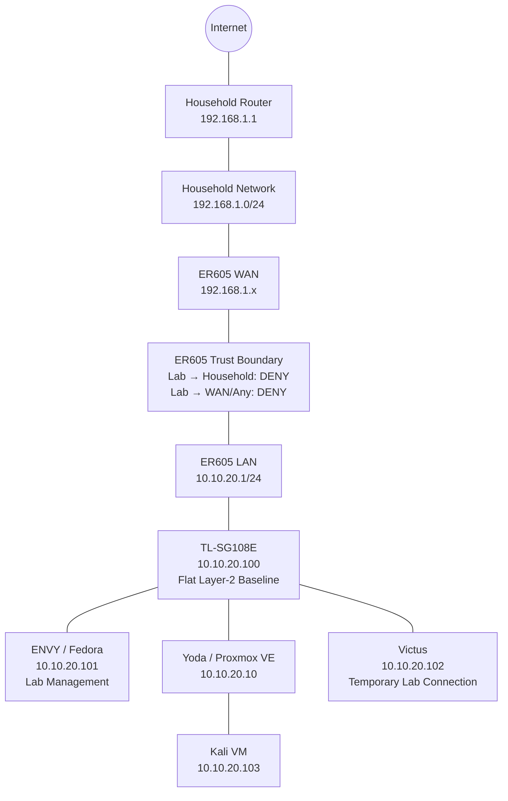
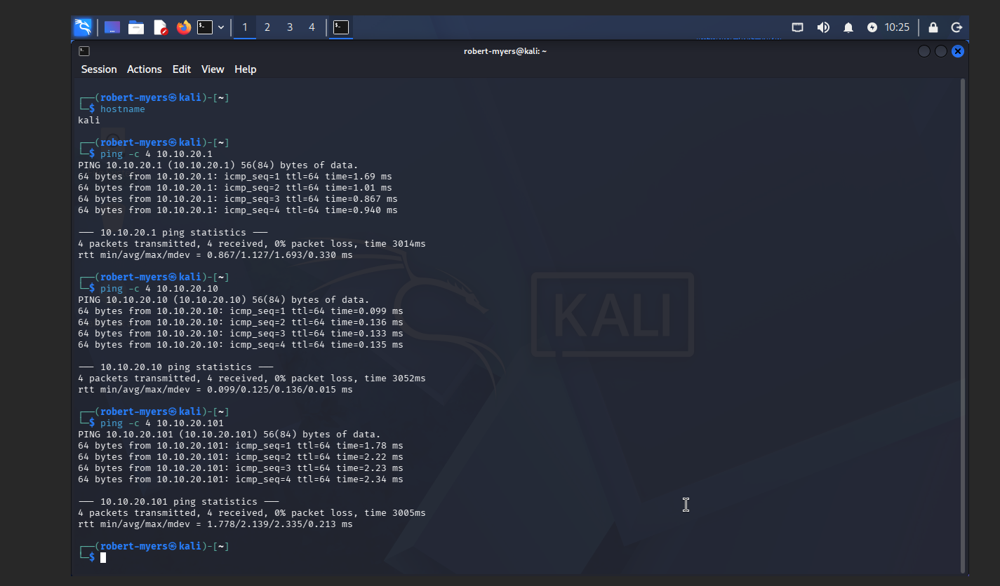
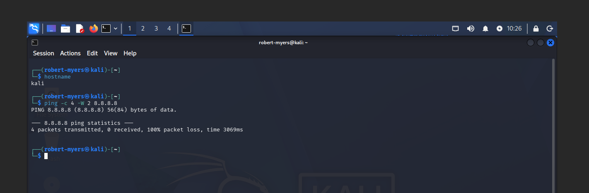
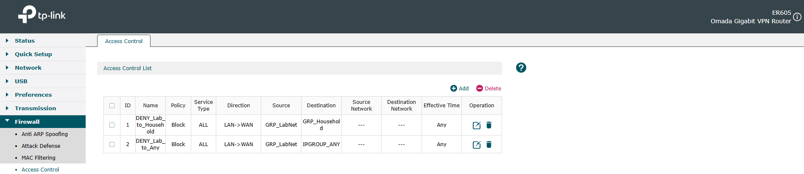
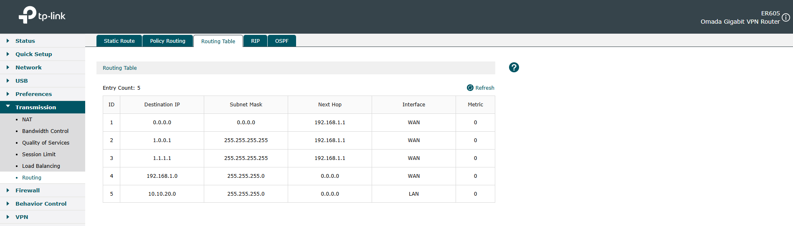
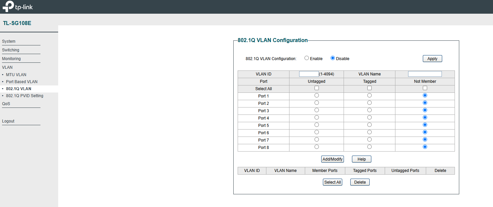
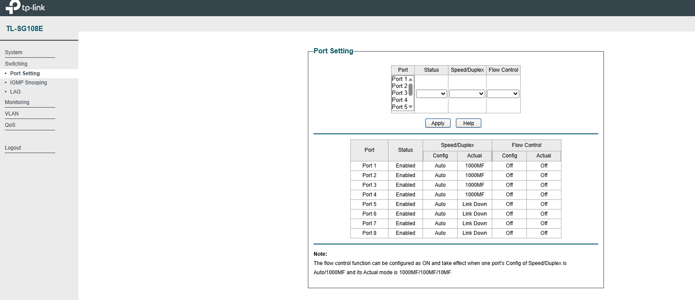

# LAB-001 — Isolated Cybersecurity Range Architecture & Trust Boundary

## Objective

Document and validate the starting architecture of my isolated cybersecurity lab before beginning the networking, security operations, and DFIR proof-of-work projects.

The lab is designed to allow systems inside the range to communicate with each other while preventing lab systems from reaching my household network or the Internet through the ER605.

This gives me a controlled environment for future networking, attack-and-defense, packet-analysis, detection, and forensic exercises.

## Employer Skills Demonstrated

- TCP/IP and IPv4 subnetting
- Layer 2 switching
- ARP and MAC-address resolution
- Routing and default-gateway behavior
- Firewall and access-control policy
- Network trust boundaries
- Linux networking
- Proxmox virtual networking
- Linux bridges
- Dual-homed host analysis
- Network troubleshooting
- Security-control validation
- Evidence collection and sanitization
- Technical documentation

## Environment

| System | Role | Lab Address |
|---|---|---|
| ER605 | Lab router and security boundary | `10.10.20.1` |
| TL-SG108E | Managed Layer 2 switch | `10.10.20.100` |
| Yoda | Proxmox VE host | `10.10.20.10` |
| ENVY | Fedora management workstation | `10.10.20.101` |
| Kali | Security-testing VM hosted on Yoda | `10.10.20.103` |
| Victus | Primary workstation; temporarily attached for setup and evidence collection | `10.10.20.102` |

The household network uses a separate `192.168.1.0/24` address space.

Public evidence is intentionally limited to information needed to explain and validate the architecture. Unnecessary hardware identifiers, MAC addresses, SSIDs, credentials, and other sensitive information are excluded or sanitized.

## Architecture



## How Local Lab Communication Works

ENVY, Yoda, Kali, and the other lab interfaces are members of the same `10.10.20.0/24` subnet.

For example, when ENVY at `10.10.20.101` communicates with Yoda at `10.10.20.10`, ENVY applies its `/24` subnet mask and determines that the destination belongs to its local network.

Because the destination is local, ENVY does not send the traffic to its default gateway.

Instead, ENVY uses ARP to determine the Layer 2 MAC address associated with Yoda's IPv4 address. The resulting Ethernet frames are forwarded through the TL-SG108E using the switch's MAC address table.

The ER605 becomes involved when traffic needs to leave the local subnet.

This distinction is important:

**Same subnet → ARP + Layer 2 switching**

**Different network → default gateway + Layer 3 routing**

## Proxmox Virtual Networking

Yoda uses a Linux bridge named `vmbr0`.

The physical interface `nic0` is attached to `vmbr0`, while Yoda's Layer 3 address is assigned to the bridge:

`10.10.20.10/24`

Kali's virtual network interface is also attached to `vmbr0` through the VM tap interface.

The path is therefore:

```text
Kali eth0
    |
Virtual NIC
    |
tap100i0
    |
vmbr0
    |
nic0
    |
TL-SG108E
```

This places Kali on the same Layer 2 lab segment as the physical systems connected to the SG108E.

The collected evidence verifies:

- `nic0` is a member of `vmbr0`
- `tap100i0` is a member of `vmbr0`
- Yoda uses `10.10.20.10/24`
- Kali uses `10.10.20.103/24`
- Yoda's default gateway is `10.10.20.1`

## Trust Boundary

The ER605 has a valid upstream route through the household router.

However, access-control rules explicitly block traffic sourced from the lab toward:

1. the household network; and
2. WAN/other destinations.

This is an important distinction.

The lab is not isolated simply because the router lacks an upstream route.

**The upstream route exists. Access is intentionally denied by security policy.**

## Validation

### Internal Lab Connectivity

Kali successfully communicated with:

- ER605 — `10.10.20.1`
- Yoda — `10.10.20.10`
- ENVY — `10.10.20.101`

All three tests completed with 0% packet loss.



This validates basic connectivity inside the lab segment.

### Egress-Control Test

Kali then attempted to reach the external address `8.8.8.8`.

The test resulted in 100% packet loss.



A failed ping by itself does not establish why traffic failed.

For that reason, the endpoint result was correlated with the router configuration rather than treated as proof by itself.

### Firewall Policy

The ER605 contains explicit access-control policies blocking Lab-to-Household and Lab-to-Any traffic.



This provides configuration evidence supporting the observed egress behavior.

### Routing Verification

The ER605 routing table contains a valid default route through the upstream household router.

It also contains directly connected routes for both the household and lab networks.



The presence of the upstream route supports the conclusion that lab egress is restricted by policy rather than simply failing because no route exists.

## Layer 2 Starting State

At the time of this baseline, 802.1Q VLAN functionality on the TL-SG108E is disabled.



The lab therefore begins as a flat Layer 2 segment.

This is intentional for the baseline. Future projects will use this documented starting state to demonstrate VLAN segmentation, trunking, traffic isolation, firewall policy, and troubleshooting.

### Physical Switch Connections

Ports 1–4 were active at 1 Gbps.

| Port | Connection |
|---:|---|
| 1 | ER605 |
| 2 | Yoda |
| 3 | ENVY |
| 4 | Victus — temporary |
| 5–8 | Available |



## Dual-Homed Management

ENVY has two network connections:

- household Wi-Fi
- lab Ethernet

Route testing demonstrated that traffic destined for the lab uses the Ethernet interface, while Internet traffic uses the household Wi-Fi interface.

IPv4 forwarding is disabled on ENVY.

This allows ENVY to function as the normal lab-management workstation without being configured to route traffic between the household and lab networks.

Victus was temporarily connected to the lab for setup and evidence collection. It is not intended to remain a permanent range member.

## Evidence Handling

Evidence was collected directly from the systems and network devices being documented.

Public evidence was reviewed before publication.

The repository excludes local raw-evidence directories through `.gitignore`, and unnecessary identifiers such as MAC addresses and the household SSID were removed from public artifacts.

Published evidence includes:

- ENVY network configuration and route-selection evidence
- Victus network configuration and forwarding-state evidence
- Yoda/Proxmox bridge configuration
- Kali connectivity validation
- ER605 routing and access-control configuration
- SG108E Layer 2 baseline configuration

## Findings

1. The `10.10.20.0/24` lab is functioning as a single Layer 2 network at baseline.
2. Lab systems can communicate locally without using the ER605 as an intermediary router.
3. Yoda successfully bridges its physical interface and Kali virtual interface through `vmbr0`.
4. The ER605 has valid upstream routing.
5. Explicit access-control policy restricts the lab from reaching the household network and WAN.
6. Kali's failed external connectivity test is consistent with the configured egress-control policy.
7. ENVY can access both management networks while IPv4 forwarding remains disabled.
8. The current flat-switch configuration provides a documented baseline for future VLAN segmentation work.

## Result

The starting environment is now documented and evidence-backed.

The lab provides internal connectivity, Proxmox virtual networking, controlled management access, and a defined trust boundary between the cybersecurity range and the household network.

This baseline will be used for future projects involving:

- Ethernet and ARP analysis
- TCP/IP and packet analysis
- routing
- NAT
- VLAN segmentation
- ACL and firewall testing
- port mirroring
- network monitoring
- security detection
- attack-and-defense exercises
- DFIR and network forensics

---

**Status:** Baseline validated  
**Date:** 2026-09-26
