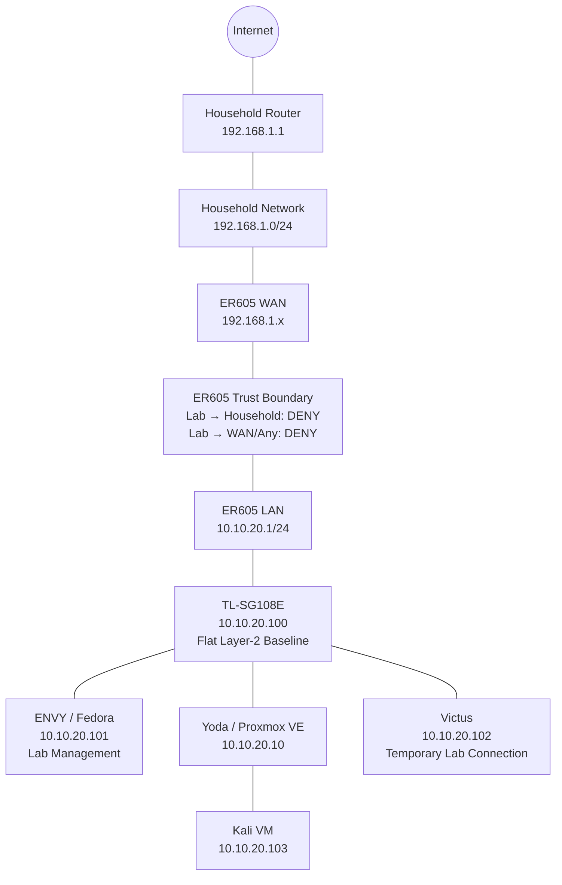
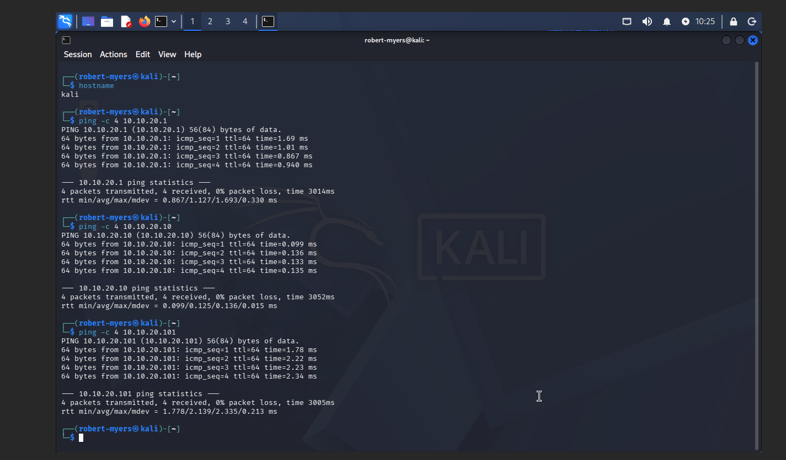
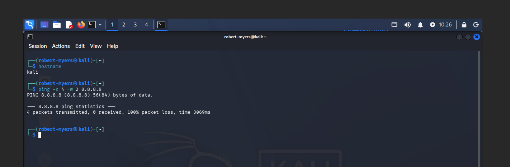
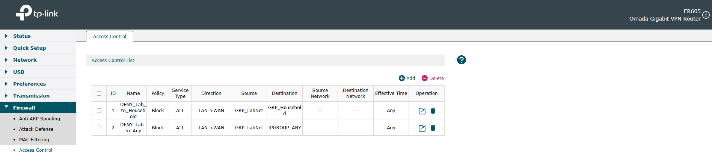
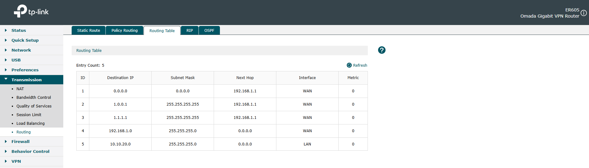
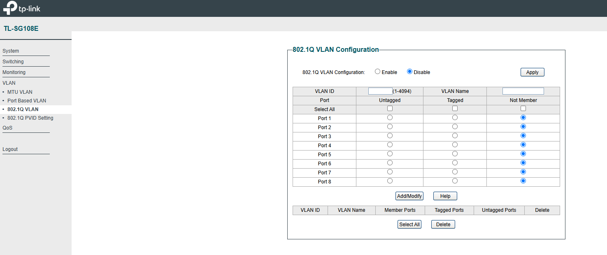
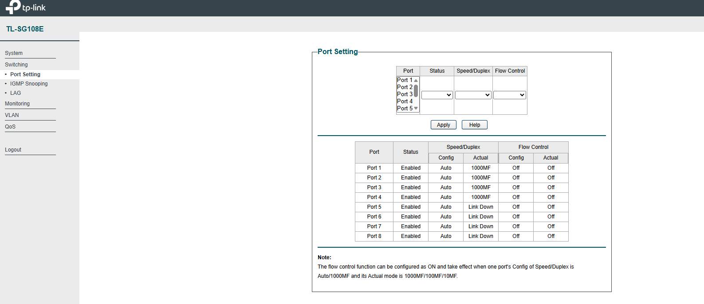

# LAB-001 — Isolated Cybersecurity Range Architecture & Trust Boundary

> **Baseline as of September 26, 2026.** This documents the lab before VLANs. ENVY later moved to VLAN 30 (NET-007), and in NET-008 it became a single-homed enclave host while Victus became the management workstation. The current layout is in the [repository README](../../README.md#lab-topology).

## Hiring Claim
After reviewing this artifact, a hiring manager has evidence that I can document a network's starting state, define a trust boundary between two networks, and validate with tests that the boundary enforces what the design says it should.

## Objective

Document and validate the starting layout of my isolated lab before building the networking projects on top of it.

The lab is designed to allow systems inside the range to communicate with each other while preventing lab systems from reaching my household network or the Internet through the ER605.

That gives me a controlled place to break things and troubleshoot without touching the household network.

## Employer Skills Demonstrated

- TCP/IP and IPv4 subnetting
- Layer 2 switching
- ARP and MAC-address resolution
- Routing and default-gateway behavior
- Firewall and access-control policy
- Network trust boundaries
- Linux networking
- Proxmox virtual networking
- Linux bridges
- Dual-homed host analysis
- Network troubleshooting
- Security-control validation
- Evidence collection and sanitization
- Technical documentation

## Environment

| System | Role | Lab Address |
|---|---|---|
| ER605 | Lab router and security boundary | `10.10.20.1` |
| TL-SG108E | Managed Layer 2 switch | `10.10.20.100` |
| Yoda | Proxmox VE host | `10.10.20.10` |
| ENVY | Fedora management workstation | `10.10.20.101` |
| Kali | Security-testing VM hosted on Yoda | `10.10.20.103` |
| Victus | Primary workstation; temporarily attached for setup and evidence collection | `10.10.20.102` |

The household network uses a separate `192.168.1.0/24` address space.

Public evidence is intentionally limited to information needed to explain and validate the architecture. Unnecessary hardware identifiers, MAC addresses, SSIDs, credentials, and other sensitive information are excluded or sanitized.

## Architecture


```mermaid
flowchart TB

    Internet((Internet))
    AX55["Household Router<br/>192.168.1.1"]
    Home["Household Network<br/>192.168.1.0/24"]
    ERWAN["ER605 WAN<br/>192.168.1.x"]
    FW["ER605 Trust Boundary<br/>Lab → Household: DENY<br/>Lab → WAN/Any: DENY"]
    ERLAN["ER605 LAN<br/>10.10.20.1/24"]
    SW["TL-SG108E<br/>10.10.20.100<br/>Flat Layer-2 Baseline"]
    ENVY["ENVY / Fedora<br/>10.10.20.101<br/>Lab Management"]
    YODA["Yoda / Proxmox VE<br/>10.10.20.10"]
    KALI["Kali VM<br/>10.10.20.103"]
    VICTUS["Victus<br/>10.10.20.102<br/>Temporary Lab Connection"]

    Internet --- AX55
    AX55 --- Home
    Home --- ERWAN
    ERWAN --- FW
    FW --- ERLAN
    ERLAN --- SW
    SW --- ENVY
    SW --- YODA
    SW --- VICTUS
    YODA --- KALI
```

## How Local Lab Communication Works

ENVY, Yoda, Kali, and the other lab interfaces are members of the same `10.10.20.0/24` subnet.

For example, when ENVY at `10.10.20.101` communicates with Yoda at `10.10.20.10`, ENVY applies its `/24` subnet mask and determines that the destination belongs to its local network.

Because the destination is local, ENVY does not send the traffic to its default gateway.

Instead, ENVY uses ARP to determine the Layer 2 MAC address associated with Yoda's IPv4 address. The resulting Ethernet frames are forwarded through the TL-SG108E using the switch's MAC address table.

The ER605 becomes involved when traffic needs to leave the local subnet.

Two rules cover it:

**Same subnet → ARP + Layer 2 switching**

**Different network → default gateway + Layer 3 routing**

## Proxmox Virtual Networking

Yoda uses a Linux bridge named `vmbr0`.

The physical interface `nic0` is attached to `vmbr0`, while Yoda's Layer 3 address is assigned to the bridge:

`10.10.20.10/24`

Kali's virtual network interface is also attached to `vmbr0` through the VM tap interface.

The path is therefore:

```text
Kali eth0
    |
Virtual NIC
    |
tap100i0
    |
vmbr0
    |
nic0
    |
TL-SG108E
```

This places Kali on the same Layer 2 lab segment as the physical systems connected to the SG108E.

The collected evidence verifies:

- `nic0` is a member of `vmbr0`
- `tap100i0` is a member of `vmbr0`
- Yoda uses `10.10.20.10/24`
- Kali answers at `10.10.20.103` (Yoda and ENVY both ping it with 0% loss); I didn't capture Kali's own interface configuration, so its prefix length isn't shown in this evidence
- Yoda's default gateway is `10.10.20.1`

## Trust Boundary

The ER605 has a valid upstream route through the household router.

However, access-control rules explicitly block traffic sourced from the lab toward:

1. the household network; and
2. WAN/other destinations.

The lab isn't isolated because the router has no way out. It has a working upstream route. The ACL rules are what block the traffic.

## Validation

### Internal Lab Connectivity

Kali successfully communicated with:

- ER605 — `10.10.20.1`
- Yoda — `10.10.20.10`
- ENVY — `10.10.20.101`

All three tests completed with 0% packet loss.



This validates basic connectivity inside the lab segment.

The ROUTE TO LAB HOST section of `evidence/envy-network-baseline.txt` shows ENVY reaching Yoda directly on the lab interface with no gateway:

```text
10.10.20.10 dev enp0s20f0u3u3c2 src 10.10.20.101 uid 1000
```

Compare that with the ROUTE TO INTERNET entry, which goes `via 192.168.1.1`. Local lab traffic does not need the ER605 as a next hop.

### Egress-Control Test

Kali then attempted to reach the external address `8.8.8.8`.

The test resulted in 100% packet loss.



A failed ping by itself does not establish why traffic failed.

For that reason, the endpoint result was correlated with the router configuration rather than treated as proof by itself.

This was one ICMP test to one external address. I didn't test TCP or UDP egress, DNS, or other destinations from the lab at this baseline.

### Firewall Policy

The ER605 contains explicit access-control policies blocking Lab-to-Household and Lab-to-Any traffic.



This provides configuration evidence supporting the observed egress behavior.

### Routing Verification

The ER605 routing table contains a valid default route through the upstream household router.

It also contains directly connected routes for both the household and lab networks.



The presence of the upstream route supports the conclusion that lab egress is restricted by policy rather than simply failing because no route exists.

## Layer 2 Starting State

At the time of this baseline, 802.1Q VLAN functionality on the TL-SG108E is disabled.



The lab therefore begins as a flat Layer 2 segment.

This is intentional for the baseline. Future projects will use this documented starting state to demonstrate VLAN segmentation, trunking, traffic isolation, firewall policy, and troubleshooting.

### Physical Switch Connections

Ports 1–4 were active at 1 Gbps. The screenshot shows link status only; the port-to-device mapping below is my cabling record and isn't proven by this screenshot.

| Port | Connection |
|---:|---|
| 1 | ER605 |
| 2 | Yoda |
| 3 | ENVY |
| 4 | Victus — temporary |
| 5–8 | Available |



## Dual-Homed Management

ENVY has two network connections:

- household Wi-Fi
- lab Ethernet

Route testing demonstrated that traffic destined for the lab uses the Ethernet interface, while Internet traffic uses the household Wi-Fi interface.

IPv4 forwarding is disabled on ENVY.

This allows ENVY to function as the normal lab-management workstation without being configured to route traffic between the household and lab networks.

Victus was temporarily connected to the lab for setup and evidence collection. It is not intended to remain a permanent range member.

## Evidence Limits

- **Lab → Household: DENY** is shown as a configured ACL rule only. I didn't run an endpoint test from the lab toward a `192.168.1.0/24` host at this baseline.
- The ACL rules reference the groups `GRP_LabNet` and `GRP_Household`. LAB-001 does not show what those groups contain. The group and address definitions are shown in NET-008 evidence captured October 5, 2026: [25-er605-ip-addresses-before.png](../../01-networking/NET-008-protected-systems-enclave/evidence/25-er605-ip-addresses-before.png) (`LabNet` = `10.10.20.0/24`, `Household` = `192.168.1.0/24`) and [26-er605-ip-groups-before.png](../../01-networking/NET-008-protected-systems-enclave/evidence/26-er605-ip-groups-before.png). Those screenshots were taken after this baseline, not on September 26.
- The SG108E port map is not evidenced beyond link status (see above).
- Egress denial rests on one ICMP test plus the ACL configuration.
- On Victus, the lab default route had the lower metric (`10.10.20.1`, ifMetric 25) than Wi-Fi (`192.168.1.1`, ifMetric 30), but the `Test-NetConnection` to `google.com:443` still went out the Wi-Fi interface. I didn't investigate why at the time.

## Evidence Index

| File | What it shows |
|---|---|
| [envy-network-baseline.txt](evidence/envy-network-baseline.txt) | ENVY interfaces, both default routes, IPv4 forwarding `0`, route lookups to Yoda (lab interface, no gateway) and `8.8.8.8` (Wi-Fi via `192.168.1.1`), pings to ER605, Yoda, Kali |
| [victus-network-baseline-sanitized.txt](evidence/victus-network-baseline-sanitized.txt) | Victus adapters, IP configuration, IPv4 route table, DNS, forwarding disabled on all interfaces, pings to ER605 and Yoda, `Test-NetConnection` path to an Internet host |
| [yoda-proxmox-network-baseline.txt](evidence/yoda-proxmox-network-baseline.txt) | Yoda interfaces and routes, `vmbr0` bridge config and members (`nic0`, `tap100i0`), Kali VM bridge assignment, pings to ER605, ENVY, Kali |
| [01-kali-internal-connectivity.png](evidence/screenshots/01-kali-internal-connectivity.png) | Kali pings ER605, Yoda, ENVY with 0% loss |
| [02-kali-egress-denied.png](evidence/screenshots/02-kali-egress-denied.png) | Kali ping to `8.8.8.8`: 4 transmitted, 0 received, 100% loss |
| [03-er605-access-control.png](evidence/screenshots/03-er605-access-control.png) | ER605 ACL rules `DENY_Lab_to_Household` and `DENY_Lab_to_Any` (Block, LAN->WAN, source `GRP_LabNet`) |
| [04-er605-routing-table.png](evidence/screenshots/04-er605-routing-table.png) | ER605 routing table: default route via `192.168.1.1` on WAN, connected `192.168.1.0/24` and `10.10.20.0/24` |
| [05-sg108e-vlan-baseline.png](evidence/screenshots/05-sg108e-vlan-baseline.png) | SG108E 802.1Q VLAN set to Disable |
| [06-sg108e-port-status.png](evidence/screenshots/06-sg108e-port-status.png) | SG108E ports 1–4 at 1000MF, ports 5–8 Link Down |

## Evidence Handling

Evidence was collected directly from the systems and network devices being documented.

Public evidence was reviewed before publication.

The repository excludes local raw-evidence directories through `.gitignore`, and unnecessary identifiers such as MAC addresses, the household SSID, and the public IP returned by the Victus `Test-NetConnection` check (`[PUBLIC-IP]`) were removed from public artifacts.

Published evidence includes:

- ENVY network configuration and route-selection evidence
- Victus network configuration and forwarding-state evidence
- Yoda/Proxmox bridge configuration
- Kali connectivity validation
- ER605 routing and access-control configuration
- SG108E Layer 2 baseline configuration

## Findings

1. The `10.10.20.0/24` lab is functioning as a single Layer 2 network at baseline.
2. Lab systems can communicate locally without using the ER605 as an intermediary router (ENVY's route lookup to Yoda uses the lab interface directly, with no gateway).
3. Yoda successfully bridges its physical interface and Kali virtual interface through `vmbr0`.
4. The ER605 has valid upstream routing.
5. Explicit access-control policy restricts the lab from reaching the household network and WAN.
6. Kali's failed external connectivity test is consistent with the configured egress-control policy.
7. ENVY can reach both the household and lab networks while IPv4 forwarding stays disabled.
8. The current flat-switch configuration provides a documented baseline for future VLAN segmentation work.

## Result

The starting environment is now documented and evidence-backed.

The lab provides internal connectivity, Proxmox virtual networking, controlled management access, and a defined trust boundary between the cybersecurity range and the household network.

This baseline will be used for future projects involving:

- Ethernet and ARP analysis
- TCP/IP and packet analysis
- routing
- NAT
- VLAN segmentation
- ACL and firewall testing
- port mirroring
- network monitoring
- security detection

---

## Status
**PROVEN**

Baseline validated 2026-09-26. Internal connectivity, bridge membership, routing, and ACL configuration are shown directly; the limits are listed under Evidence Limits.
