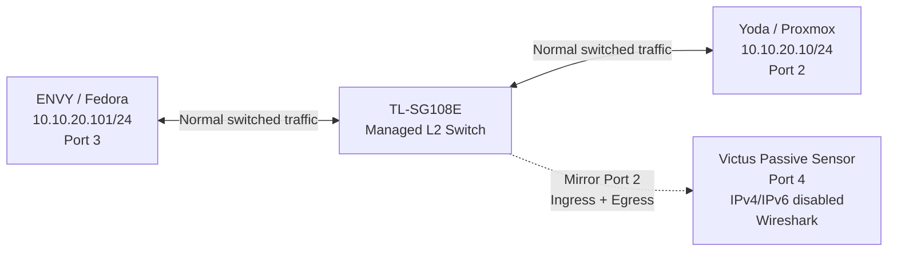
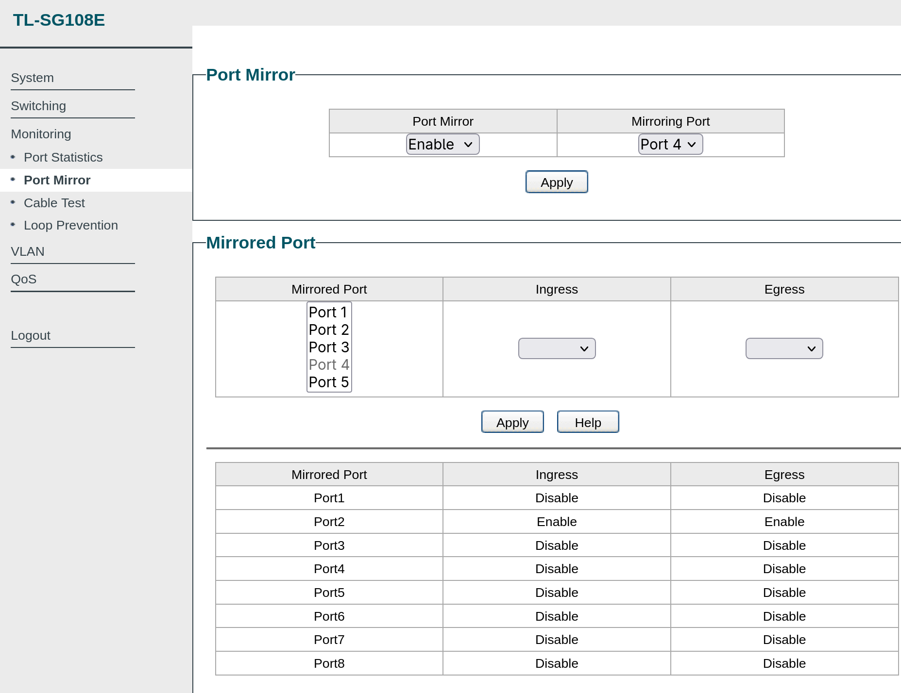
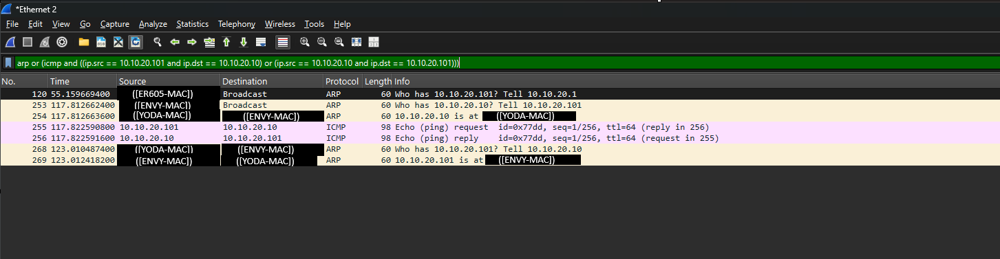
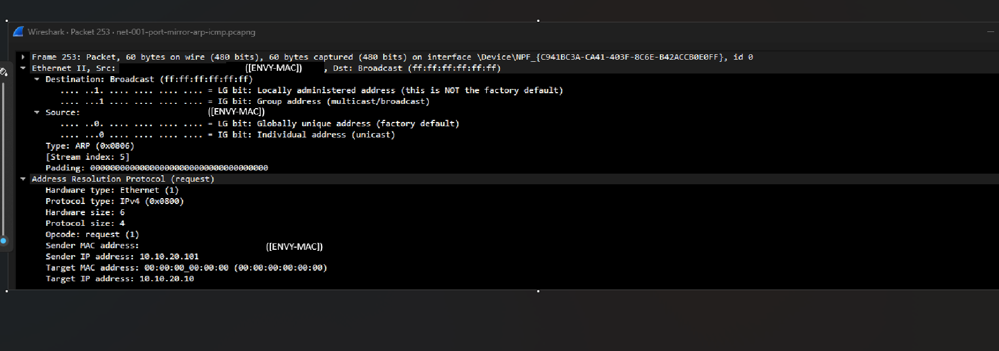
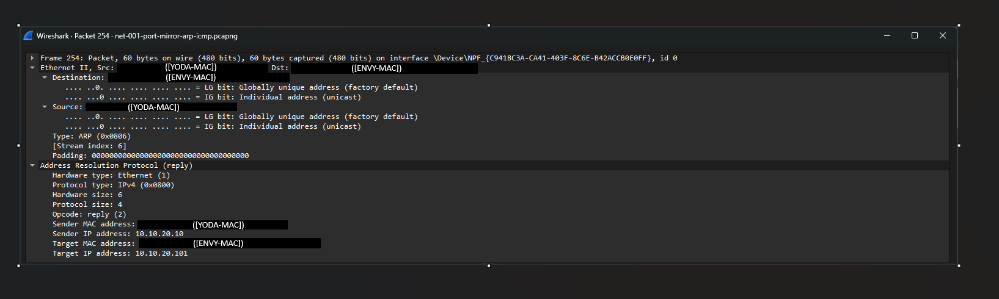
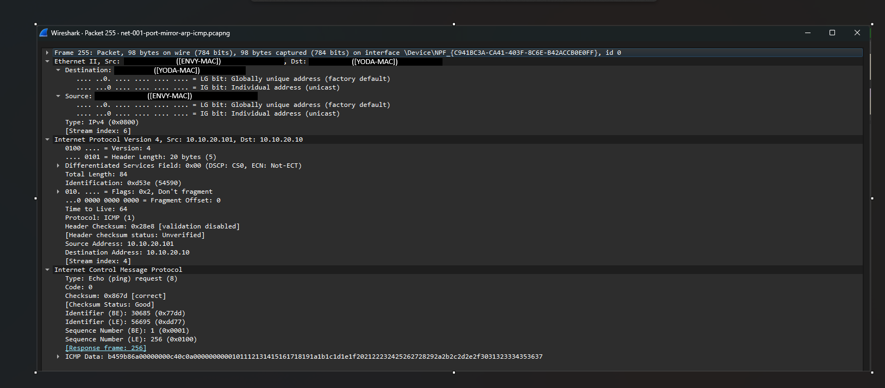

# NET-001 — Ethernet, ARP & MAC Learning with Port Mirroring

## Hiring Claim
After reviewing this artifact, a hiring manager has evidence that I can explain, observe, and validate same-subnet Ethernet communication using ARP, ICMP, packet analysis, and physical switch port mirroring.

## Employer Skills Demonstrated
- Ethernet and Layer 2 communication
- IPv4 subnet reasoning
- ARP and MAC-address resolution
- Linux neighbor-cache analysis
- ICMP validation
- Wireshark and TShark packet analysis
- Managed-switch port mirroring
- Passive network monitoring
- Protocol encapsulation
- Evidence isolation and technical documentation

## Scenario / Objective
The objective was to prove what happens when ENVY (`10.10.20.101/24`) communicates with Yoda (`10.10.20.10/24`) on the same subnet when Yoda's MAC address is not already available in ENVY's neighbor cache.

Rather than relying only on an endpoint capture, the TL-SG108E mirrored Yoda's switch port to a separate Victus capture interface. IPv4 and IPv6 were disabled on that Victus Ethernet interface during the clean capture so it could operate as a passive monitoring interface.

## Environment
| System | Role | Relevant Connection |
|---|---|---|
| ENVY / Fedora | Traffic generator | `10.10.20.101/24`, Port 3 |
| Yoda / Proxmox | Destination | `10.10.20.10/24`, Port 2 |
| TL-SG108E | Managed Layer 2 switch | Port 2 mirrored to Port 4 |
| Victus | Passive packet sensor | Port 4, Wireshark |
| TShark / Editcap | CLI analysis/evidence isolation | Four-packet extraction |

## Test Architecture


## Prediction
Before generating traffic, I expected ENVY to determine that `10.10.20.10` belonged to its local `/24` network. Because the destination was local, ENVY should not send the traffic to the default gateway.

With Yoda's MAC unknown, ENVY should broadcast an ARP request. Yoda should return its MAC address in an ARP reply. ENVY could then construct a unicast Ethernet frame carrying the ICMP Echo Request.

Expected sequence:
1. ARP request — broadcast
2. ARP reply — unicast
3. ICMP Echo Request — unicast
4. ICMP Echo Reply — unicast

## Starting State
ENVY initially had an existing Yoda neighbor entry in a `STALE` state. I removed it with:

```text
sudo ip neigh del 10.10.20.10 dev enp0s20f0u3u3c2
```

A subsequent lookup returned no entry, forcing address resolution on the next communication attempt.

## Methodology
1. Verified and removed ENVY's existing Yoda neighbor entry.
2. Configured SG108E Port 2 (Yoda) for ingress and egress mirroring.
3. Configured Port 4 as the mirror destination.
4. Connected Victus to Port 4 as the independent sensor.
5. Disabled IPv4 and IPv6 bindings on the Victus Ethernet capture interface.
6. Started a clean Wireshark capture.
7. Generated one ICMP Echo Request from ENVY to Yoda.
8. Stopped the capture and identified the controlled event.
9. Used TShark and Editcap to isolate the four relevant packets into a small evidence PCAP.

## Switch Port Mirroring
The SG108E mirrored both directions of Yoda's Port 2 to Victus on Port 4.



This allowed Victus to observe frames entering and leaving Yoda's port without being either endpoint in the conversation.

## Observed Packet Sequence
| Evidence PCAP Frame | Protocol | Direction | Observation |
|---:|---|---|---|
| 1 | ARP | ENVY → Broadcast | Who has `10.10.20.10`? Tell `10.10.20.101` |
| 2 | ARP | Yoda → ENVY | `10.10.20.10` replies with its MAC address |
| 3 | ICMP | ENVY → Yoda | Echo Request |
| 4 | ICMP | Yoda → ENVY | Echo Reply |



The full capture also contained unrelated/background traffic. The controlled event was identified by correlating the generated action, timing, source/destination addresses, and protocol sequence.

## ARP Request Analysis


The request shows:
- Ethernet destination `ff:ff:ff:ff:ff:ff`
- EtherType ARP (`0x0806`)
- opcode request (`1`)
- sender IP `10.10.20.101`
- target MAC `00:00:00:00:00:00`
- target IP `10.10.20.10`

The broadcast destination allows the request to be flooded within the local broadcast domain. The zero target MAC reflects that ENVY is trying to discover the Layer 2 address associated with Yoda's IPv4 address.

## ARP Reply Analysis


The reply differs from the request:
- Ethernet destination is ENVY's MAC rather than broadcast
- opcode is reply (`2`)
- sender IP is `10.10.20.10`
- sender MAC is Yoda's MAC
- target IP is `10.10.20.101`
- target MAC is ENVY's MAC

The request must be broadcast because the destination MAC is unknown. The reply can be unicast because Yoda learned ENVY's sender information from the request.

## Neighbor-State Validation
After the exchange and successful ping, ENVY's neighbor table contained Yoda as `REACHABLE`.

```text
Before:
(no entry for 10.10.20.10)

Action:
ping -c 1 10.10.20.10

Result:
1 transmitted, 1 received, 0% packet loss

After:
10.10.20.10 dev enp0s20f0u3u3c2 lladdr [YODA-MAC] REACHABLE
```

## Same-Subnet Forwarding
ENVY and Yoda are both in `10.10.20.0/24`.

```text
10.10.20.101 AND 255.255.255.0 = 10.10.20.0
10.10.20.10  AND 255.255.255.0 = 10.10.20.0
```

Because the resulting network addresses match, Yoda is local. The default gateway is not required for this exchange. ARP resolves the destination IPv4 address to a MAC address, and Layer 2 switching forwards the Ethernet frames locally.

## Host Neighbor Cache vs. Switch MAC Table
These are separate functions.

**Host ARP/neighbor cache:** maps IPv4 address → MAC address.

**Switch MAC table:** maps source MAC address → switch port.

The host needs the ARP result to construct the Ethernet frame. The switch uses learned MAC-to-port information to forward frames.

The SG108E firmware used here does not expose its dynamic MAC table through the web interface, so this artifact does not claim direct inspection of that table.

## Encapsulation Analysis


The Echo Request shows:

```text
Ethernet II
└── IPv4
    └── ICMP Echo Request
```

Ethernet carries the source/destination MAC addresses. IPv4 carries source `10.10.20.101`, destination `10.10.20.10`, and protocol ICMP (`1`). ICMP identifies an Echo Request, Type `8`, Code `0`.

## Passive Monitoring Validation
Victus was connected to mirror destination Port 4. IPv4 and IPv6 bindings were disabled on its Ethernet capture interface during the clean capture.

The sensor therefore did not need to participate as an IPv4/IPv6 endpoint to observe the mirrored Layer 2 traffic. The switch copied Port 2 ingress and egress frames to Port 4 for passive analysis.

This is the same way a network sensor or IDS tap is usually connected.

## Evidence Handling and Sanitization

The original working capture contained additional network traffic that was not part of the controlled event.

The original PCAP is retained locally under the ignored `evidence/raw/` directory and is not published.

TShark was used to extract the four controlled frames, originally numbered 253–256, into `evidence/packet-summary.txt`.

Persistent hardware identifiers in the public screenshots and text evidence were replaced with stable role labels:

- `[ENVY-MAC]`
- `[YODA-MAC]`
- `[ER605-MAC]`

Protocol-significant generic values such as the Ethernet broadcast address and the all-zero unknown ARP target were retained where they contribute directly to the analysis.

This keeps the public evidence focused on the technical relationships required to support the findings without publishing persistent device identifiers or unrelated captured traffic.

## Findings
1. ENVY identified Yoda as a same-subnet destination.
2. With no cached Yoda neighbor entry, ENVY broadcast an ARP request.
3. Yoda returned a unicast ARP reply containing its MAC address.
4. ENVY then transmitted the ICMP Echo Request as a unicast Ethernet frame.
5. Yoda returned the corresponding ICMP Echo Reply.
6. ENVY's neighbor state changed from no entry to `REACHABLE`.
7. The SG108E mirrored both directions of Yoda's Port 2 to the passive sensor on Port 4.
8. Victus observed the exchange without participating as an IPv4/IPv6 endpoint on the capture interface.
9. Background capture traffic had to be distinguished from the controlled event through correlation.
10. The evidence PCAP contains only the four packets needed to show the event. It is kept local with the original capture because it still contains real MAC addresses. The published proof is the screenshots and `packet-summary.txt`.

## Why This Matters
ARP and Ethernet behavior sit underneath network troubleshooting and many security investigations. Understanding IP-to-MAC resolution, switch forwarding, broadcast versus unicast traffic, and routed versus local traffic is necessary for interpreting packet captures correctly.

Port mirroring lets a sensor see traffic without being part of the conversation.

## Evidence Index
| Evidence | Purpose |
|---|---|
| `01-port-mirror-arp-icmp-observation.png` | Controlled ARP/ICMP event from the mirror sensor |
| `02-arp-request-frame-analysis.png` | ARP request fields and broadcast destination |
| `03-arp-reply-frame-analysis.png` | Unicast ARP reply and resolved addressing |
| `04-icmp-encapsulation-analysis.png` | Ethernet → IPv4 → ICMP encapsulation |
| `05-sg108e-port-mirror-configuration.png` | Port 2 ingress/egress mirrored to Port 4 |
| `packet-summary.txt` | TShark summary of the four-packet evidence PCAP |

## Status
**PROVEN**

The expected ARP and ICMP behavior was predicted, generated on the physical lab network, independently observed through switch port mirroring, analyzed at the frame and packet levels, and preserved as focused, sanitized evidence.
