# NET-002 — TCP vs UDP Traffic Analysis

## Hiring Claim
After reviewing this artifact, a hiring manager has evidence that I can establish and analyze TCP and UDP traffic, interpret socket state, explain TCP sequence and acknowledgment behavior, identify connection establishment and teardown, and show with packet captures how UDP behaves when sent to an open port versus a closed port, including the ICMP Port Unreachable a closed port returns.

## Employer Skills Demonstrated
- TCP/IP traffic analysis
- TCP three-way handshake analysis
- TCP sequence and acknowledgment reasoning
- TCP socket-state analysis
- TCP application-data validation
- TCP connection teardown and TIME-WAIT
- UDP socket and datagram analysis
- Ephemeral-port analysis
- ICMP Destination Unreachable analysis
- Linux `ss`, `nc`, `tcpdump`, and TShark
- Client/server troubleshooting
- Evidence handling and technical documentation

## Scenario / Objective
The objective was to compare TCP and UDP behavior on the same physical lab network using controlled client/server traffic between ENVY and Yoda.

The testing focused on behavior observable on the wire and in operating-system socket tables: ephemeral-port selection, TCP establishment, socket state, sequence/ACK behavior, application data, teardown, UDP delivery, and UDP closed-port error behavior.

## Environment
| System | Role | Address |
|---|---|---|
| ENVY / Fedora | Client, traffic generator, packet capture | `10.10.20.101/24` |
| Yoda / Proxmox | TCP and UDP server | `10.10.20.10/24` |
| TL-SG108E | Layer 2 switching | Lab switch |
| netcat (`nc`) | Controlled TCP/UDP client and server | Application traffic |
| `ss` | Socket-state validation | Linux |
| `tcpdump` | Packet capture and analysis; PCAPs written to `~/net-002-evidence/` on ENVY (screenshots 09, 10) | ENVY |
| TShark | Public evidence extraction | Victus (the TShark runs aren't shown in the screenshots) |

## Ephemeral-Port Baseline
ENVY's configured IPv4 ephemeral-port range is:

```text
net.ipv4.ip_local_port_range = 32768    60999
```

I didn't capture this check during the original test. I captured it on October 5, 2026 with `sysctl net.ipv4.ip_local_port_range`.

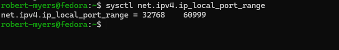

During testing ENVY selected:

| Test | Source Port |
|---|---:|
| TCP connection | `54000` |
| UDP open-port | `46681` |
| UDP closed-port | `34871` |

All three are inside that range.

# Part 1 — TCP

## TCP Socket State and Four-Tuple
Yoda ran a controlled TCP service on `10.10.20.10:8080`.

Screenshot 01 shows two `ss` checks on Yoda: `ss -ltnp` with a `LISTEN` socket on `10.10.20.10:8080`, and `ss -tanp` with an `ESTAB` socket from `10.10.20.101:54000`.

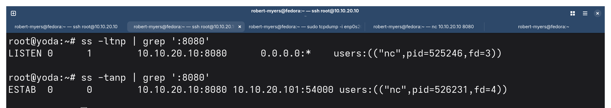

ENVY selected source port `54000`, producing this four-tuple:

```text
Source IP:        10.10.20.101
Source Port:      54000
Destination IP:   10.10.20.10
Destination Port: 8080
```

ENVY showed the corresponding `ESTAB` socket:

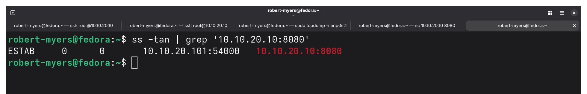

**Correction (October 5, 2026):** I originally wrote that Yoda kept the listening socket alongside the established socket and that the listener stayed available for more clients. Screenshot 01 doesn't show that. The `LISTEN` line belongs to `nc` pid `525246` and the `ESTAB` line belongs to `nc` pid `526231`, so the two outputs came from different `nc` runs. The `ss -tanp` output shows no `LISTEN` line at all. Plain `nc -l` accepts one connection and stops listening, so this screenshot does not show `LISTEN` and `ESTAB` at the same time. The [October 5 re-test](#re-test--october-5-2026) shows both together under one process.

## TCP Three-Way Handshake
The live packet capture showed:

```text
ENVY                                      YODA

        SYN ---------------------------->
            <-------------------- SYN, ACK
        ACK ---------------------------->

                 ESTABLISHED
```

Observed values included:

```text
ENVY -> Yoda
Flags [S]
seq 2705272252

Yoda -> ENVY
Flags [S.]
seq 2996551558
ack 2705272253

ENVY -> Yoda
Flags [.]
relative seq 1
relative ack 1
```

The SYN consumes one sequence number, so Yoda acknowledged ENVY's initial sequence number plus one.

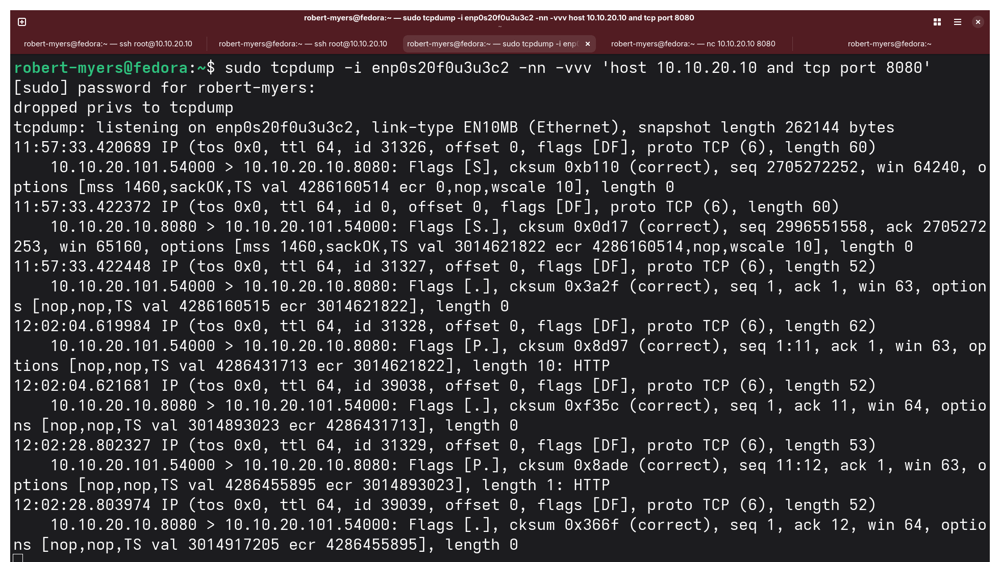

## TCP Application Data and Acknowledgment
ENVY sent `PROVE-TCP` plus a newline, producing a 10-byte payload.

The capture showed:

```text
ENVY -> Yoda
Flags [P.]
seq 1:11
ack 1
length 10

Yoda -> ENVY
Flags [.]
seq 1
ack 11
length 0
```

ACK `11` means bytes through sequence 10 were received and byte 11 is expected next.

Yoda displayed the payload:

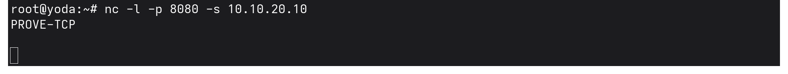

A later one-byte transmission advanced ENVY's relative sequence range from `11` to `12`, and Yoda acknowledged `12`.

TCP acknowledgments therefore track the next expected byte rather than simply counting packets.

## Independent Sequence Spaces
Each endpoint maintains its own TCP sequence space. Immediately before teardown, ENVY was operating around relative sequence `12/13` while Yoda was around `1/2`.

An ACK refers to the next sequence number expected from the opposite endpoint; the two hosts do not share one sequence counter.

## TCP Teardown
ENVY initiated the close. The capture showed a three-segment graceful teardown:

```text
ENVY                                      YODA

FIN, ACK
seq 12, ack 1 -------------------------->

            <-------------------- FIN, ACK
                           seq 1, ack 13

ACK
seq 13, ack 2 -------------------------->
```

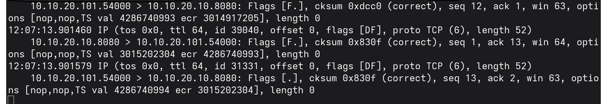

Yoda combined its acknowledgment of ENVY's FIN with its own FIN.

Although the FIN carried zero application payload bytes, FIN consumes one TCP sequence number:

```text
ENVY FIN seq 12 -> Yoda ACK 13
Yoda FIN seq 1  -> ENVY ACK 2
```

## TIME-WAIT
After ENVY initiated the close, its socket table showed the connection in `TIME-WAIT`.

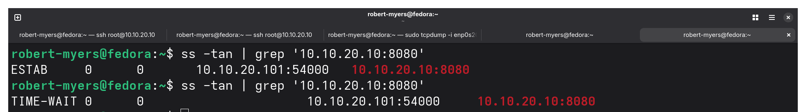

This provides host-level evidence of the TCP lifecycle after the packet-level FIN exchange.

# Part 2 — UDP

## UDP Listener State
Yoda ran a UDP service on `10.10.20.10:9090`.

The socket table showed an `UNCONN` socket rather than a TCP-style LISTEN/ESTAB lifecycle.

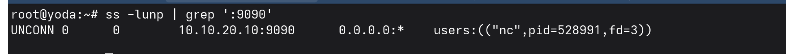

The UDP socket could receive datagrams without first establishing a transport-layer connection to ENVY.

## UDP Delivery to an Open Port
ENVY sent `PROVE-UDP` plus a newline, producing a 10-byte UDP payload.

The raw capture contained one UDP datagram:

```text
10.10.20.101:46681 -> 10.10.20.10:9090
UDP
length 10
```

Yoda received the payload:

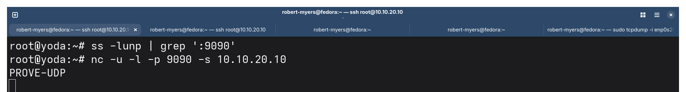

The public TShark extraction is stored in `evidence/udp-open-port-summary.txt`.

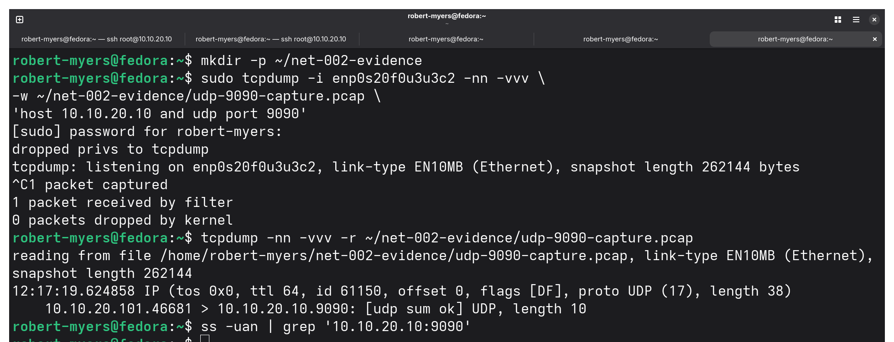

After the one-shot client completed, ENVY had no matching persistent UDP client socket to display.

## No UDP Transport Acknowledgment
The open-port capture contained the datagram sent from ENVY to Yoda but no UDP transport-layer acknowledgment returned from Yoda.

The capture filter for this test was `host 10.10.20.10 and udp port 9090`, so it only shows that no UDP traffic came back on port 9090. It would not have recorded an ICMP reply or other traffic from Yoda.

An application can implement its own acknowledgments, retries, or reliability on top of UDP. UDP itself does not provide TCP-style connection establishment, sequence-number reliability, transport acknowledgments, retransmission, ordered delivery, or FIN teardown.

# Part 3 — UDP to a Closed Port

## Closed-Port Test
I stopped the UDP/9090 listener before this test. I didn't capture an `ss` check after stopping it. The empty `ss -lunp | grep ':9090'` in screenshot 08 was run before the listener started, not after it stopped. The ICMP Port Unreachable below is what shows nothing was bound to UDP/9090 on Yoda when the datagram arrived.

ENVY then sent `CLOSED-UDP` plus a newline, producing an 11-byte UDP datagram.

The capture showed:

```text
ENVY:34871 -> Yoda:9090
UDP
length 11
```

followed by:

```text
Yoda -> ENVY
ICMP Destination Unreachable
UDP port 9090 unreachable
```

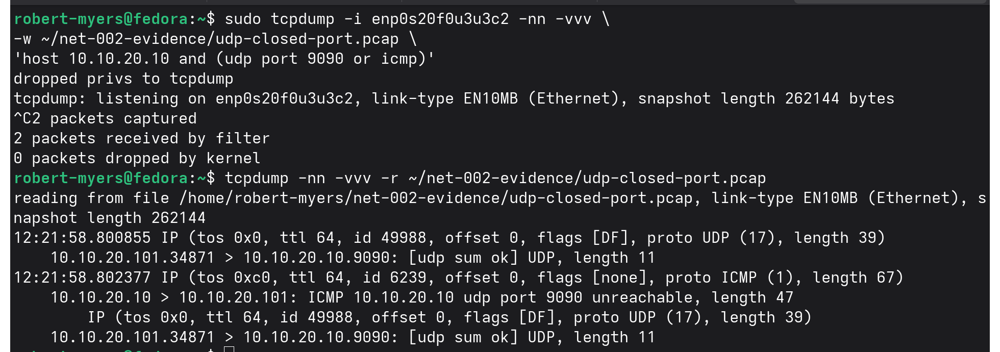

The public TShark extraction is stored in `evidence/udp-closed-port-summary.txt`.

## Why ICMP Appears in a UDP Test
UDP itself did not acknowledge or reject the datagram. Yoda's IP stack generated a separate ICMP error indicating that the UDP destination port was unreachable.

The ICMP error includes information from the offending packet so the receiving host can associate the error with the traffic that caused it.

```text
UDP open port:
ENVY -> UDP datagram -> Yoda
No UDP transport acknowledgment

UDP closed port:
ENVY -> UDP datagram -> Yoda
ENVY <- ICMP Port Unreachable <- Yoda
```

The ICMP response is not a UDP acknowledgment; it is a separate network-layer error-reporting mechanism.

# TCP vs UDP — Observed Results

| Behavior | TCP Test | UDP Test |
|---|---|---|
| Server port | `8080` | `9090` |
| Client source port | `54000` | `46681` open / `34871` closed |
| IP protocol number | TCP `6` | UDP `17` |
| Connection handshake | SYN → SYN/ACK → ACK | None |
| Server socket state | `LISTEN`, then `ESTAB` (separate `nc` runs) | `UNCONN` |
| Client established state | `ESTAB` | None in one-shot test |
| Open-port payload | 10 bytes | 10 bytes |
| Transport acknowledgment | ACK advanced to `11` | None |
| Sequence tracking | Yes | No TCP-style sequence space |
| Graceful teardown | FIN/ACK exchange | None |
| Post-close state observed | `TIME-WAIT` | No equivalent session state |
| Closed-port behavior | Not tested | ICMP Port Unreachable observed |

## Key Technical Conclusions
TCP demonstrated ephemeral client-port selection, four-tuple identification, SYN/SYN-ACK/ACK establishment, independent sequence spaces, byte-oriented acknowledgments, persistent established socket state, FIN sequence consumption, graceful teardown, and `TIME-WAIT`.

UDP demonstrated ephemeral client-port selection, a bound `UNCONN` server socket, one-shot datagram delivery, no TCP-style transport acknowledgment or established session, no FIN teardown, and ICMP Port Unreachable when the destination UDP port was closed.

# Re-test — October 5, 2026

## Why I Re-tested
The October 5 correction above left two things unproven:

- Screenshot 01 never showed `LISTEN` and `ESTAB` at the same time, because the two lines came from different `nc` runs.
- No screenshot showed a bounded `tcpdump` capture with the full command visible.

The original test also only had data moving one way. Yoda acknowledged ENVY's bytes but never sent any of its own, so Yoda's sequence number stayed at 1.

## What Changed From the Original
| Item | Original | Re-test |
|---|---|---|
| Client | ENVY `10.10.20.101` | Kali `10.10.20.103` |
| Server process | `nc -l` on Yoda | `python3 -m http.server 8080 --bind 10.10.20.10` on Yoda |
| Capture point | ENVY | Yoda, bridge `vmbr0` |

ENVY is now in the VLAN 30 enclave, and the enclave rules stop it from opening connections into the lab LAN (see NET-008). Kali is on the same LAN as Yoda, so it became the client.

I checked netcat on Yoda before using it as the listener:

```text
root@yoda:~# nc -h 2>&1 | head -1
[v1.10-50]
```

That is traditional netcat. In this version `-k` turns on TCP keepalive; it does not keep the listener open after the first connection. Installing a different netcat would have meant opening a temporary egress window for Yoda just to get a tool, so I used Python's built-in web server instead. It keeps its listening socket open and gives each accepted connection its own socket.

## Capture
The capture was started before the listener and the client, so it would catch the first packet of the connection:

```text
tcpdump -i vmbr0 -nn -c 20 -w /root/net002-retest.pcap 'host 10.10.20.103 and tcp port 8080'
```

- `-i vmbr0`: Yoda's bridge, which holds `10.10.20.10`
- `-c 20`: stop after 20 packets
- `-w`: write raw packets to a file to read back later
- filter: only Kali to and from TCP 8080

## LISTEN and ESTAB From One Command
With the server running, I connected from Kali and left the connection idle:

```text
nc -v 10.10.20.10 8080
(UNKNOWN) [10.10.20.10] 8080 (http-alt) open
```

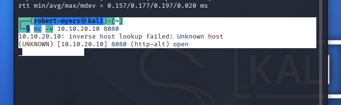

While that connection was open, one `ss` command on Yoda showed both sockets:

```text
ss -tanp 'sport = :8080'
LISTEN  10.10.20.10:8080  0.0.0.0:*            users:(("python3",pid=2364379,fd=3))
ESTAB   10.10.20.10:8080  10.10.20.103:51868   users:(("python3",pid=2364379,fd=4))
```

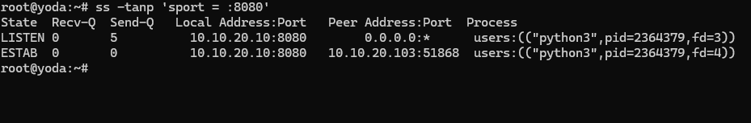

One process, two sockets, at the same moment:

- **fd 3** is the listening socket, still waiting for new clients.
- **fd 4** is the conversation with Kali on source port `51868`.

This is what the original screenshot 01 was supposed to show and didn't.

## Connection 1 — Held Open, No Data
I left the connection idle, then closed it from Kali with Ctrl+C. The capture stopped at 6 packets, 0 dropped.

| Time | Direction | Flags | Seq / Ack |
|---|---|---|---|
| 13:59:46.395 | Kali → Yoda | `S` | seq 3348818357 |
| 13:59:46.395 | Yoda → Kali | `S.` | ack 3348818358 |
| 13:59:46.395 | Kali → Yoda | `.` | ack 1 |
| 14:03:27.150 | Kali → Yoda | `F.` | seq 1, ack 1 |
| 14:03:27.150 | Yoda → Kali | `F.` | seq 1, ack 2 |
| 14:03:27.150 | Kali → Yoda | `.` | ack 2 |

- Yoda acknowledged Kali's initial sequence number plus one, because the SYN consumes a sequence number.
- The connection stayed established for 3 minutes 41 seconds with no packets at all. An idle TCP connection sends nothing unless the application turns on keepalives. A capture that started after 13:59:46 would have seen only the teardown.
- Kali closed first, and Yoda answered with its ACK and its own FIN in one segment. That makes three segments, the same pattern as the original test. Kali, as the side that closed first, entered `TIME-WAIT`.

After the teardown I checked the server again. The listening socket was still open and still owned by the same process:

```text
ss -tlnp | grep 8080
LISTEN 0  5  10.10.20.10:8080  0.0.0.0:*  users:(("python3",pid=2364379,fd=3))

ps -o pid,lstart,args -p 2364379
2364379 Mon Oct 5 13:58:52 2026 python3 -m http.server 8080 --bind 10.10.20.10
```

The server closed its connection socket, but not its listener. Plain `nc -l` could not do that.

## Connection 2 — Data in Both Directions
Because the listener was still up, I ran a second capture to get data moving both ways:

```text
tcpdump -i vmbr0 -nn -c 20 -w /root/net002-retest-02.pcap 'host 10.10.20.103 and tcp port 8080'
curl -v -o /dev/null http://10.10.20.10:8080/
```

`curl` reported an HTTP/1.0 `200 OK` with `Content-Length: 657`, and noted that HTTP/1.0 closes the connection after the body. The capture stopped at 11 packets, 0 dropped.

Before reading the capture back, I worked out the byte counts from the request and response headers. The capture matched:

| Expected | Observed |
|---|---|
| GET request = 80 bytes, Kali `seq 1:81` | `[P.] seq 1:81, length 80` |
| Yoda acknowledges with `ack 81` | `[.] ack 81` |
| Response headers = 155 bytes | `[P.] seq 1:156, length 155` |
| Body = 657 bytes, Yoda data ends at 813 | `[FP.] seq 156:813, length 657` |
| Kali final acknowledgment = 814 | `[.] ack 814` |

| Direction | Flags | Seq / Ack | Length |
|---|---|---|---|
| Kali → Yoda | `S` | seq 711813585 | 0 |
| Yoda → Kali | `S.` | seq 1154959097, ack 711813586 | 0 |
| Kali → Yoda | `.` | ack 1 | 0 |
| Kali → Yoda | `P.` | seq 1:81, ack 1 | 80 (GET) |
| Yoda → Kali | `.` | ack 81 | 0 |
| Yoda → Kali | `P.` | seq 1:156, ack 81 | 155 (headers) |
| Yoda → Kali | `FP.` | seq 156:813, ack 81 | 657 (body + FIN) |
| Kali → Yoda | `.` | ack 156 | 0 |
| Kali → Yoda | `.` | ack 814 | 0 |
| Kali → Yoda | `F.` | seq 81, ack 814 | 0 |
| Yoda → Kali | `.` | ack 82 | 0 |

The whole exchange took about 2.2 ms.

**Independent sequence spaces.** Each side counted only its own bytes, and each side's ACK referred to the other side's count:

```text
Kali seq:  1 -> 81 -> 82
Yoda seq:  1 -> 156 -> 813 -> 814
```

**FIN on the data segment.** Yoda set FIN on the same segment that carried the last 657 bytes of the body (`[FP.]`). The data ended at 813 and the FIN consumed one more sequence number, which is why Kali's final ACK was 814.

**Server-initiated close.** HTTP/1.0 closes after the response, so this time Yoda closed first and was the side that entered `TIME-WAIT`. The packet order shows this. I did not capture it in Yoda's socket table, because the 60-second `TIME-WAIT` period had passed by the time I checked.

## Ephemeral Ports
Kali's range is the same as ENVY's:

```text
net.ipv4.ip_local_port_range = 32768    60999
```

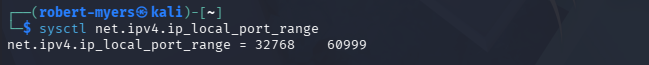

Both source ports Kali picked in the re-test, `51868` and `35920`, are inside that range.

## Cleanup
`http.server` serves the directory it was started from, which on Yoda was `/root`. I stopped it with `kill 2364379` as soon as the captures were done, and `ss -tlnp | grep 8080` came back empty.

## Re-test Comparison
| | Original | Connection 1 | Connection 2 |
|---|---|---|---|
| Client | ENVY | Kali | Kali |
| Server | `nc -l` | `http.server` | `http.server` |
| LISTEN and ESTAB shown together | No | Yes, same PID | Listener confirmed still open afterward |
| Data sent by client | 10 bytes, then 1 | None | 80 bytes |
| Data sent by server | None | None | 812 bytes |
| Both sequence numbers advanced | No | No | Yes |
| Side that closed first | Client | Client | Server |
| `TIME-WAIT` on | ENVY (socket table) | Kali (from packets) | Yoda (from packets) |

## Re-test Evidence Limits
- `TIME-WAIT` in the re-test is shown by packet order only, not by a socket table.

## Evidence Handling
The two UDP PCAPs are retained locally under `evidence/raw/`, which is excluded from version control.

The two re-test PCAPs are kept on Yoda and are not published. The re-test summaries are `tcpdump -nn -r` readbacks written without `-e`, so they contain no MAC addresses.

Public evidence consists of TShark-derived Layer 3/4 summaries and screenshots required to support the findings. Persistent Layer 2 identifiers and unrelated raw packet data are not published when unnecessary to the hiring claim.

## Evidence Index
| Evidence | Purpose |
|---|---|
| `01-yoda-listen-and-established-sockets.png` | Yoda TCP/8080 `LISTEN` socket and an `ESTAB` socket, from different `nc` runs |
| `02-envy-tcp-established-socket.png` | ENVY TCP client socket and four-tuple |
| `03-tcp-handshake-data-ack-sequence.png` | TCP establishment, payload sequence range, ACK behavior |
| `04-yoda-received-tcp-payload.png` | Application data received by Yoda |
| `05-tcp-fin-teardown-sequence.png` | Three-segment FIN/ACK teardown |
| `06-envy-tcp-teardown-state.png` | ENVY `TIME-WAIT` after client-initiated close |
| `07-yoda-udp-9090-listener.png` | UDP socket in `UNCONN` state |
| `08-yoda-received-udp-payload.png` | UDP payload received by Yoda |
| `09-udp-single-datagram-no-session.png` | One UDP datagram and no persistent client session |
| `10-udp-closed-port-icmp-unreachable.png` | Closed UDP port and ICMP Port Unreachable |
| `12-kali-client-connected.png` | Re-test: Kali connected to Yoda TCP/8080 and holding the connection open |
| `13-yoda-listen-and-estab-same-pid.png` | Re-test: `LISTEN` and `ESTAB` from one `ss` command, same `python3` PID |
| `15-envy-ephemeral-port-range.png` | ENVY ephemeral-port range, captured October 5, 2026 |
| `16-kali-ephemeral-port-range.png` | Kali ephemeral-port range, re-test client |
| `udp-open-port-summary.txt` | TShark-derived open-port UDP evidence |
| `udp-closed-port-summary.txt` | TShark-derived closed-port UDP/ICMP evidence |
| `net002-retest-01-summary.txt` | Re-test connection 1: handshake, 3m41s idle, client-initiated teardown |
| `net002-retest-02-summary.txt` | Re-test connection 2: data both directions, FIN on data segment, server-initiated close |

## Status
**PROVEN**

TCP and UDP behavior was generated on the physical lab network, validated through operating-system socket state and packet evidence, compared directly, and documented with focused public evidence. The October 5 re-test showed `LISTEN` and `ESTAB` together under one process, a bounded capture with its full command, data in both directions, and a server-initiated close.
