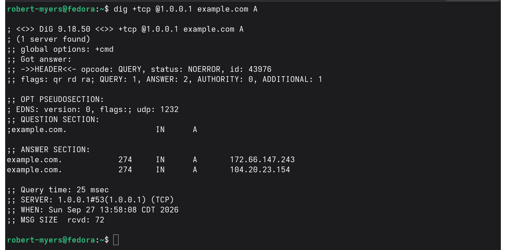
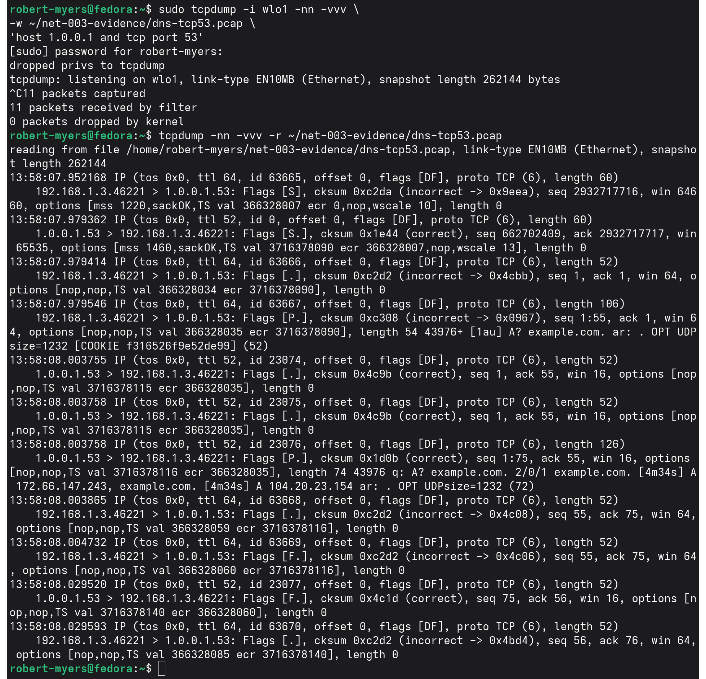
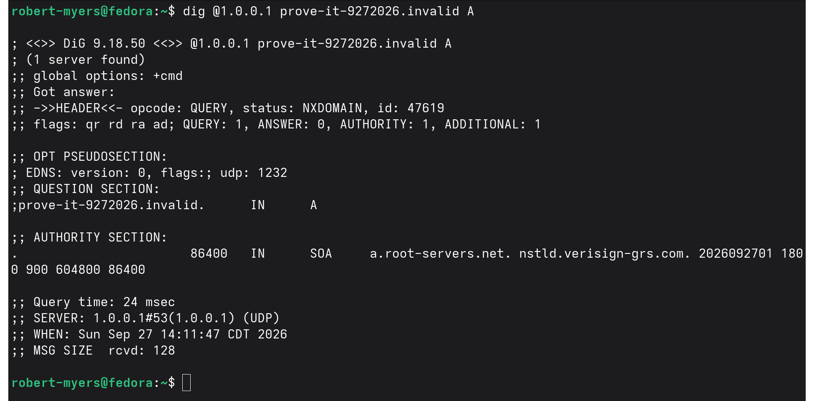
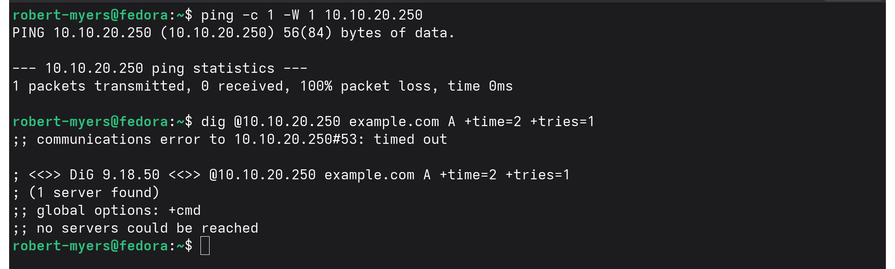

# NET-003 — DNS Resolution and Troubleshooting

## Hiring Claim
This artifact demonstrates that I can trace DNS resolution across a dual-homed Linux host, analyze DNS over UDP and TCP, interpret resolver behavior and common response states, and distinguish name-resolution failures from reachability failures using packet and host evidence.

## Skills Demonstrated
- DNS troubleshooting and packet analysis
- `systemd-resolved` / local stub analysis
- Multi-interface resolver-path analysis
- UDP/53 and TCP/53
- A, AAAA, CNAME, MX, TXT, NS, and SOA interpretation
- NXDOMAIN vs NOERROR/empty-answer reasoning
- DNS timeout troubleshooting
- TTL/cache analysis
- `dig`, `resolvectl`, `ip route`, `tcpdump`, and TShark
- TCP sequence/ACK analysis applied to DNS

## Environment
ENVY was dual-homed during testing.

| Link | Address | DNS |
|---|---|---|
| Wi-Fi (`wlo1`) | `192.168.1.3` | `1.1.1.1`, `1.0.0.1` |
| Lab Ethernet | `10.10.20.101` | `10.10.20.1`, domain `lan` |

`/etc/resolv.conf` pointed applications to the local `systemd-resolved` stub at `127.0.0.53`.

## Normal Resolution Through the Local Stub
A normal `dig example.com` query reported `SERVER: 127.0.0.53#53 (UDP)`. That proves the application queried the local stub, but not which upstream resolver was used.

The packet capture exposed the path. The sanitized extraction is in `evidence/dns-normal-resolution-summary.txt`.

For the A lookup:

```text
Application: 127.0.0.1:44308 -> 127.0.0.53:53
Lab path:    10.10.20.101:49642 -> 10.10.20.1:53
Wi-Fi path:  192.168.1.3:35762 -> 1.0.0.1:53
```

Both upstream resolvers returned `172.66.147.243` and `104.20.23.154`. The lab-side response arrived first and the local stub returned the answer to the application; the Cloudflare response also arrived.

A later AAAA query repeated the dual-upstream behavior through `10.10.20.1` and `1.0.0.1`.

### Finding
Route metrics alone did not explain DNS behavior. `systemd-resolved` had both links available for DNS, and packet evidence showed queries over both paths.

## Direct Resolver Validation
Direct queries bypassed the stub:

```text
dig @10.10.20.1 example.com A  -> 10.10.20.1#53 (UDP)
dig @1.0.0.1 example.com A     -> 1.0.0.1#53 (UDP)
```

Route lookup confirmed:

```text
10.10.20.1 dev lab-Ethernet src 10.10.20.101
1.0.0.1 via 192.168.1.1 dev wlo1 src 192.168.1.3
```

This separated the application-facing stub, upstream resolver behavior, and direct resolver queries governed by routing.

## DNS over TCP/53
A DNS query was deliberately forced over TCP:

```text
dig +tcp @1.0.0.1 example.com A
```

The result explicitly showed `SERVER: 1.0.0.1#53 (TCP)`.



The 11-packet capture demonstrated SYN/SYN-ACK/ACK establishment, a DNS query, a DNS response, acknowledgments, and FIN teardown.



The sanitized packet evidence is in `evidence/dns-tcp53-summary.txt`.

The DNS query carried 54 bytes of TCP payload at relative `seq 1`; the resolver acknowledged `55`. The DNS response carried 74 bytes and the client acknowledged `75`. During teardown, FIN advanced the client sequence from `55` to `56` and the server sequence from `75` to `76`.

### Finding
DNS is not limited to UDP/53. This controlled test carried the complete DNS request and response inside a TCP/53 connection and applied the TCP sequence/ACK behavior demonstrated in NET-002 to an application protocol.

## DNS Record Investigation
Direct queries were used to examine common records:

| Record | Meaning |
|---|---|
| A | IPv4 address |
| AAAA | IPv6 address |
| CNAME | Canonical-name alias |
| MX | Mail exchanger |
| TXT | Text associated with a DNS name, often policy/verification |
| NS | Authoritative name servers |
| SOA | Zone authority and administrative parameters |

A `google.com` investigation returned multiple A/AAAA addresses, an MX target, NS records, and TXT records including SPF and service/domain-verification data. A direct `www.google.com CNAME` query returned no CNAME result, so no alias was inferred.

## Negative DNS Answers

### NOERROR with No Answer
A deliberately nonexistent hostname under `example.com` returned:

```text
status: NOERROR
ANSWER: 0
AUTHORITY: 1
```

The response included the zone SOA. DNS successfully processed the request but did not return the requested record.

### NXDOMAIN
A query under the reserved `.invalid` namespace returned:

```text
status: NXDOMAIN
ANSWER: 0
AUTHORITY: 1
```



The resolver was reachable and returned a valid negative DNS response. NXDOMAIN therefore does not mean that DNS itself is unavailable.

## DNS Server Timeout
A controlled unused lab address (`10.10.20.250`) was queried directly with a two-second timeout and one attempt. No DNS response was received:

```text
communications error to 10.10.20.250#53: timed out
no servers could be reached
```



The preceding ping also received no reply, but ping failure alone was not treated as proof that a host was absent because ICMP can be filtered.

| Condition | DNS response? | Interpretation |
|---|---:|---|
| Successful answer | Yes | Requested data returned |
| NOERROR / empty answer | Yes | Query processed, requested data not returned |
| NXDOMAIN | Yes | Queried name does not exist |
| Timeout | No | No DNS response before timeout |

## TTL and Local Cache Observation
After flushing `systemd-resolved` caches, a first `example.net` query through `127.0.0.53` took 22 ms. An immediate second query through the same stub took 0 ms, behavior consistent with local caching.

System-wide cache counters also changed, but they include unrelated host DNS activity and were not attributed solely to the controlled queries. Returned TTL values were not treated as a simple single-cache countdown because multiple upstream paths and distributed recursive infrastructure were involved.

## Background Traffic and Scope
The broad `port 53` capture also contained unrelated DNS traffic generated by Fedora and applications. The controlled transaction was isolated by query name and correlated using addresses, ports, DNS transaction IDs, timestamps, and responses.

A capture filter defines what is collected; it does not automatically define which packets belong to the investigation.

## Checksum-Offload Observation
Some outbound packets appeared in local capture with an incorrect checksum while corresponding inbound traffic showed valid checksums. This was not treated as malformed DNS traffic because locally captured outbound packets may be observed before NIC checksum offload completes calculation.

## Evidence Handling
Original PCAPs remain local under `evidence/raw/` and are excluded from version control. Public packet evidence is TShark-derived and limited to fields needed to support the findings.

## Evidence Index
| Evidence | Purpose |
|---|---|
| `01-dns-tcp53-full-transaction.png` | Complete DNS-over-TCP transaction |
| `02-dig-forced-tcp53-result.png` | Application proof of TCP/53 |
| `03-dns-nxdomain-response.png` | Valid NXDOMAIN response |
| `04-dns-server-timeout.png` | No-response DNS failure |
| `dns-normal-resolution-summary.txt` | Stub and dual-upstream A/AAAA evidence |
| `dns-tcp53-summary.txt` | TCP handshake, DNS payload, ACK, and teardown evidence |

## Status
**PROVEN**

DNS resolution was traced from application to local stub and upstream resolvers; UDP and TCP transport behavior was validated; record and response semantics were investigated; and negative-answer versus no-response failures were distinguished using host and packet evidence.
