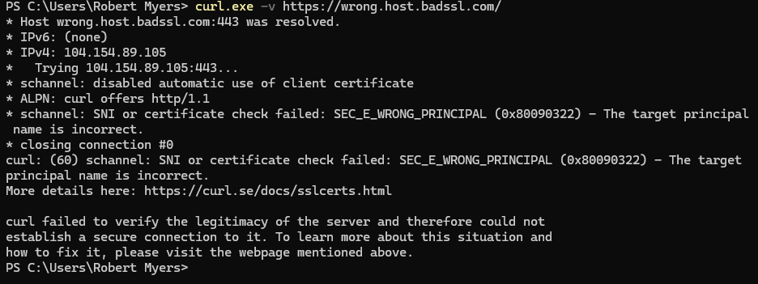
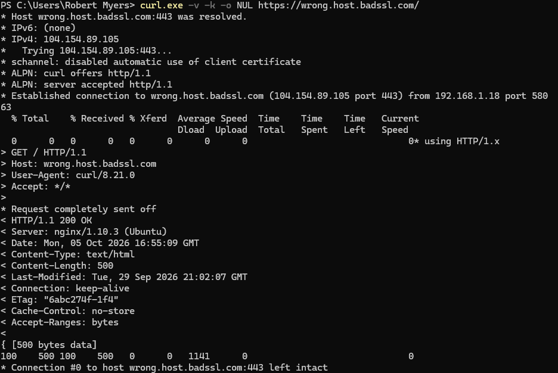

# NET-004 — HTTP/TLS Traffic Analysis

## Hiring Claim
> After reviewing this artifact, a hiring manager has evidence that I can trace an HTTPS transaction from the TCP handshake through TLS 1.3 negotiation, certificate validation, encrypted HTTP, and teardown, and tell a server-side TLS rejection apart from a client-side certificate rejection.

## Skills Demonstrated
- HTTPS/TLS traffic analysis
- TCP/443 lifecycle analysis
- TLS ClientHello, SNI, ALPN, cipher suites, and JA3
- X.509 certificate validation
- HTTP request/response validation
- TLS troubleshooting
- `curl`, OpenSSL, `tcpdump`, and TShark
- Privacy-conscious evidence publication

## Environment
| Host | OS / TLS library | Address used | Tests |
|---|---|---|---|
| ENVY | Fedora, curl 8.18.0 with OpenSSL | `192.168.1.3` (household Wi-Fi) | Successful HTTPS transaction, capture, certificate check, server-side failure (September 27, 2026) |
| Victus | Windows 11, `curl.exe` 8.21.0 with Schannel | `192.168.1.18` (household Wi-Fi) | Client-side certificate rejection (October 5, 2026) |

At the time of the original test, ENVY was dual-homed on the lab network and household Wi-Fi (see NET-003 and NET-005). Screenshot 01 shows the connection established `from 192.168.1.3 port 47580`, so this traffic left through the household Wi-Fi side, not the lab.

## Scenario
ENVY/Fedora generated a controlled HTTPS transaction to `example.com`. The original capture is retained locally as `evidence/raw/https-example-full.pcap`; public evidence contains only focused screenshots and TShark-derived summaries.

## End-to-End HTTPS Transaction
The successful `curl` transaction demonstrated destination selection, TCP/443 establishment, TLS 1.3 negotiation, certificate verification, an HTTP/1.1 request carried inside TLS, and an HTTP `200 OK` response.


```text
DNS
  -> route/destination selection
  -> TCP/443 handshake
  -> TLS ClientHello / ServerHello
  -> certificate validation
  -> encrypted HTTP request/response
  -> TCP teardown
```

## Packet-Level Lifecycle
The controlled conversation was isolated as frames 206–228. The public machine-derived evidence is `evidence/tls-lifecycle-summary.txt`.

```text
206 Client -> Server  SYN
207 Server -> Client  SYN/ACK
208 Client -> Server  ACK
209      Client -> Server  TLS ClientHello, SNI=example.com
211-217  Server -> Client  Server handshake flight: ServerHello and Change Cipher Spec
                           (211), then encrypted handshake records (213, 215, 217)
219      Client -> Server  Change Cipher Spec + client Finished (encrypted)
220      Client -> Server  Encrypted record, consistent with the HTTP GET
222-223  Server -> Client  Encrypted records after the request (session tickets and
                           HTTP response, per curl's output)
226      Client -> Server  FIN/ACK
227 Server -> Client  FIN/ACK
228 Client -> Server  ACK
```


HTTPS therefore operates above an established TCP connection rather than replacing TCP.

Correction (October 5, 2026): I originally treated frame 217 onward as application traffic. In TLS 1.3, everything the server sends after ServerHello is encrypted, including EncryptedExtensions, Certificate, CertificateVerify, and Finished. Wireshark can't see inside those records, so it labels them `Application Data`, which is what frame 217 shows in screenshot 02. Frames 211, 213, 215, and 217 carry 1448 + 1448 + 1448 + 740 = 5,084 bytes from the server before the client's next record, and curl's verbose output in screenshot 01 lists ServerHello, Change Cipher Spec, Encrypted Extensions, Certificate, CERT verify, and Finished all arriving before the client sends its own Finished. That fits 211-217 being the server's handshake flight, not HTTP data. The roles I gave frames 219-223 come from their order and direction lined up against curl's output; I can't read the encrypted contents to confirm them.

## TLS ClientHello
Frame 209 was extracted to `evidence/tls-clienthello-summary.txt`.

Observed values:

```text
Source:       192.168.1.3:47580
Destination:  172.66.147.243:443
SNI:          example.com
Versions:     0x0304, 0x0303
ALPN:         http/1.1
JA3:          42cb4ba4c818da3ce6424cb212377c24
```

`0x0304` represents TLS 1.3 and `0x0303` TLS 1.2. The ClientHello also advertised multiple cipher suites.

These values represent client capabilities/preferences; they are not proof that every offered version or cipher was used.

### SNI
The ClientHello exposed `example.com` through Server Name Indication. This lets a server hosting multiple TLS names select the appropriate virtual host/certificate early in the handshake.

### ALPN
The ClientHello advertised `http/1.1`, identifying the application protocol intended to run inside TLS.

### JA3
TShark calculated JA3 `42cb4ba4c818da3ce6424cb212377c24`. JA3 can support traffic classification and investigation, but it is an indicator rather than unique proof of a specific application or actor.

## Negotiated TLS
The successful application and certificate evidence showed TLS 1.3 with `TLS_AES_256_GCM_SHA384`. The packet lifecycle also shows the server-side handshake dissected as TLS 1.3.

This is kept separate from the ClientHello's offered capabilities. A ClientHello can contain legacy-compatible fields while newer versions are offered through extensions.

## Certificate and Identity Validation


Screenshot 03 is from a separate `openssl s_client` session. Its first line shows `Connecting to 104.20.23.154`, the other `example.com` address, while the curl transaction and the capture used `172.66.147.243`. That session also got `Peer certificate: CN=example.com` and `Verification: OK`. The second command in 03 connects to `example.com:443` by name, and the screenshot doesn't show which address it used. Its issuer and validity dates match what curl reported in screenshot 01.

The validation evidence includes successful verification, subject/issuer information, validity dates, SAN coverage for `example.com` and `*.example.com`, and negotiated TLS/cipher information.

HTTPS identity validation therefore depends on more than reaching an IP address; the hostname used by the client must be compatible with the certificate identity.

## Encrypted Application Traffic
After the handshake, the HTTP request and response travel as encrypted TLS 1.3 records. In the capture these look the same as the encrypted handshake records: Wireshark labels both `Application Data`.

A passive capture can still expose metadata such as addresses, ports, timing, TCP flags, record sizes, direction, and some handshake metadata such as SNI. The ordinary packet capture does not expose the HTTP content once it is carried as encrypted TLS application data.

`curl`, as an endpoint of the TLS session, can display the HTTP request/response because it has access to decrypted application data. This distinguishes endpoint visibility from passive network visibility.

## Controlled TLS Failure


To see what a TLS failure looks like when the network path is fine, I used curl's `--resolve` option to send a hostname that doesn't exist, `wrong.example`, to example.com's real address, `104.20.23.154`. The first line of the output shows the override: `Added wrong.example:443:104.20.23.154 to DNS cache`.

**Expected:** TCP connects, then TLS fails because the name doesn't belong to that server.
**Observed:**

```text
* TLSv1.3 (OUT), TLS handshake, Client hello (1):
* TLSv1.3 (IN), TLS alert, handshake failure (552):
curl: (35) TLS connect error: error:0A000410:SSL routines::ssl/tls alert handshake failure
```

**Analysis:** TCP/443 connected and curl sent its ClientHello with SNI `wrong.example`. The server answered with a `handshake_failure` alert and closed the connection. It never sent a certificate, so curl never got to certificate validation.

That makes this a server-side rejection. The Cloudflare edge at that address doesn't serve `wrong.example`, so it refused the handshake on the SNI alone. A client-side certificate mismatch looks different: the handshake completes, the server sends its certificate, and curl rejects it with an error like `no alternative certificate subject name matches target host name`.

The troubleshooting lesson is:

```text
IP reachability can succeed
TCP/443 can be reachable
TLS can still fail
```

A working route and open TCP port do not guarantee a successful HTTPS transaction. TLS adds identity, protocol, and cryptographic requirements above TCP connectivity.

### Client-Side Certificate Rejection — October 5, 2026

The test above failed on the server side. To see the other kind of failure, where the server finishes its part and the client refuses the certificate, I ran a second test from Victus (Windows). Fedora no longer has internet access after the NET-008 changes.

The target was `wrong.host.badssl.com`, a public test site. badssl.com documents this host as set up so the certificate it serves doesn't cover that name. I didn't capture the certificate's contents, so I'm relying on the site's description and the error below, not on certificate evidence of my own.

**Step 1: normal request**

```powershell
curl.exe -v https://wrong.host.badssl.com/
```

```text
curl: (60) schannel: SNI or certificate check failed: SEC_E_WRONG_PRINCIPAL (0x80090322) - The target principal name is incorrect.
```



Windows curl uses Schannel, so the wording is different from the OpenSSL errors on Fedora. Schannel's message says "SNI or certificate", so on its own it doesn't say which one failed.

**Step 2: same request, certificate verification skipped**

```powershell
curl.exe -v -k -o NUL https://wrong.host.badssl.com/
```

```text
* ALPN: server accepted http/1.1
* Established connection to wrong.host.badssl.com (104.154.89.105 port 443) ...
< HTTP/1.1 200 OK
```



The only change was `-k`, which skips certificate verification. With it, the TLS session completed and the server returned `200 OK`. So the server accepted the name and did its part. The failure in step 1 was my client rejecting the certificate because the name didn't match. `-k` is only for proving the cause in a test. On a real connection it removes the protection against impersonation.

### Two TLS Failures Compared

| | Server-side rejection (Fedora) | Client-side rejection (Victus) |
|---|---|---|
| Name sent | `wrong.example` to example.com's address | `wrong.host.badssl.com` |
| What happened | Server sent a `handshake_failure` alert and closed | Server sent its certificate; the client refused it |
| Certificate received | No | Yes (implied by the name error) |
| curl exit code | `35`, TLS connect error | `60`, certificate verification error |
| Works with `-k` | Not tested | Yes, `200 OK` |
| Where to fix it | Server: it doesn't serve that name | Name or certificate: the cert doesn't cover that name |

The exit code is the quickest tell. `35` is curl's TLS connect error; here it came from the server's alert before any certificate arrived. `60` means the certificate was received and failed verification.

## Relationship to Earlier Proof
```text
NET-001  Ethernet / ARP / switching
    ->
NET-002  TCP / UDP / sockets / ACKs / teardown
    ->
NET-003  DNS / resolver paths / UDP+TCP 53
    ->
NET-004  HTTPS / TLS / certificates / encrypted application traffic
```

NET-004 applies the TCP lifecycle from NET-002 to a real encrypted application protocol and follows the DNS work established in NET-003.

## Evidence Limits
- Screenshots 03 and 04 are cropped. The `openssl s_client` connect command that produced the top of 03 and the full curl command for 04 (including `--resolve`) aren't shown; only their output is. The `--resolve` override is shown by curl's `Added wrong.example:443:104.20.23.154 to DNS cache` line.
- I didn't run the `wrong.example` test with `-k`.
- I didn't capture packets for either failure test, and I didn't capture the `wrong.host.badssl.com` certificate.
- Frame roles after the ClientHello are based on direction, size, and order lined up with curl's output, not on decrypted contents.

## Evidence Handling
The original capture contains substantially more traffic than the controlled HTTPS conversation and remains local under `evidence/raw/`, which is excluded from version control.

Public packet evidence is TShark-derived and limited to the controlled conversation. Persistent Layer-2 identifiers and unrelated captured traffic are not required for the hiring claim and are not published.

## Evidence Index
| Evidence | Purpose |
|---|---|
| `01-curl-https-tls-http-transaction.png` | Successful HTTPS transaction and HTTP `200 OK` |
| `02-tls-packet-lifecycle.png` | TCP handshake, TLS records, and teardown |
| `03-tls-certificate-sni-validation.png` | TLS/cipher and X.509 identity validation |
| `04-tls-handshake-failure.png` | Server-side SNI rejection, `curl: (35)` |
| `05-victus-client-cert-name-rejected.png` | Client-side certificate name rejection, `curl: (60)` |
| `06-victus-same-request-verification-skipped.png` | Same request with `-k` completes with `200 OK` |
| `tls-lifecycle-summary.txt` | TShark-derived TCP/TLS lifecycle |
| `tls-clienthello-summary.txt` | SNI, offered versions/ciphers, ALPN, and JA3 |

## Status
**PROVEN**

The successful transaction is backed by curl output, a TShark lifecycle extraction, and a ClientHello extraction, and both failure types are shown in curl output. The limits above are about cropped commands and frame roles I inferred, not missing results.

A complete HTTPS transaction was traced through transport establishment, TLS negotiation, certificate validation, encrypted application traffic, and teardown. Observable ClientHello metadata was extracted, endpoint-versus-network visibility was distinguished, and two TLS failures were diagnosed above the TCP layer: a server-side SNI rejection and a client-side certificate name rejection.
