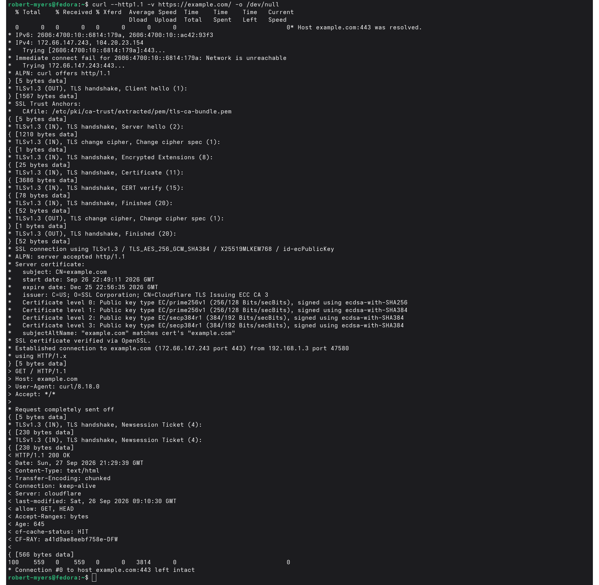
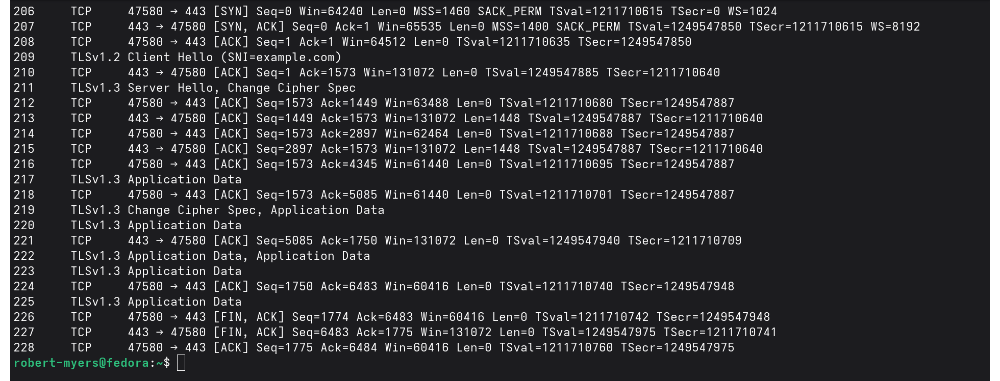
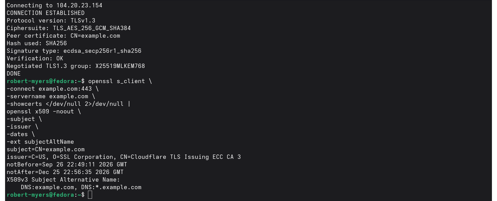
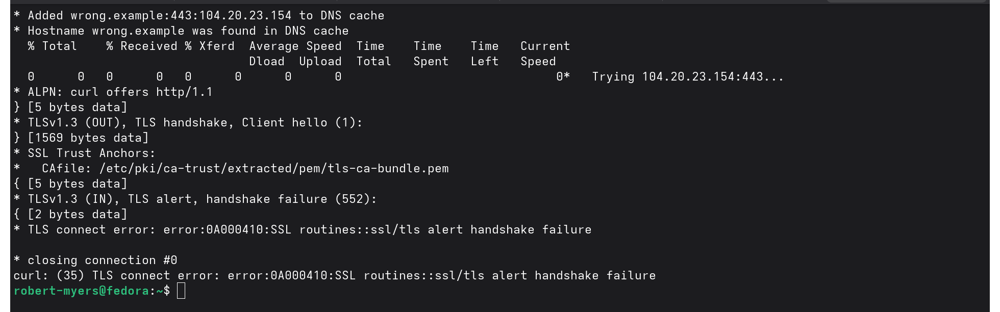

# NET-004 — HTTP/TLS Traffic Analysis

## Hiring Claim
This artifact demonstrates that I can trace an HTTPS transaction from TCP establishment through TLS negotiation, certificate validation, encrypted application traffic, and teardown, then troubleshoot a controlled TLS handshake failure.

## Skills Demonstrated
- HTTPS/TLS traffic analysis
- TCP/443 lifecycle analysis
- TLS ClientHello, SNI, ALPN, cipher suites, and JA3
- X.509 certificate validation
- HTTP request/response validation
- TLS troubleshooting
- `curl`, OpenSSL, `tcpdump`, and TShark
- Privacy-conscious evidence publication

## Scenario
ENVY/Fedora generated a controlled HTTPS transaction to `example.com`. The original capture is retained locally as `evidence/raw/https-example-full.pcap`; public evidence contains only focused screenshots and TShark-derived summaries.

## End-to-End HTTPS Transaction
The successful `curl` transaction demonstrated destination selection, TCP/443 establishment, TLS 1.3 negotiation, certificate verification, an HTTP/1.1 request carried inside TLS, and an HTTP `200 OK` response.



```text
DNS
  -> route/destination selection
  -> TCP/443 handshake
  -> TLS ClientHello / ServerHello
  -> certificate validation
  -> encrypted HTTP request/response
  -> TCP teardown
```

## Packet-Level Lifecycle
The controlled conversation was isolated as frames 206–228. The public machine-derived evidence is `evidence/tls-lifecycle-summary.txt`.

```text
206 Client -> Server  SYN
207 Server -> Client  SYN/ACK
208 Client -> Server  ACK
209 Client -> Server  TLS ClientHello, SNI=example.com
211 Server -> Client  TLS handshake response
217+                  TLS 1.3 encrypted records
226 Client -> Server  FIN/ACK
227 Server -> Client  FIN/ACK
228 Client -> Server  ACK
```



HTTPS therefore operates above an established TCP connection rather than replacing TCP.

## TLS ClientHello
Frame 209 was extracted to `evidence/tls-clienthello-summary.txt`.

Observed values:

```text
Source:       192.168.1.3:47580
Destination:  172.66.147.243:443
SNI:          example.com
Versions:     0x0304, 0x0303
ALPN:         http/1.1
JA3:          42cb4ba4c818da3ce6424cb212377c24
```

`0x0304` represents TLS 1.3 and `0x0303` TLS 1.2. The ClientHello also advertised multiple cipher suites.

These values represent client capabilities/preferences; they are not proof that every offered version or cipher was used.

### SNI
The ClientHello exposed `example.com` through Server Name Indication. This lets a server hosting multiple TLS names select the appropriate virtual host/certificate early in the handshake.

### ALPN
The ClientHello advertised `http/1.1`, identifying the application protocol intended to run inside TLS.

### JA3
TShark calculated JA3 `42cb4ba4c818da3ce6424cb212377c24`. JA3 can support traffic classification and investigation, but it is an indicator rather than unique proof of a specific application or actor.

## Negotiated TLS
The successful application and certificate evidence showed TLS 1.3 with `TLS_AES_256_GCM_SHA384`. The packet lifecycle also shows the server-side handshake dissected as TLS 1.3.

This is kept separate from the ClientHello's offered capabilities. A ClientHello can contain legacy-compatible fields while newer versions are offered through extensions.

## Certificate and Identity Validation


The validation evidence includes successful verification, subject/issuer information, validity dates, SAN coverage for `example.com` and `*.example.com`, and negotiated TLS/cipher information.

HTTPS identity validation therefore depends on more than reaching an IP address; the hostname used by the client must be compatible with the certificate identity.

## Encrypted Application Traffic
After negotiation, the capture shows TLS 1.3 records carrying application data.

A passive capture can still expose metadata such as addresses, ports, timing, TCP flags, record sizes, direction, and some handshake metadata such as SNI. The ordinary packet capture does not expose the HTTP content once it is carried as encrypted TLS application data.

`curl`, as an endpoint of the TLS session, can display the HTTP request/response because it has access to decrypted application data. This distinguishes endpoint visibility from passive network visibility.

## Controlled TLS Failure


A separate test deliberately produced a hostname/SNI-related TLS failure while targeting an HTTPS endpoint.

The troubleshooting lesson is:

```text
IP reachability can succeed
TCP/443 can be reachable
TLS can still fail
```

A working route and open TCP port do not guarantee a successful HTTPS transaction. TLS adds identity, protocol, and cryptographic requirements above TCP connectivity.

## Relationship to Earlier Proof
```text
NET-001  Ethernet / ARP / switching
    ->
NET-002  TCP / UDP / sockets / ACKs / teardown
    ->
NET-003  DNS / resolver paths / UDP+TCP 53
    ->
NET-004  HTTPS / TLS / certificates / encrypted application traffic
```

NET-004 applies the TCP lifecycle from NET-002 to a real encrypted application protocol and follows the DNS work established in NET-003.

## Evidence Handling
The original capture contains substantially more traffic than the controlled HTTPS conversation and remains local under `evidence/raw/`, which is excluded from version control.

Public packet evidence is TShark-derived and limited to the controlled conversation. Persistent Layer-2 identifiers and unrelated captured traffic are not required for the hiring claim and are not published.

## Evidence Index
| Evidence | Purpose |
|---|---|
| `01-curl-https-tls-http-transaction.png` | Successful HTTPS transaction and HTTP `200 OK` |
| `02-tls-packet-lifecycle.png` | TCP handshake, TLS records, and teardown |
| `03-tls-certificate-sni-validation.png` | TLS/cipher and X.509 identity validation |
| `04-tls-handshake-failure.png` | Controlled TLS failure/troubleshooting |
| `tls-lifecycle-summary.txt` | TShark-derived TCP/TLS lifecycle |
| `tls-clienthello-summary.txt` | SNI, offered versions/ciphers, ALPN, and JA3 |

## Status
**PROVEN**

A complete HTTPS transaction was traced through transport establishment, TLS negotiation, certificate validation, encrypted application traffic, and teardown. Observable ClientHello metadata was extracted, endpoint-versus-network visibility was distinguished, and a controlled TLS failure was diagnosed above the TCP layer.
