# NET-005 — Routing and Path Selection

## Hiring Claim

> After reviewing this artifact, a hiring manager has evidence that I can read a Linux routing table on a dual-homed host, apply longest-prefix match and route metrics to explain which path the kernel picks, override that choice with a static host route, confirm with `tcpdump` which interface the traffic actually left on, and remove the change afterward.

## Skills Demonstrated

- Linux routing-table analysis
- Connected vs default routes
- Longest-prefix match
- Route metric comparison
- Static host routes
- Dual-homed path selection
- Source-address selection (from `ip route get`)
- Packet-path validation with tcpdump
- Neighbor/next-hop validation
- Controlled change and restoration
- Fault isolation with a capture point chosen to show where traffic stops
- Per-interface forwarding and ICMP redirect analysis on Linux

## Environment

ENVY was dual-homed during testing.

| Interface | Address | Network |
|---|---|---|
| `enp0s20f0u3u3c2` | `10.10.20.101/24` | Lab |
| `wlo1` | `192.168.1.3/24` | Household/Internet |

The routing table contained two default routes:

```text
default via 192.168.1.1 dev wlo1 metric 600
default via 10.10.20.1 dev enp0s20f0u3u3c2 metric 20100
```

It also contained directly connected routes for both local networks.

The lab default carries metric `20100`. NetworkManager adds 20000 to a default route's metric when its connectivity check fails (documented in NET-008), and the lab network has no internet egress by design: the ER605 rule `DENY_Lab_to_Any` blocks lab-to-WAN traffic (LAB-001; NET-008 evidence 24, `24-er605-acl-rules-before.png`). A base metric of 100 plus that penalty is consistent with ENVY's lab link failing its connectivity check, but I didn't capture NetworkManager's connectivity state here.

## Experiment 1 — Connected Route vs Default Route

For Yoda (`10.10.20.10`), Linux selected:

```text
10.10.20.10 dev enp0s20f0u3u3c2 src 10.10.20.101
```

The `10.10.20.0/24` connected route was more specific than either `/0` default route.

For `1.1.1.1`, neither connected `/24` matched, leaving the two `/0` routes to compete. Because their prefix lengths were equal, the lower metric selected Wi-Fi:

```text
1.1.1.1 via 192.168.1.1 dev wlo1 src 192.168.1.3
```

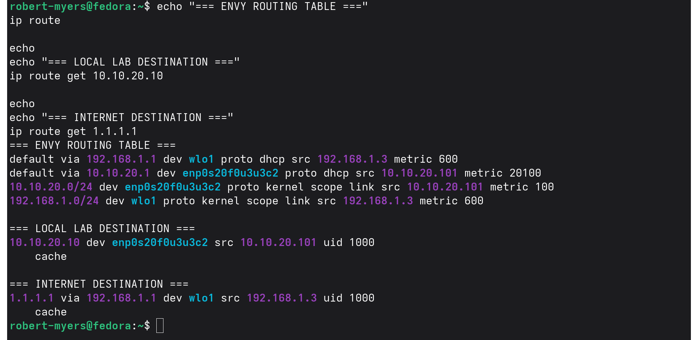

### Finding

Routing selection was demonstrated as:

```text
Longest-prefix match
        ↓
competing equally specific routes
        ↓
metric / preference
        ↓
next hop and interface
```

A lower-metric default route does not override a more-specific route.

## Experiment 2 — Specific Route Overrides Default

A temporary host route was installed:

```text
1.1.1.1/32 via 10.10.20.1 dev enp0s20f0u3u3c2
```

Before the change, `1.1.1.1` used the Wi-Fi default with metric 600.

After the `/32` was installed, Linux selected:

```text
1.1.1.1 via 10.10.20.1 dev enp0s20f0u3u3c2 src 10.10.20.101
```

The `/32` won even though the competing Wi-Fi `/0` had a much lower metric.

Packet capture on the selected Ethernet interface observed:

```text
10.10.20.101 > 1.1.1.1: ICMP echo request
```

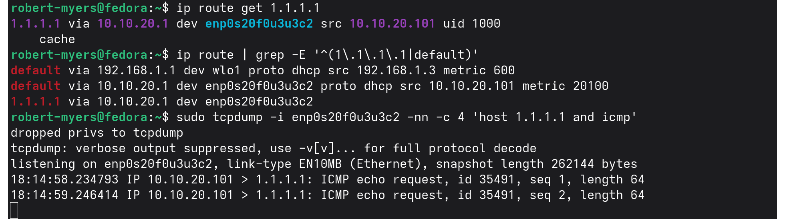

### Finding

`ip route get` demonstrated the kernel's route decision while `tcpdump` independently demonstrated that packets actually followed the selected interface.

This separates **control-plane decision evidence** from **data-plane observation**.

Correction (October 5, 2026): this experiment proves route selection, not reachability. Screenshot 02 shows two echo requests leaving `enp0s20f0u3u3c2` and no replies in the capture. The lab has no internet egress by design (`DENY_Lab_to_Any`), so replies weren't expected. The result shows where the kernel sent the traffic, nothing more.

## Experiment 3 — Route Restoration

After deleting the temporary `/32`, the destination immediately returned to:

```text
1.1.1.1 via 192.168.1.1 dev wlo1 src 192.168.1.3
```

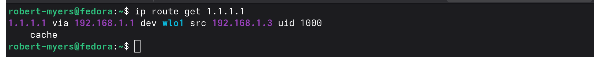

The controlled routing change was fully reversible.

## Experiment 4 — Route Exists but No Return Traffic

A second controlled `/32` was installed for the documentation address:

```text
203.0.113.10/32 via 10.10.20.1 dev enp0s20f0u3u3c2
```

Linux changed the selected path from Wi-Fi to the lab Ethernet interface.

The configured next hop was checked with the neighbor table and was:

```text
REACHABLE
```

The MAC address is redacted as `[ER605-MAC]` (see Evidence Handling).

Two ICMP echo requests were transmitted, but no replies were received:

```text
2 packets transmitted
0 received
100% packet loss
```

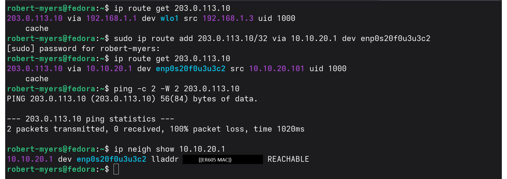

### Diagnosis

The evidence demonstrated:

```text
Local route exists                 YES
        ↓
Correct interface selected         YES
        ↓
Next hop reachable at Layer 2      YES
        ↓
Traffic transmitted                YES
        ↓
Return traffic observed            NO
```

The evidence therefore does not support the conclusion that ENVY lacked a route.

It supports the narrower conclusion that ENVY selected the configured route and its next hop was `REACHABLE` in the neighbor table. The neighbor check ran after the ping, as shown in screenshot 04.

Correction (October 5, 2026): this test can't tell me where the loss happened. `203.0.113.10` is in TEST-NET-3 (`203.0.113.0/24`, RFC 5737), a documentation range, so no host was going to answer. On top of that, the ER605 blocks lab traffic to the internet (`DENY_Lab_to_Any`). With both of those true, "no return traffic" can't distinguish a path problem from a destination that doesn't exist. I also didn't run `tcpdump` during this test, so "Traffic transmitted" above comes from ping's `2 packets transmitted` count, not from a capture on the wire. What this experiment does show is the route change and the next-hop state. The [October 5 re-test](#re-test--experiment-4-october-5-2026) below reruns it against a destination that answers, with a capture that locates the failure.

## Final Restoration

The temporary route was deleted.

Final route checks showed both test destinations again using:

```text
via 192.168.1.1 dev wlo1 src 192.168.1.3
```

No persistent routing changes were left behind.

Screenshot 03 shows `1.1.1.1` back on `wlo1`. I didn't capture the route deletion or the restored `ip route get` for `203.0.113.10`.

# Re-test — Experiment 4, October 5, 2026

## Why I Re-tested
The original Experiment 4 couldn't locate a failure. The destination was a documentation address that would never answer, the lab blocks internet egress anyway, and I didn't run `tcpdump`. I reran it against a destination that does answer, with a next hop I picked to break the path on purpose, and a capture point that would show where the traffic stopped.

## Design
| Item | Value |
|---|---|
| Client | Kali VM `10.10.20.103` (ENVY is now in the VLAN 30 enclave, see NET-008) |
| Destination | ER605 VLAN 30 interface `10.10.30.1`, which the lab LAN is allowed to reach |
| Normal next hop | ER605 `10.10.20.1` |
| Fault | `/32` host route on Kali sending `10.10.30.1` to Yoda `10.10.20.10` instead |
| Capture point | Yoda's physical NIC `nic0` |

Kali is a VM on Yoda, so all of Kali's traffic passes through Yoda's bridge `vmbr0`, including normal traffic to the ER605. A capture on `vmbr0` would see the packets either way. Normal traffic to the ER605 has to leave through `nic0`, so `nic0` is where the difference shows up.

## Baseline
Kali reached the destination on the normal path:

```text
ping -c 2 10.10.30.1
2 packets transmitted, 2 received, 0% packet loss
```

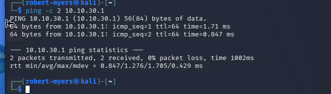

The test depended on Yoda not forwarding traffic. I checked the global setting:

```text
sysctl net.ipv4.ip_forward
net.ipv4.ip_forward = 0
```

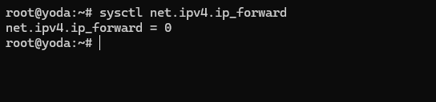

Kali's route before the change:

```text
10.10.30.1 via 10.10.20.1 dev eth0 src 10.10.20.103
```

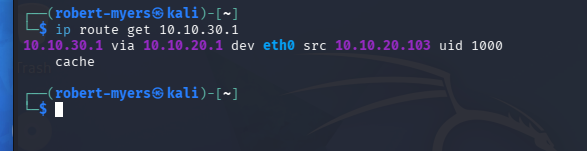

Normal traffic crossing Yoda's physical NIC, to show the capture point sees this path:

```text
tcpdump -i nic0 -nn -c 4 'icmp and host 10.10.30.1'
10.10.20.103 > 10.10.30.1: ICMP echo request, id 43374, seq 1
10.10.30.1 > 10.10.20.103: ICMP echo reply, id 43374, seq 1
10.10.20.103 > 10.10.30.1: ICMP echo request, id 43374, seq 2
10.10.30.1 > 10.10.20.103: ICMP echo reply, id 43374, seq 2
4 packets captured
```

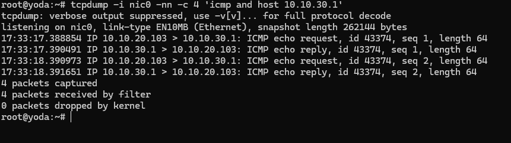

## Fault Injected
```text
sudo ip route add 10.10.30.1/32 via 10.10.20.10
ip route get 10.10.30.1
10.10.30.1 via 10.10.20.10 dev eth0 src 10.10.20.103
```

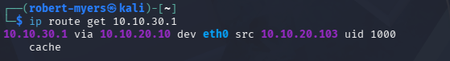

The `/32` beat the default route, and the next hop changed to Yoda.

## The Fault Didn't Happen
I expected the pings to die at Yoda. They didn't:

```text
ping -c 4 10.10.30.1
From 10.10.20.10 icmp_seq=1 Redirect Host(New nexthop: 10.10.20.1)
64 bytes from 10.10.30.1: icmp_seq=1 ttl=64
64 bytes from 10.10.30.1: icmp_seq=2 ttl=64
64 bytes from 10.10.30.1: icmp_seq=3 ttl=64
3 packets transmitted, 3 received, +1 errors, 0% packet loss
```

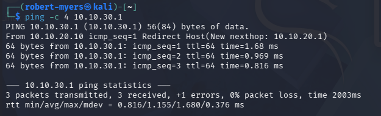

Yoda's `nic0` showed the requests leaving toward the ER605 and the replies coming back:

```text
timeout 30 tcpdump -i nic0 -nn 'icmp and host 10.10.30.1'
10.10.20.103 > 10.10.30.1: ICMP echo request, id 43375, seq 1
10.10.30.1 > 10.10.20.103: ICMP echo reply, id 43375, seq 1
...
6 packets captured
```

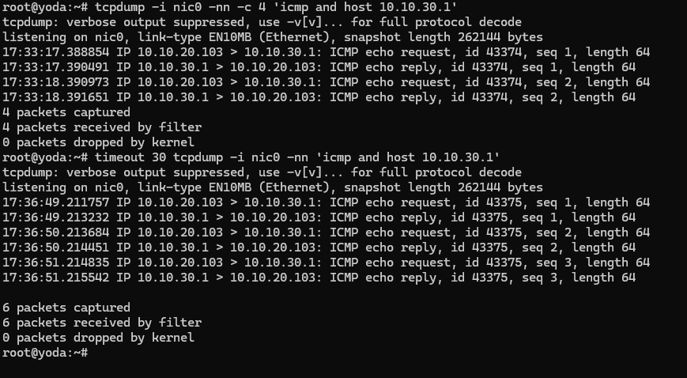

Two things say Yoda acted as a router:

- The first request arrived at Yoda and left again through `nic0` toward the ER605.
- Yoda sent Kali an ICMP redirect. Linux only sends a redirect from its forwarding path, when a packet comes in and goes back out the same interface to a next hop on the same subnet.

The redirect told Kali to use `10.10.20.1` directly. The `nic0` capture can't show which path the later pings took, because traffic to the ER605 leaves through `nic0` either way.

## Investigation
The global setting was 0, but the kernel decides forwarding per interface:

```text
sysctl net.ipv4.conf.all.forwarding net.ipv4.conf.vmbr0.forwarding net.ipv4.conf.vmbr0.send_redirects
net.ipv4.conf.all.forwarding = 0
net.ipv4.conf.vmbr0.forwarding = 1
net.ipv4.conf.vmbr0.send_redirects = 1
```

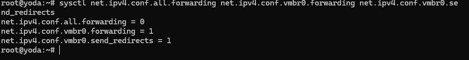

Only the bridge had forwarding on, for both IPv4 and IPv6. `default`, `nic0`, and Kali's `tap100i0` were all 0:

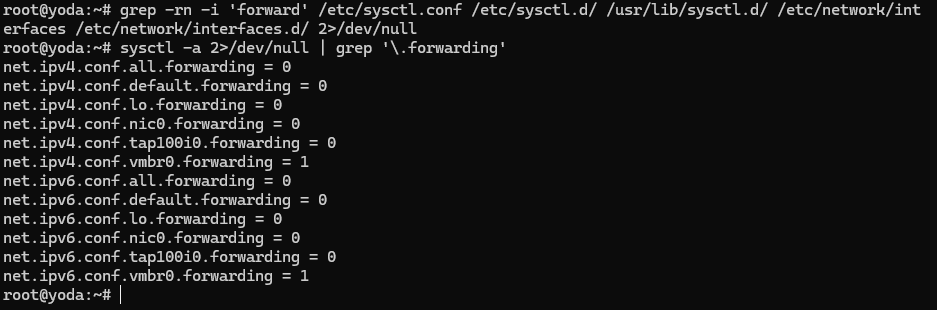

Nothing in the sysctl configuration or `/etc/network/interfaces` set it. `grep` across `/etc/sysctl.conf`, `/etc/sysctl.d/`, `/usr/lib/sysctl.d/`, and the interfaces files found no forwarding setting, and `ifquery --with-defaults vmbr0` didn't list one either:

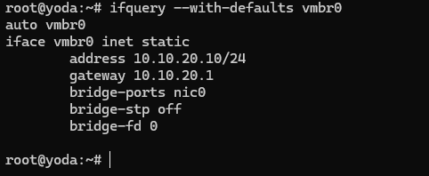

The source turned out to be in ifupdown2, the tool that brings up `vmbr0` at boot. In `/usr/share/ifupdown2/addons/address.py`, bridges go through `_set_bridge_forwarding()` first:

```python
def _set_bridge_forwarding(self, ifaceobj):
    """ set ip forwarding to 0 if bridge interface does not have a
    ip nor svi """
    ...
    if ( not ifaceobj.upperifaces and not ifaceobj.get_attr_value('address') and ...):
        # write 0 to ipv4 and ipv6 forwarding
    else:
        # write 1 to ipv4 and ipv6 forwarding
```

`vmbr0` has an address (`10.10.20.10/24`), so ifupdown2 writes `1` to `/proc/sys/net/ipv4/conf/vmbr0/forwarding` and to the IPv6 equivalent at every boot. It writes to `/proc` directly, which is why no config file mentioned it. An explicit `ip-forward` or `ip6-forward` in the stanza is applied after this function and overrides it. My stanza had neither, and the built-in default (`off`) only applies when a policy file sets it, which this system doesn't have.

**Root cause:** ifupdown2 enables forwarding on any bridge that has an IP address. Checking `net.ipv4.ip_forward` didn't catch it, because the global value doesn't reflect per-interface settings.

## Fix
Runtime, with no network restart:

```text
sysctl -w net.ipv4.conf.vmbr0.forwarding=0 net.ipv6.conf.vmbr0.forwarding=0
```

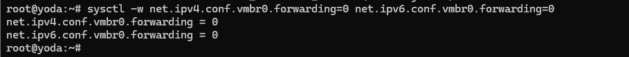

My SSH session to Yoda is traffic to Yoda, not through it, and VMs reach the network by bridging at Layer 2, so neither depends on IP forwarding.

## Re-run With the Fix in Place
The cached redirect on Kali had expired, and Kali's route was back to `via 10.10.20.10`. Same capture, same ping:

```text
ping -c 4 10.10.30.1
4 packets transmitted, 0 received, 100% packet loss
```

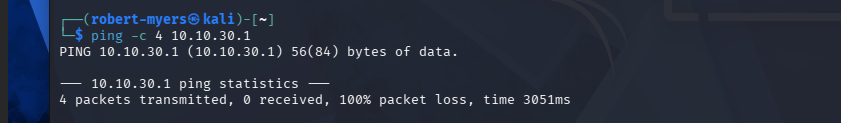

```text
timeout 30 tcpdump -i nic0 -nn 'icmp and host 10.10.30.1'
0 packets captured
0 packets received by filter
0 packets dropped by kernel
```

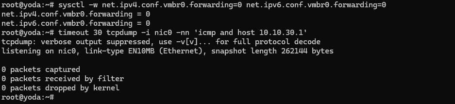

No redirect, no replies, and nothing left through `nic0`. Kali sent four requests to Yoda, and none of them left Yoda. The failure is located inside Yoda: it received the packets and dropped them because it is not the destination and no longer forwards.

## Restoration
```text
sudo ip route del 10.10.30.1/32
ip route get 10.10.30.1
10.10.30.1 via 10.10.20.1 dev eth0 src 10.10.20.103
```

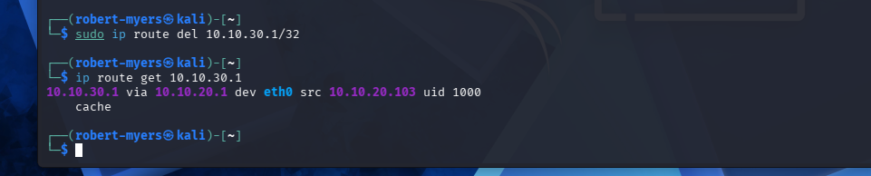

```text
ping -c 2 10.10.30.1
2 packets transmitted, 2 received, 0% packet loss
```

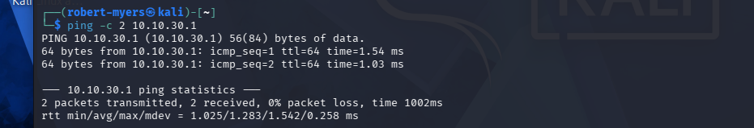

## Persistent Fix
The runtime change would be undone at the next boot, so I added the explicit settings to the `vmbr0` stanza after backing up the file:

```text
cp /etc/network/interfaces /etc/network/interfaces.bak-2026-10-05
```

```text
auto vmbr0
iface vmbr0 inet static
        address 10.10.20.10/24
        gateway 10.10.20.1
        bridge-ports nic0
        bridge-stp off
        bridge-fd 0
        ip-forward off
        ip6-forward off
```

I didn't reload the network on the hypervisor during the session. `ifquery --check` confirmed ifupdown2 accepts the new lines and that they match the running state:

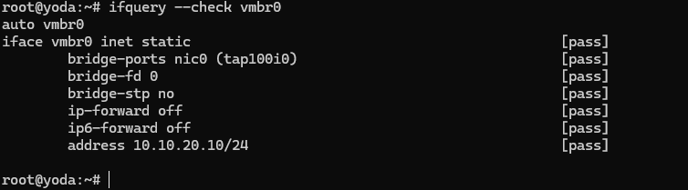

With IPv6 forwarding off, `vmbr0` could start accepting router advertisements. `ip -6 addr show dev vmbr0` showed only a link-local address, so it did not pick up a routable IPv6 address.

## Findings
1. A `/32` host route overrode the default route on Kali, as expected.
2. Yoda was forwarding IPv4 and IPv6 on `vmbr0`, even though `net.ipv4.ip_forward` was 0.
3. ifupdown2 enables forwarding on bridges that have an IP address. The setting comes from code, not a config file.
4. With forwarding on, Yoda forwarded traffic it received and sent an ICMP redirect.
5. With forwarding off, the same traffic stopped at Yoda, shown by Kali's send count and an empty capture on `nic0`.
6. The route and the normal path were restored and verified.

## Production Considerations
- A hypervisor with one bridged network has no reason to route. This one wasn't a bypass because Yoda has a single interface and could only hand traffic back to the ER605, where the ACLs still apply. With a second interface or a VLAN-aware bridge, the same default would make it a path around the segmentation.
- Checking a global sysctl is not enough. The per-interface value is what the kernel uses.
- ICMP redirects let one host change another host's routing. I didn't change `send_redirects` on Yoda or `accept_redirects` on Kali in this session.

## Re-test Evidence Limits
- The persistent fix hasn't been tested across a reboot yet. It's supported by the ifupdown2 code and `ifquery --check`. The check after the next reboot is `sysctl net.ipv4.conf.vmbr0.forwarding`, which should return `0`.
- During the forwarding run, the `nic0` capture can't show whether pings 2 and 3 went through Yoda or straight to the ER605 after the redirect.

## Evidence Limits

- Experiment 2 shows two echo requests leaving the lab NIC. It does not show reachability; replies weren't expected because the lab has no internet egress.
- Experiment 4 (original): no `tcpdump` was captured, and the destination is a documentation address, so the test doesn't localize any failure. The October 5 re-test closes this.
- I didn't capture the `ip route del` commands or the restored `ip route get 203.0.113.10`.
- I didn't capture NetworkManager's connectivity state, so the reason for metric `20100` is inferred.

## Evidence Handling

The ER605's MAC address is redacted in screenshot 04. The label in the image reads `[ER605 MAC]`; in this README and other text I refer to it as `[ER605-MAC]`. Private lab and household addresses were kept because the routing decisions depend on them.

## Evidence Index

| Evidence | Purpose |
|---|---|
| `01-longest-prefix-and-default-route.png` | Connected route, defaults, longest-prefix and metric behavior |
| `02-specific-route-overrides-default.png` | `/32` override plus actual packet-path evidence |
| `03-route-restored-to-default.png` | Controlled restoration |
| `04-route-exists-but-no-return-traffic.png` | `/32` route change, ping with no replies, and `REACHABLE` next hop |
| `05-kali-baseline-ping-er605-vlan30.png` | Re-test: destination answers on the normal path |
| `06-yoda-global-ip-forward.png` | Re-test: global `ip_forward` = 0 |
| `07-kali-route-before.png` | Re-test: route before the fault, via the ER605 |
| `08-yoda-nic0-normal-path.png` | Re-test: normal traffic crossing Yoda's physical NIC |
| `09-kali-route-after-fault.png` | Re-test: `/32` sends the destination to Yoda |
| `10-kali-ping-redirect.png` | Re-test: ICMP redirect from Yoda, pings still answered |
| `11-yoda-nic0-forwarded.png` | Re-test: Yoda forwarding the faulted traffic out `nic0` |
| `12-yoda-per-interface-forwarding.png` | Re-test: `all` = 0, `vmbr0` = 1, redirects on |
| `13-yoda-forwarding-all-interfaces.png` | Re-test: only `vmbr0` forwarding, IPv4 and IPv6 |
| `14-yoda-ifquery-vmbr0-defaults.png` | Re-test: ifupdown2 shows no forwarding setting for `vmbr0` |
| `15-yoda-forwarding-disabled-runtime.png` | Re-test: runtime fix |
| `16-kali-ping-fault-after-fix.png` | Re-test: 4 sent, 0 received, no redirect |
| `17-yoda-nic0-nothing-leaves.png` | Re-test: nothing leaves Yoda during the fault |
| `18-kali-route-restored.png` | Re-test: route back via the ER605 |
| `19-kali-ping-restored.png` | Re-test: normal path working again |
| `20-yoda-ifquery-check-pass.png` | Re-test: persistent `ip-forward off` / `ip6-forward off` accepted and matching |
| `routing-findings.txt` | Concise findings from the controlled routing experiments |

## Key Takeaway

A route being present does not prove end-to-end connectivity.

Effective troubleshooting separates:

**route selection → next-hop reachability → packet transmission → return path → destination/application behavior.**

## Status

**PROVEN**

Longest-prefix match, metric tie-breaking, the `/32` override, and the interface the traffic left on are all shown in command output and `tcpdump`. The original Experiment 4 couldn't show where traffic was lost. The October 5 re-test does: it locates the drop inside Yoda, and along the way found and fixed IP forwarding that ifupdown2 had turned on for Yoda's bridge.
