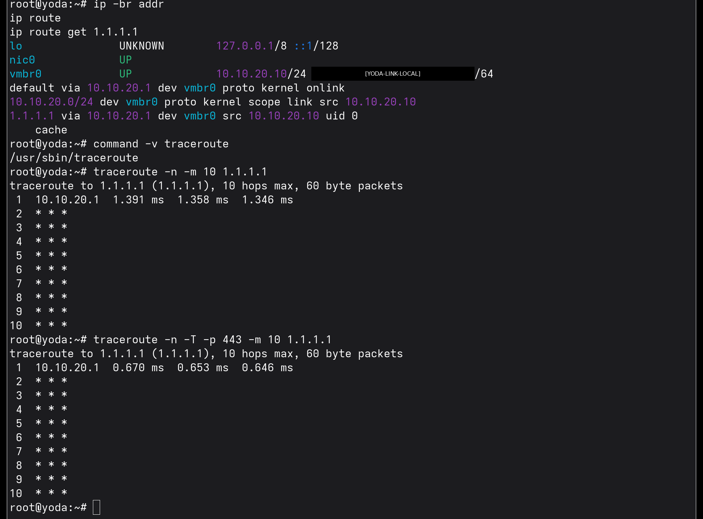
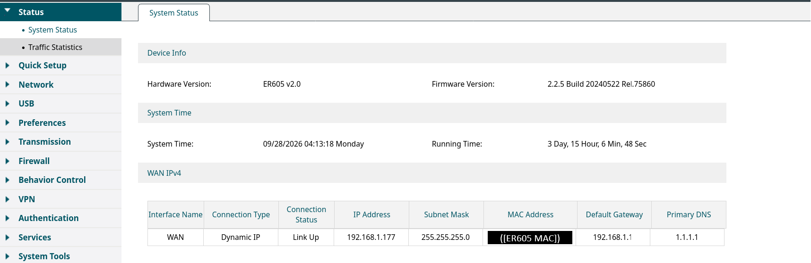
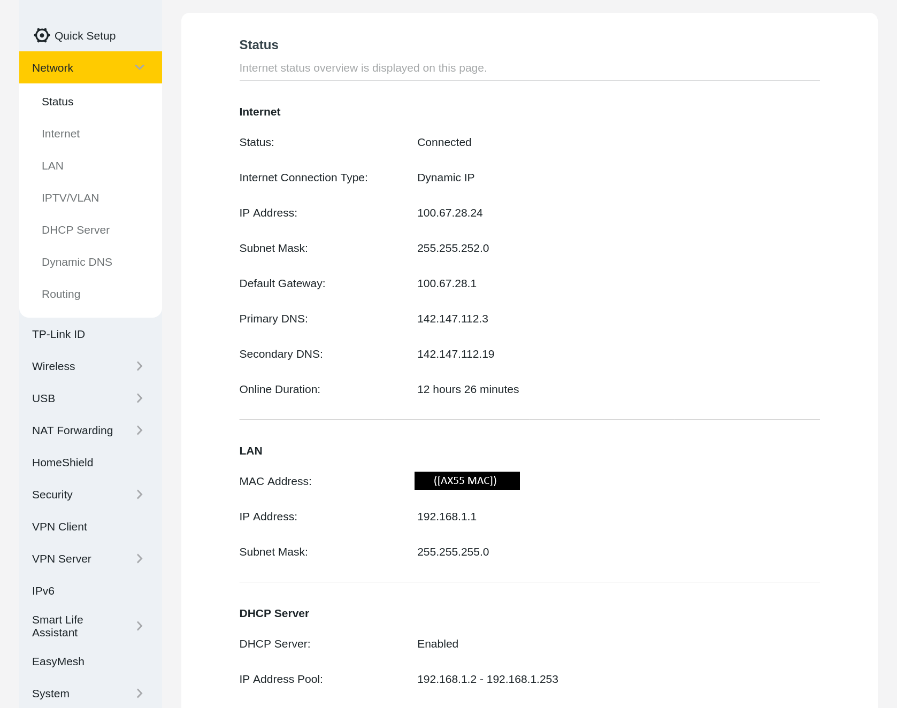
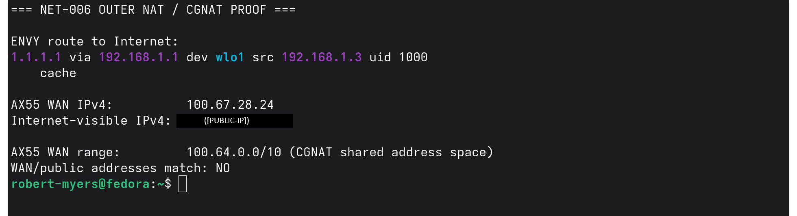
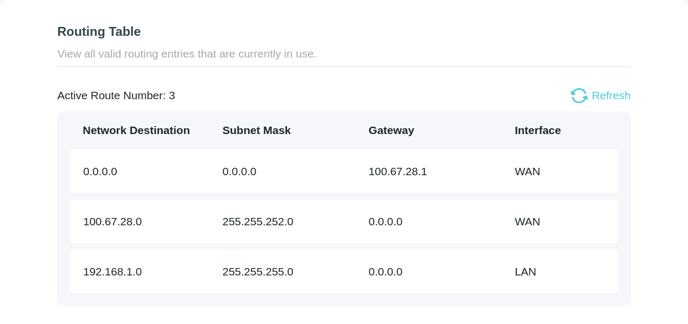

# NET-006 — NAT and CGNAT Path Analysis

## Hiring Claim

> After reviewing this artifact, a hiring manager has evidence that I can trace addressing boundaries through a nested lab/household network and identify CGNAT, by recognizing an RFC 6598 `100.64.0.0/10` WAN address and confirming that the Internet-visible address is different.

The title says NAT, but I didn't capture any translation evidence (no NAT/session table, no before-and-after packet capture). The NAT boundaries here are inferred from addressing and routing, not observed.

## Skills Demonstrated

- NAT/CGNAT path analysis
- RFC1918 private-address recognition
- RFC6598 shared-address recognition
- Default-gateway and route analysis
- Multi-router topology analysis
- WAN/LAN boundary identification
- Public-versus-WAN address comparison
- Traceroute interpretation and limitations
- Network segmentation awareness
- Evidence-scoped technical conclusions
- Privacy-conscious publication

## Environment

Observed addressing:

```text
Yoda 10.10.20.10/24
    |
    v
ER605 LAN 10.10.20.1
    |
    v
ER605 WAN 192.168.1.177/24
    |
    v
AX55 LAN 192.168.1.1/24
    |
    v
AX55 WAN 100.67.28.24/22
    |
    v
ISP / CGNAT
    |
    v
Public Internet
```

Lab hosts on `10.10.20.0/24`, Yoda included, have no internet egress by design. The ER605 rule `DENY_Lab_to_Any` blocks lab-to-WAN traffic (LAB-001; the rule is shown in NET-008 evidence 24, `24-er605-acl-rules-before.png`). That control was not weakened for this experiment.

## Experiment 1 — Yoda Route and First Hop

Yoda reported `10.10.20.10/24` with a default route through `10.10.20.1`.

A route lookup for `1.1.1.1` selected:

```text
1.1.1.1 via 10.10.20.1 dev vmbr0 src 10.10.20.10
```

Both conventional and TCP/443 traceroute identified the ER605 as the first responding hop. Subsequent hops did not respond.



### Finding

The evidence proves that Yoda selects `10.10.20.1` as its first routed hop for an off-subnet destination. The nonresponsive hops after the ER605 are not identified. Silence after hop 1 is what I'd expect with `DENY_Lab_to_Any` in place, but I didn't capture anything on the ER605 showing the probes being dropped.

## Experiment 2 — ER605 WAN Boundary

The ER605 status interface showed:

```text
WAN IPv4:        192.168.1.177
Subnet Mask:     255.255.255.0
Default Gateway: 192.168.1.1
Connection:      Dynamic IP
```



### Finding

This establishes the observed addressing relationship between the `10.10.20.0/24` lab and the upstream `192.168.1.0/24` network. The status page establishes addressing and topology; it is not a packet-level NAT translation record.

## Experiment 3 — AX55 CGNAT-Space WAN Address

The AX55 status interface showed:

```text
LAN IPv4:        192.168.1.1/24
WAN IPv4:        100.67.28.24
WAN Mask:        255.255.252.0
Default Gateway: 100.67.28.1
Connection:      Dynamic IP
```



`100.67.28.24` falls within `100.64.0.0/10`, the shared address space used for carrier-grade NAT.

### Finding

The AX55 does not hold a globally routable public IPv4 address on its WAN interface. Its WAN address is inside CGNAT shared address space.

## Experiment 4 — WAN Address vs Internet-Visible Address

ENVY, which legitimately has Internet access through the household Wi-Fi network, was used as the outer observation host.

Its route selected:

```text
via 192.168.1.1 dev wlo1 src 192.168.1.3
```

The AX55 WAN address was compared with the IPv4 observed by an external Internet service:

```text
AX55 WAN IPv4:          100.67.28.24
Internet-visible IPv4:  [PUBLIC-IP]
WAN/public match:       NO
```



### Finding

Two independent facts support the CGNAT conclusion:

1. The AX55 WAN address is within `100.64.0.0/10`.
2. The Internet-visible IPv4 is different from the AX55 WAN IPv4.

Together, these support the conclusion that there is a carrier translation boundary between the AX55 and the public Internet.

## Experiment 5 — AX55 Routing Table

The AX55 routing table showed:

```text
0.0.0.0/0       via 100.67.28.1   WAN
100.67.28.0/22   connected         WAN
192.168.1.0/24   connected         LAN
```



### Finding

The routing table independently corroborates the AX55 topology from `192.168.1.0/24` to `100.67.28.0/22` and then through the default gateway `100.67.28.1`.

## Security-Control Observation

An attempted public-IP lookup from Yoda timed out during name resolution. I didn't check Yoda's resolver configuration at the time, so I can't say whether the timeout came from the lab egress policy or from DNS not being set up on Yoda. Either way, Yoda has no internet access by design (`DENY_Lab_to_Any`; LAB-001, NET-008 evidence 24).

The security control was left intact. ENVY was used for the public-side comparison instead of weakening isolation simply to complete the experiment.

## Evidence Boundaries

The collected evidence directly establishes:

- Yoda address `10.10.20.10/24`
- Yoda default gateway `10.10.20.1`
- ER605 WAN `192.168.1.177/24`
- ER605 upstream gateway `192.168.1.1`
- AX55 LAN `192.168.1.1/24`
- AX55 WAN `100.67.28.24/22`
- AX55 upstream gateway `100.67.28.1`
- AX55 WAN membership in `100.64.0.0/10`
- a different Internet-visible public IPv4

From those facts I conclude there is an upstream CGNAT condition. That is a conclusion, not something the evidence shows directly.

The collected evidence does not include a router NAT/session table showing a live mapping such as `inside-address:port -> translated-address:port`.

Yoda also did not generate an allowed end-to-end Internet flow through every boundary because its isolation policy remained enabled.

Accordingly, this artifact does not claim packet-level observation of every possible translation from Yoda to the Internet.

### Evidence Limits

- Screenshot 04 is an echo-style summary I printed, not raw command output. The `ip route get` line is real output, but the AX55 WAN address, the `100.64.0.0/10` range, and `match: NO` are values I typed in. The command I used to look up the Internet-visible IPv4 isn't shown.
- No NAT translation was captured at either router, so the ER605 and AX55 NAT boundaries are inferred from addressing and routing.
- Nothing past the ER605 was identified by traceroute.

## Evidence Index

| Evidence | Purpose |
|---|---|
| `01-yoda-first-hop-traceroute.png` | Yoda addressing, route lookup, and ER605 first hop |
| `02-er605-wan-private-address.png` | ER605 WAN address and upstream private-network gateway |
| `03-ax55-cgnat-wan-address.png` | AX55 LAN/WAN boundary and RFC6598 shared-space WAN |
| `04-cgnat-wan-vs-public-ip.png` | AX55 WAN versus redacted Internet-visible IPv4 |
| `05-ax55-routing-table-cgnat-upstream.png` | AX55 connected networks and CGNAT-side default route |
| `nat-cgnat-findings.txt` | Concise evidence-derived findings |

## Evidence Handling

Identifiers that don't matter to the findings were redacted from the screenshots before publishing:

- 01: Yoda's IPv6 link-local address (`[YODA-LINK-LOCAL]`)
- 02: ER605 firmware version (`[FIRMWARE]`) and WAN MAC (`[ER605 MAC]`)
- 03: ISP DNS servers (`[ISP-DNS-1]`, `[ISP-DNS-2]`) and AX55 MAC (`[AX55 MAC]`)
- 04: Internet-visible IPv4 (`[PUBLIC-IP]`), retained locally

Private lab and household addresses and the CGNAT-range WAN address were kept because the findings depend on them.

## Key Takeaway

The strongest CGNAT proof in this experiment was the combination of an AX55 WAN address inside `100.64.0.0/10` and a different IPv4 observed from the public Internet.

## Status

**PROVEN**

The addressing boundaries and the CGNAT condition are supported by router status pages, the AX55 routing table, and the WAN-versus-public comparison. NAT translation itself was not captured, and the public-side comparison is a typed summary rather than raw output.
