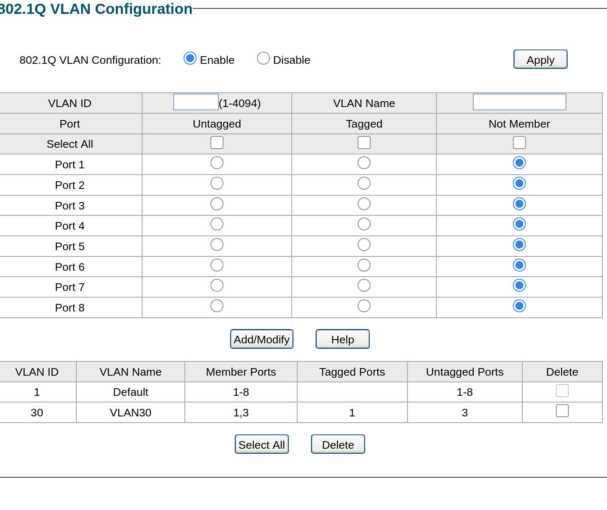
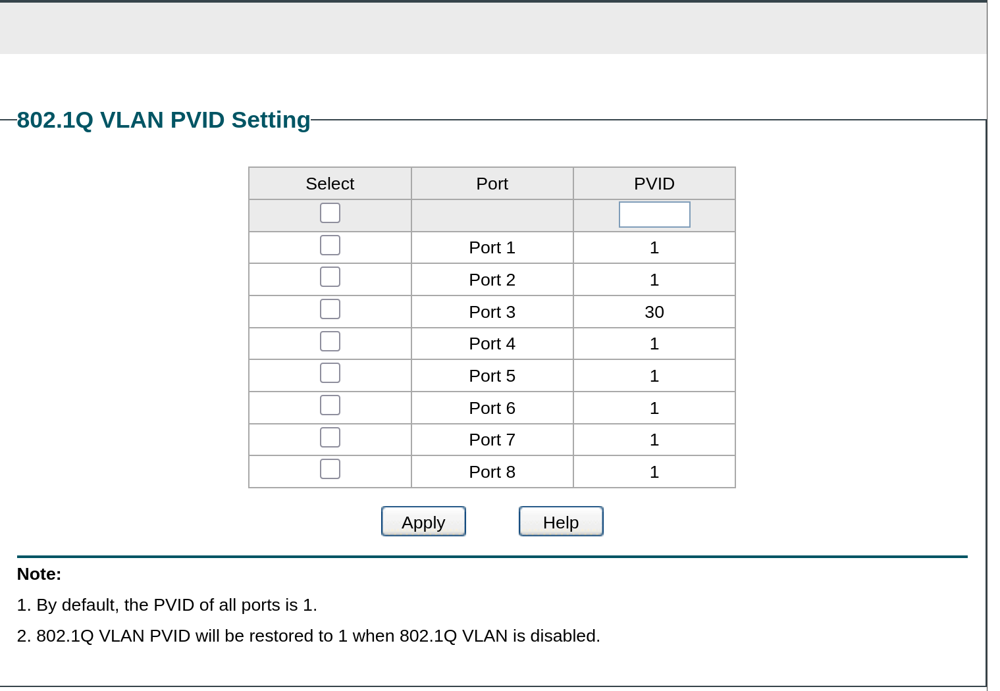
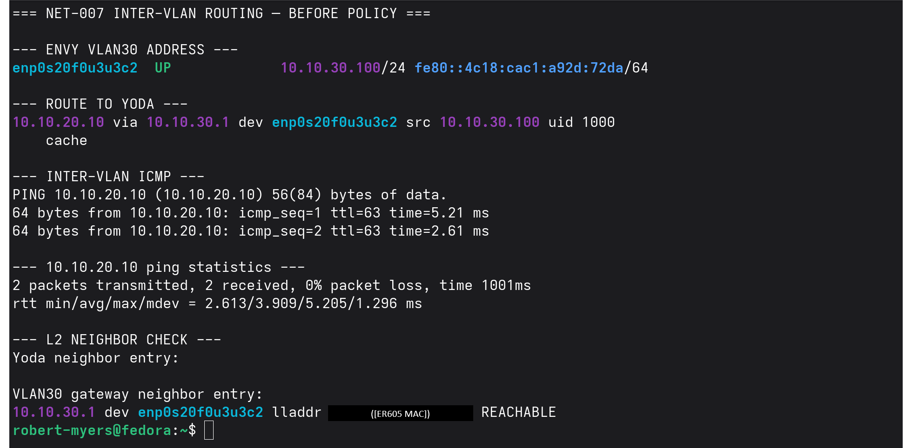
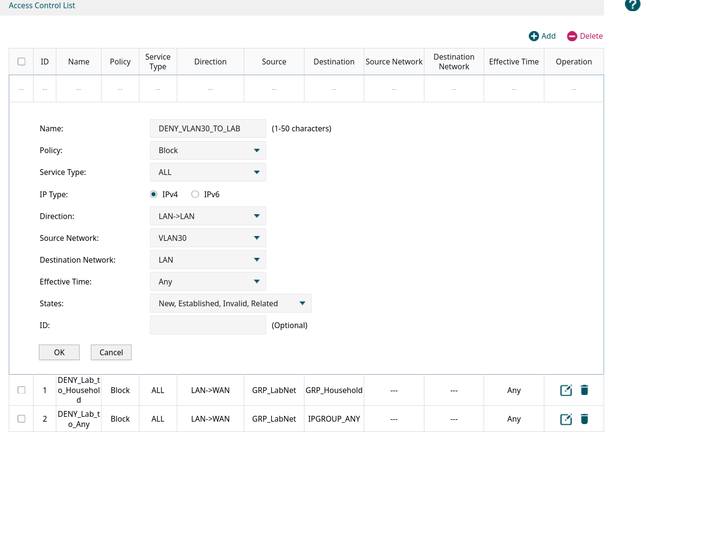
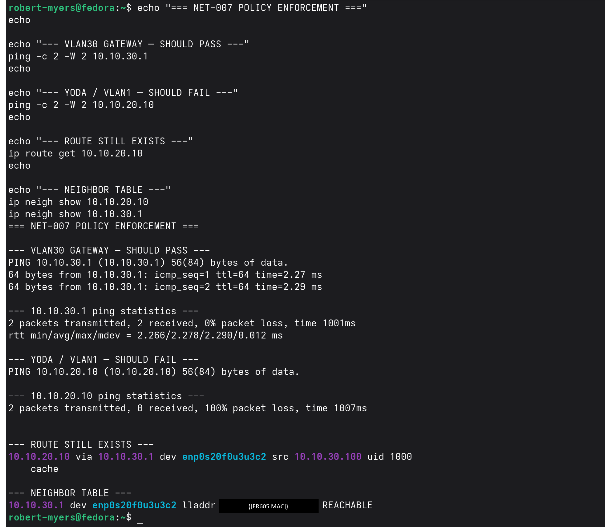

# NET-007 — VLAN Segmentation and Policy Enforcement

> **Correction — October 5, 2026.** The isolation in this project covers one direction of one path: VLAN 30 to the lab LAN (`10.10.20.0/24`). When I re-tested in NET-008, VLAN 30 could still reach the household network and the internet, because I never added it to `GRP_LabNet`, the group the existing egress rules use ([NET-008 Finding 3](../NET-008-protected-systems-enclave/README.md#finding-3--vlan30-had-household-and-internet-egress-through-the-er605)). The VLAN 30 DHCP pool I set up here also handed out `10.10.31.1` as Primary DNS, a typo ([NET-008 Finding 1](../NET-008-protected-systems-enclave/README.md#finding-1--vlan30-dhcp-handed-out-a-nonexistent-dns-server)). Both are fixed in NET-008.

## Hiring Claim
After reviewing this artifact, a hiring manager has evidence that I can design and implement VLAN segmentation, configure tagged and untagged switch ports, verify DHCP and Layer-3 inter-VLAN routing, distinguish Layer-2 neighbor behavior from routed communication, and block VLAN 30 from reaching the lab LAN with a LAN-to-LAN ACL.

## Skills Demonstrated
- 802.1Q VLAN configuration
- Tagged uplink and untagged access-port design
- PVID configuration
- VLAN-aware DHCP
- Inter-VLAN routing
- ARP / neighbor-table analysis
- Layer-2 versus Layer-3 troubleshooting
- LAN-to-LAN ACL enforcement
- Before/after policy validation
- Controlled infrastructure change

## Environment
The existing lab network was preserved while a second routed VLAN was introduced.

| Component | Address / Role |
|---|---|
| Existing LAN / VLAN 1 | `10.10.20.0/24` |
| ER605 gateway | `10.10.20.1` |
| Yoda | `10.10.20.10` |
| VLAN 30 | `10.10.30.0/24` |
| VLAN 30 gateway | `10.10.30.1` |
| ENVY after cutover | `10.10.30.100` |

```text
ER605 Port 3
     |
     | VLAN 1 untagged
     | VLAN 30 tagged
     v
SG108E Port 1
     +---------------------+
     |                     |
SG108E Port 2         SG108E Port 3
VLAN 1                VLAN 30 / PVID 30
     |                     |
   Yoda                  ENVY
10.10.20.10          10.10.30.100
```

## Baseline
Before segmentation, ENVY and Yoda shared `10.10.20.0/24`. ENVY used `10.10.20.101/24` and could reach both the ER605 gateway and Yoda. The SG108E initially had 802.1Q disabled and all ports used PVID 1.

The existing network was preserved rather than redesigning it merely to make a VLAN ID match the subnet number.

## VLAN 30 Creation
A second LAN interface was created on the ER605:

```text
Name: VLAN30
VLAN ID: 30
IP Address: 10.10.30.1
Subnet Mask: 255.255.255.0
DHCP Server: Enabled
DHCP Range: 10.10.30.100-10.10.30.199
Default Gateway: 10.10.30.1
Primary DNS: 10.10.31.1   (typo; fixed to 10.10.30.1 in NET-008)
```

The DHCP settings are shown in NET-008 [evidence 18](../NET-008-protected-systems-enclave/evidence/18-er605-vlan30-dhcp-dns-before.png) (as I set them here) and [evidence 19](../NET-008-protected-systems-enclave/evidence/19-er605-vlan30-dhcp-dns-after.png) (after the fix). Both were captured October 5, 2026; I didn't capture the form when I created VLAN 30.

The existing VLAN 1 / `10.10.20.0/24` network remained intact. The ER605 carried VLAN 30 as tagged traffic while retaining VLAN 1 as untagged traffic on the lab uplink.

## SG108E VLAN Membership
802.1Q VLAN support was enabled on the managed switch.

| Port | Device / Role | VLAN 30 |
|---|---|---|
| Port 1 | ER605 uplink | Tagged |
| Port 2 | Yoda | Not Member |
| Port 3 | ENVY | Untagged |
| Ports 4-8 | Not used for VLAN 30 | Not Member |

The resulting VLAN 30 membership was Port 1 tagged and Port 3 untagged.



## Access-Port PVID
Port 3 connects to ENVY. Its PVID was changed from `1` to `30`, causing untagged frames entering Port 3 to be classified as VLAN 30 traffic.



## DHCP Cutover
After the PVID change, ENVY's Ethernet connection was disconnected and reactivated. ENVY received:

```text
10.10.30.100/24
Gateway: 10.10.30.1
```

Its connected Ethernet route changed from `10.10.20.0/24` to `10.10.30.0/24`.

This validated the path:

```text
ENVY
  | untagged
  v
SG108E Port 3 / PVID 30
  | VLAN 30
  v
SG108E Port 1
  | tagged VLAN 30
  v
ER605 Port 3
  v
10.10.30.1
```

The address and gateway show the path works end to end. The tagging and the ER605 port in this diagram come from the configuration; see [Evidence Limits](#evidence-limits).

## Inter-VLAN Routing Before Policy
VLAN separation created a separate Layer-2 broadcast domain, but it did not automatically prevent Layer-3 communication.

Before applying an ACL, ENVY successfully reached Yoda.

```text
ENVY: 10.10.30.100
Yoda: 10.10.20.10
Route: 10.10.20.10 via 10.10.30.1
ICMP: 2 transmitted, 2 received, 0% loss
```

The replies arrived with TTL 63, consistent with traffic crossing a Layer-3 routing boundary.



## Layer-2 Neighbor Behavior
ENVY did not maintain a direct neighbor entry for Yoda at `10.10.20.10`. Instead, it maintained a reachable Layer-2 neighbor for its local gateway at `10.10.30.1`.

ENVY recognized Yoda as off-subnet and forwarded traffic to its gateway rather than ARPing directly for Yoda.

```text
ENVY 10.10.30.100
        |
        v
Gateway 10.10.30.1
        |
        | Layer-3 routing
        v
Yoda 10.10.20.10
```

The gateway hardware address visible in terminal evidence was redacted before publication.

## Policy Enforcement
An IPv4 LAN-to-LAN ACL was created on the ER605:

```text
Name: DENY_VLAN30_TO_LAB
Policy: Block
Service: ALL
IP Type: IPv4
Direction: LAN->LAN
Source Network: VLAN30
Destination Network: LAN
Effective Time: Any
States: New, Established, Invalid, Related
```



The form's States field is set to `New, Established, Invalid, Related`. This project doesn't test how the ER605 applies that setting to reply traffic. NET-008 shows that SSH started from the lab LAN to VLAN 30 still works with this rule in place.

This screenshot shows the rule as it was being created. The saved rule in the ER605 policy table is shown in [NET-008 evidence 07](../NET-008-protected-systems-enclave/evidence/07-er605-vlan30-to-lab-deny-rule.png).

## Post-Policy Validation
After the ACL was applied, the VLAN 30 gateway remained reachable:

```text
ENVY -> 10.10.30.1
2 transmitted, 2 received, 0% loss
```

Yoda became unreachable from VLAN 30:

```text
ENVY -> 10.10.20.10
2 transmitted, 0 received, 100% loss
```

The route still existed:

```text
10.10.20.10 via 10.10.30.1
```



The failure was therefore not caused by a missing route, failed VLAN, failed switch port, or unavailable VLAN gateway. The ACL intentionally changed what traffic was permitted across the routed boundary.

## Before vs. After

| Test | Before ACL | After ACL |
|---|---|---|
| ENVY address | `10.10.30.100/24` | `10.10.30.100/24` |
| VLAN 30 gateway reachable | Yes | Yes |
| Route to Yoda exists | Yes | Yes |
| ENVY can ping Yoda | Yes | No |
| Direct Yoda L2 neighbor on ENVY | No | No |
| VLAN 30 operational | Yes | Yes |
| VLAN30 -> LAN policy | Permitted | Blocked |

## What the Lab Proved
**Layer-2 segmentation:** VLAN 30 created a separate broadcast domain.

**Layer-3 routing:** because the ER605 had interfaces in both networks, it could route between `10.10.30.0/24` and `10.10.20.0/24` before policy enforcement.

**Security policy:** the LAN-to-LAN ACL prevented VLAN 30 from reaching the existing lab LAN without destroying the underlying route or VLAN.

This separates two different questions:

```text
Can the network route the packet?
Should security policy permit the packet?
```

## Troubleshooting Record

**Expected:** VLAN 30 should not reach the lab LAN.
**Observed:** with the VLAN in place and no ACL, ENVY pinged Yoda with 2 of 2 replies at TTL 63, routed via `10.10.30.1` (screenshot 01). The VLAN alone did not stop routed traffic.
**Change:** I created `DENY_VLAN30_TO_LAB` on the ER605 (screenshot 05).
**Validation:** ENVY still reached `10.10.30.1` (2 of 2), Yoda failed (0 of 2, 100% loss), and the route via `10.10.30.1` was still there (screenshot 02). The loss came from the policy, not from routing or the VLAN.

## Evidence Index

| Evidence | Purpose |
|---|---|
| `01-vlan30-intervlan-routing-before-policy.png` | Inter-VLAN routing before ACL enforcement |
| `02-vlan30-acl-isolation-after-policy.png` | Gateway health, retained route, and blocked inter-VLAN traffic |
| `03-sg108e-vlan30-membership.png` | Tagged uplink and untagged ENVY access-port membership |
| `04-sg108e-port3-pvid30.png` | ENVY ingress traffic assigned to VLAN 30 |
| `05-er605-vlan30-to-lab-acl.png` | LAN-to-LAN policy that blocks VLAN 30 from the lab LAN |
| `vlan-segmentation-findings.txt` | Concise evidence-derived findings |

## Evidence Limits
- **Baseline and DHCP cutover:** I didn't capture ENVY at `10.10.20.101`, the SG108E with 802.1Q disabled, or the lease change from `10.10.20.101` to `10.10.30.100`. Screenshot 01 shows ENVY at `10.10.30.100/24` afterward; the route-table change isn't captured.
- **ER605 Port 3:** the diagram shows the SG108E uplink on ER605 Port 3. No screenshot here shows the ER605 port.
- **802.1Q tagging:** tagging is shown as switch configuration only (screenshot 03: VLAN 30 tagged on Port 1, untagged on Port 3). I didn't capture a tagged frame on the wire.
- **DHCP settings:** shown only in NET-008 evidence 18 and 19, captured October 5, 2026.

## Evidence Handling
Hardware addresses visible in terminal evidence were redacted before publication. No credentials, authentication secrets, or unrelated raw packet captures are included.

## Final State

```text
Yoda
10.10.20.10
Existing LAN / VLAN 1

ENVY
10.10.30.100
VLAN 30
```

VLAN 30 remained operational, ENVY retained connectivity to its VLAN 30 gateway, and `DENY_VLAN30_TO_LAB` remained enabled.

## Key Takeaway
A VLAN creates a Layer-2 boundary, but VLAN membership alone does not guarantee isolation between routed networks.

Effective segmentation requires the interaction of:

```text
VLAN membership
       +
Layer-3 routing
       +
Security policy
```

Each stage was tested on its own, and the VLAN 30 to lab LAN block has before-and-after evidence.

## Status

**PROVEN**

VLAN 30, inter-VLAN routing, and the VLAN 30 to lab LAN block are proven with before-and-after tests. Household and internet egress from VLAN 30 were not covered here; they were found open and closed in NET-008 (October 5, 2026).
