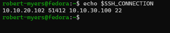

# NET-008 — Protected Systems Enclave

## Hiring Claim
After reviewing this artifact, a hiring manager has evidence that I can place a host behind an explicit trust boundary, restrict management access to a single authorized source with layered network and host controls, and prove both the allowed and the denied paths with positive and negative tests.

## Employer Skills Demonstrated
- VLAN segmentation and inter-VLAN routing
- Router ACL policy (ER605)
- Host firewall policy (firewalld rich rules)
- Least-privilege management access
- Windows route-table troubleshooting on a dual-homed host
- Persistent route and firewall configuration
- Service-state versus network-path troubleshooting
- Positive and negative control testing

## Objective

Build and validate a protected systems enclave using VLAN segmentation, routed management access, and host-level firewall controls.

The goal was to move beyond basic VLAN separation and prove that a protected host could be managed from an authorized system while remaining isolated from unauthorized management systems and unable to initiate connections back into the management network.

## Environment

| System | Role | Address |
|---|---|---|
| Windows workstation | Authorized management host | 10.10.20.102 |
| Yoda / Proxmox | Management-side infrastructure host | 10.10.20.10 |
| Fedora | Protected enclave host | 10.10.30.100 |
| ER605 | Inter-VLAN gateway / policy enforcement | 10.10.20.1 / 10.10.30.1 |
| VLAN30 | Protected systems enclave | 10.10.30.0/24 |
| Lab LAN | Management network | 10.10.20.0/24 |

## Design

The protected enclave uses two layers of control:

1. The ER605 blocks VLAN30 from initiating connections into the management LAN.
2. Fedora firewalld restricts SSH management access to the designated Windows management workstation at 10.10.20.102.

This creates an asymmetric trust model:

```text
Authorized Management Host
10.10.20.102
        |
        | TCP/22 allowed
        v
Protected Fedora Host
10.10.30.100

Yoda
10.10.20.10
        |
        X TCP/22 denied

Protected Enclave
10.10.30.0/24
        |
        X
Management LAN
10.10.20.0/24
```

## Initial Validation

Fedora was connected to the protected VLAN with:

```text
Address: 10.10.30.100/24
Gateway: 10.10.30.1
```

Initial testing confirmed that Fedora could reach its VLAN gateway but could not reach Yoda at 10.10.20.10.

```bash
ping -c 3 10.10.20.10
nc -vz -w 3 10.10.20.10 22
```

Both tests failed.

The ER605 ACL confirmed that VLAN30 was blocked from initiating traffic into the management LAN.


## Reverse-Path Validation

Traffic from the management network into VLAN30 was tested from Yoda.

```bash
ping -c 4 10.10.30.100
nc -vz -w 3 10.10.30.100 22
```

ICMP succeeded.

The first TCP/22 test returned `Connection refused`, which showed that the network path was working but SSH was not yet listening on Fedora.

After enabling `sshd`, TCP/22 became reachable from Yoda.

This separated a service-state issue from a routing or firewall issue.

## Windows Routing Issue

The Windows management workstation was dual-homed:

- 10.10.20.102 on the lab network
- 192.168.1.18 on the household network

An initial connection attempt to 10.10.30.100 used the Wi-Fi interface and household gateway instead of the lab path.

Route inspection confirmed that Windows was selecting the wrong interface.

A specific route was added for the enclave network:

```powershell
route -p add 10.10.30.0 mask 255.255.255.0 10.10.20.1 metric 5 if 23
```

The corrected route uses Ethernet 2, source address 10.10.20.102, and next hop 10.10.20.1.


This demonstrated longest-prefix-match behavior in practice. The specific 10.10.30.0/24 route overrides the competing default routes for traffic destined for the protected enclave.

## Authorized Management Access

After correcting the route, the Windows management workstation successfully reached Fedora over SSH.

```powershell
Test-NetConnection 10.10.30.100 -Port 22
```

Validated path:

```text
Source:      10.10.20.102
Interface:   Ethernet 2
Destination: 10.10.30.100
Port:        TCP/22
Result:      Success
```


A full SSH login was then completed from the authorized management workstation.


## Host-Level Management Restriction

The ER605 provides network-level VLAN separation, but the LAN-to-LAN ACL interface in this environment only exposed network-level selectors for this use case.

Host-specific SSH restriction was therefore enforced on Fedora with firewalld.

A rich rule was created to permit SSH only from the authorized Windows management host:

```bash
sudo firewall-cmd --permanent \
  --add-rich-rule='rule family="ipv4" source address="10.10.20.102/32" port port="22" protocol="tcp" accept'
```

The broad SSH service permission was removed:

```bash
sudo firewall-cmd --permanent --remove-service=ssh
sudo firewall-cmd --reload
```

The final active and permanent configuration retained the specific /32 SSH allow rule without the general SSH service permission.


The saved (`--permanent`) configuration at the end of the original build is shown below. It confirms the SSH rule persisted, and it also shows the Fedora Workstation default `1025-65535` TCP/UDP port range, which I removed during the October 5 re-test.


## Unauthorized Management Test

Yoda remained on the same 10.10.20.0/24 management network but was not included in the Fedora SSH allow rule.

Testing TCP/22 from Yoda:

```bash
nc -vz -w 3 10.10.30.100 22
```

returned a blocked result:

```text
No route to host
```

while the authorized Windows management workstation continued to connect successfully.

Despite the wording, this is not a routing failure. The reverse-path test earlier showed Yoda could reach Fedora, so the route existed. Traffic that matches no allow rule in the firewalld zone is rejected with an ICMP host-prohibited message, and Linux reports that ICMP error to `nc` as "No route to host". A silent drop would have produced a timeout instead, as in the enclave-isolation test below.


## Enclave Isolation Test

The protected Fedora host was tested against Yoda in the management network:

```bash
ping -c 3 10.10.20.10
nc -vz -w 3 10.10.20.10 22
```

Results:

- ICMP: 100% packet loss
- TCP/22: timeout

This validated that VLAN30 could not initiate traffic into the management LAN.


## Final Validation Matrix

| Source | Destination | Test | Result |
|---|---|---|---|
| Windows 10.10.20.102 | Fedora 10.10.30.100 | TCP/22 | Allowed |
| Windows 10.10.20.102 | Fedora 10.10.30.100 | SSH login | Allowed |
| Yoda 10.10.20.10 | Fedora 10.10.30.100 | TCP/22 | Blocked |
| Fedora 10.10.30.100 | Yoda 10.10.20.10 | ICMP | Blocked |
| Fedora 10.10.30.100 | Yoda 10.10.20.10 | TCP/22 | Blocked |
| Fedora 10.10.30.100 | ER605 10.10.30.1 | ICMP | Allowed |

## Troubleshooting Performed

This lab included several distinct troubleshooting points:

- Verified host addressing and gateway reachability.
- Confirmed inter-VLAN path behavior with ping, traceroute, route inspection, and TCP testing.
- Distinguished `Connection refused` from a timeout.
- Identified incorrect Windows route selection on a dual-homed system.
- Corrected the path with a specific route to 10.10.30.0/24.
- Verified source address and interface selection after the route change.
- Restricted SSH access with a host-specific firewalld rich rule.
- Re-tested both authorized and unauthorized management sources.
- Reloaded firewalld and validated that the permanent configuration matched the intended active state.

## Key Concepts Demonstrated

- VLAN segmentation
- Inter-VLAN routing
- Asymmetric trust boundaries
- Least-privilege management access
- Host firewall policy
- Defense in depth
- Longest-prefix-match route selection
- Dual-homed host troubleshooting
- Service-state versus network-path troubleshooting
- Positive and negative control testing
- Persistent route configuration
- Persistent firewall configuration

## Evidence

1. [Windows route to enclave](evidence/01-windows-route-to-enclave.png)
2. [Windows authorized SSH test](evidence/02-windows-authorized-ssh-test.png)
3. [Windows successful SSH login](evidence/03-windows-successful-ssh-login.png)
4. [Fedora firewall management rule](evidence/04-fedora-firewall-management-rule.png)
5. [Yoda unauthorized SSH blocked](evidence/05-yoda-unauthorized-ssh-blocked.png)
6. [Enclave to management blocked](evidence/06-enclave-to-management-blocked.png)
7. [ER605 VLAN30 to Lab deny rule](evidence/07-er605-vlan30-to-lab-deny-rule.png)
8. [Fedora permanent firewall policy before tightening](evidence/34-firewall-permanent-before-tightening.png)
9. [Windows persistent enclave route](evidence/09-windows-persistent-enclave-route.png)

Re-test evidence (October 5, 2026) is shown inline in the section above, numbered 10–41. Numbers 15, 16, 21, 23 and 29 were not kept as screenshots; their terminal output is in [`remediation-terminal-output.txt`](evidence/remediation-terminal-output.txt).

## Result

NET-008 established a protected systems enclave on VLAN30 with a controlled management path from the lab network.

The final design allows the designated Windows management workstation to administer the Fedora enclave host over SSH, blocks another management-side host from the same service, and prevents the enclave from initiating connections back into the management LAN.

The result is a small but functional example of segmented infrastructure with layered enforcement at both the network and host level.

After the October 5 re-test, the enclave host is single-homed, has no household or internet egress, resolves DNS only through the ER605, and accepts no inbound connection except SSH from the authorized workstation.

## Re-Test and Fixes — October 5, 2026

On October 5 I re-tested the enclave. My original tests only checked the paths the design was meant to control. This time I also tested the paths around it, and found five problems. I confirmed each one, traced it to a root cause, fixed it, and re-tested.

Terminal output I didn't capture as screenshots is in [`remediation-terminal-output.txt`](evidence/remediation-terminal-output.txt).

### Finding 1 — VLAN30 DHCP handed out a nonexistent DNS server

**Expected:** VLAN30 clients resolve names through the ER605.
**Observed:** Fedora's only lab resolver was `10.10.31.1`, an address on no configured subnet.
**Investigated:** `resolvectl status` showed the resolver; `nmcli -f DHCP4 device show` showed it arrived from the ER605 (`dhcp_server_identifier = 10.10.30.1`, `domain_name_servers = 10.10.31.1`). Before changing anything, `dig @10.10.30.1` confirmed the ER605 answers DNS on VLAN30.
**Root cause:** a one-digit typo I made in the VLAN30 DHCP pool's Primary DNS field when I created VLAN30 in NET-007.
**Change:** I changed Primary DNS to `10.10.30.1` and renewed Fedora's lease with `nmcli connection up`.
**Validation:** `resolvectl` reports `10.10.30.1`, and `resolvectl query` resolves through the lab interface.


DNS seemed fine during the original build because Fedora was also resolving over its Wi-Fi interface. That's Finding 2.

### Finding 2 — The enclave host was dual-homed on the household network

**Expected:** the enclave host's only network path is VLAN30 through the ER605.
**Observed:** `ip route` showed Fedora's Wi-Fi interface on `192.168.1.0/24` with its own default route. The household network was directly attached, bypassing every ER605 control in both directions.
**Root cause:** I left the host's Wi-Fi connected when I moved it into the enclave. I didn't include host interfaces in the original test plan.
**Change:** `sudo nmcli radio wifi off`. NetworkManager persists the radio state across reboots.
**Validation:** `ip route` shows only the VLAN30 interface, and `resolvectl` shows `wlo1` with no scopes and no default route.

The SSH restriction was not exposed through this path: both interfaces were in the same firewalld zone, so the `/32` rule applied to Wi-Fi too.

### Finding 3 — VLAN30 had household and internet egress through the ER605

**Expected:** like the rest of the lab, the enclave cannot reach the household network or the internet.
**Observed:** with Wi-Fi off, `ping 192.168.1.1` and `ping 1.1.1.1` from Fedora both succeeded. A TTL of 63 from the household router confirmed the traffic was routed by the ER605.
**Investigated:** the ER605 egress rules (`DENY_Lab_to_Household`, `DENY_Lab_to_Any`) match the source group `GRP_LabNet`, which contained only `LabNet` (`10.10.20.0/24`).
**Root cause:** when I added VLAN30 in NET-007, I gave it a rule blocking the management LAN but never added it to the lab group the existing egress rules use.
**Change:** I added an address object `Enclave` (`10.10.30.0/24`) to `GRP_LabNet`. I didn't add or edit any ACL rules. Any rule keyed on the group now covers both subnets.
**Validation:** both pings now fail with 100% loss. A non-cached lookup (`resolvectl query --cache=no example.org`) still succeeds, because the ER605 performs the upstream query itself.


### Finding 4 — The SSH lockdown was the only inbound restriction

**Expected:** the enclave accepts only management SSH from the authorized workstation.
**Observed:** the saved firewall zone still carried the Fedora Workstation default of TCP and UDP `1025-65535` open. `ss -tuln` showed `passimd` listening on `0.0.0.0:27500`, and Yoda — refused on port 22 — connected to port 27500.
**Investigated:** `ss -tlnp` identified the owner as `passimd`, the fwupd firmware-metadata sharing service. It's legitimate, but its job is sharing files with neighboring hosts, and an enclave host shouldn't do that.
**Change:** I masked the service with `systemctl mask --now passim.service`. Then I removed the high-port ranges and `samba-client` from the saved zone, checked the saved config, and applied it with `firewall-cmd --reload`.
**Validation:** port 27500 has no listener. Yoda is rejected on TCP 5355 (LLMNR), a service that is still listening, which proves the firewall alone now blocks it.


### Finding 5 — A pre-rule SSH session from Yoda survived for three days

**Observed:** `who` on Fedora showed an SSH session from Yoda (`10.10.20.10`) opened at 19:57 on October 2, before the `/32` rule was applied that evening.
**Root cause:** firewalld tracks established connections, so tightening the rules does not terminate sessions that are already open. A plain `firewall-cmd --reload` preserves them.
**Change:** I closed the session.
**Validation:** a new connection from Yoda is rejected, and `who` shows only the authorized session.





### Post-Remediation Validation Matrix

| Source | Destination | Test | Before Oct 5 | After Oct 5 |
|---|---|---|---|---|
| Windows 10.10.20.102 | Fedora | TCP/22 SSH | Allowed | Allowed |
| Yoda 10.10.20.10 | Fedora | New TCP/22 | Rejected | Rejected |
| Yoda 10.10.20.10 | Fedora | TCP 27500 / 5355 | **Open** | Rejected |
| Fedora | Yoda 10.10.20.10 | ICMP | Blocked | Blocked |
| Fedora | Household 192.168.1.1 | ICMP | **Allowed** | Blocked |
| Fedora | Internet 1.1.1.1 | ICMP | **Allowed** | Blocked |
| Fedora | ER605 resolver | DNS | **Wrong resolver** | Resolves |


### Lessons

- **Test around the design, not just the design.** My original matrix only covered the paths the policy was built for. Every finding was on a path I hadn't written a test for: a second interface, an egress direction, a high port.
- **Group-based policy needs group maintenance.** Adding a subnet is incomplete until it is in every group the existing rules depend on.
- **A working symptom can hide a broken dependency.** DNS worked over Wi-Fi, so the broken lab resolver went unnoticed for a week.
- **Firewall changes don't revoke existing sessions.** After tightening access, check for and close sessions that predate the change.

### Production Considerations

- The enclave now has no standing internet egress. OS updates require a change window: temporarily allow VLAN30 egress, update, remove the allow, then re-run this validation matrix.
- In production, the ER605 and firewalld changes would go through change control with a rollback plan. The two-stage `--permanent` then `--reload` sequence used here is the host-level version of that discipline.
- Host interface inventory (`ip -br link`, `ip route`) belongs in any segmentation acceptance test.

## Status
**PROVEN**

Allowed and denied management paths were tested from both sides of the boundary, and both the route and the firewall policy were made persistent. The October 5 re-test found and fixed five problems; see [GAPS.md](../../_control/GAPS.md).

## Public Evidence Notes

The screenshots used in this project were reviewed before publication. Public evidence excludes passwords, tokens, public IP addresses, MAC addresses, private keys, and other unnecessary identifiers. RFC1918 lab addresses are retained because they are part of the documented network design.
