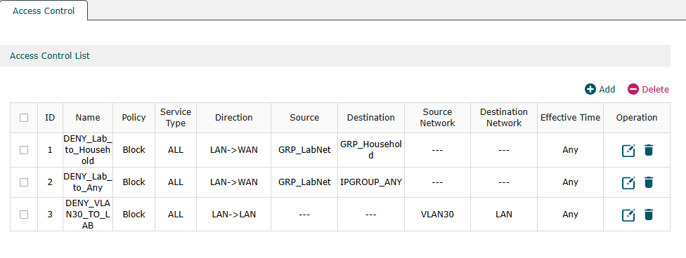
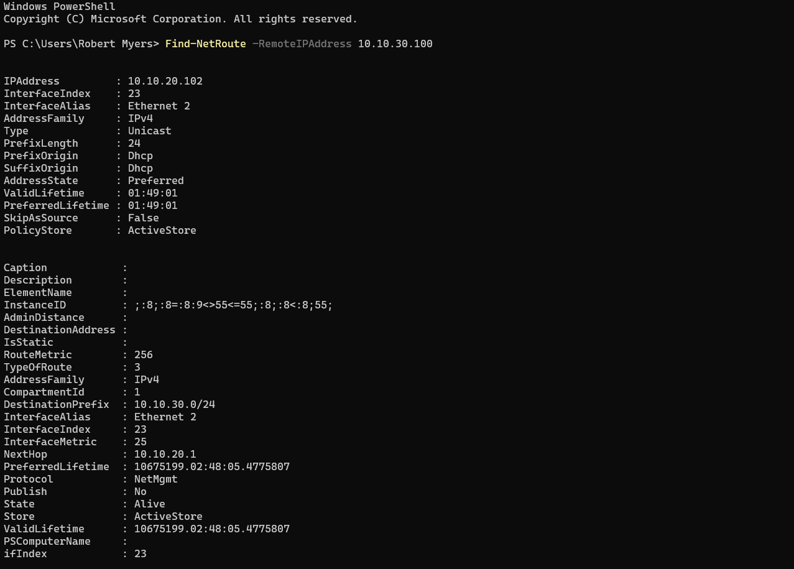
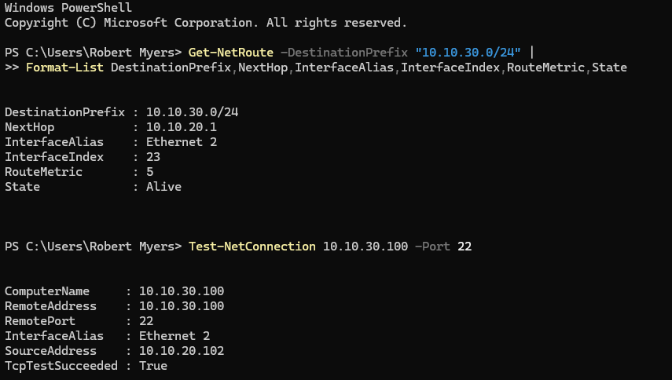
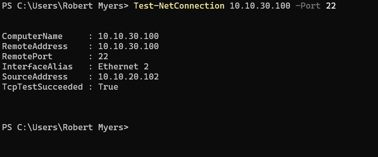
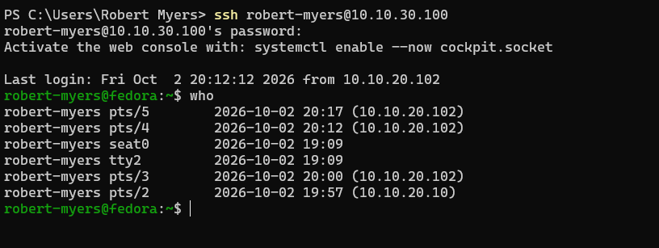
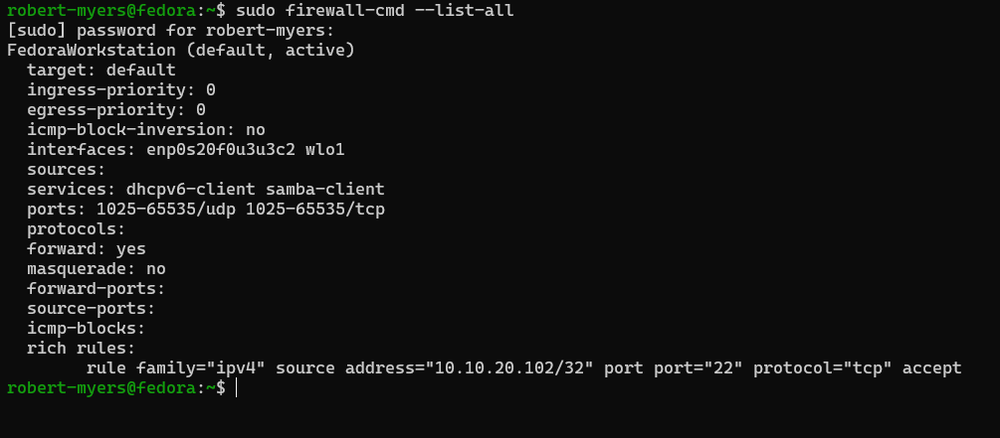
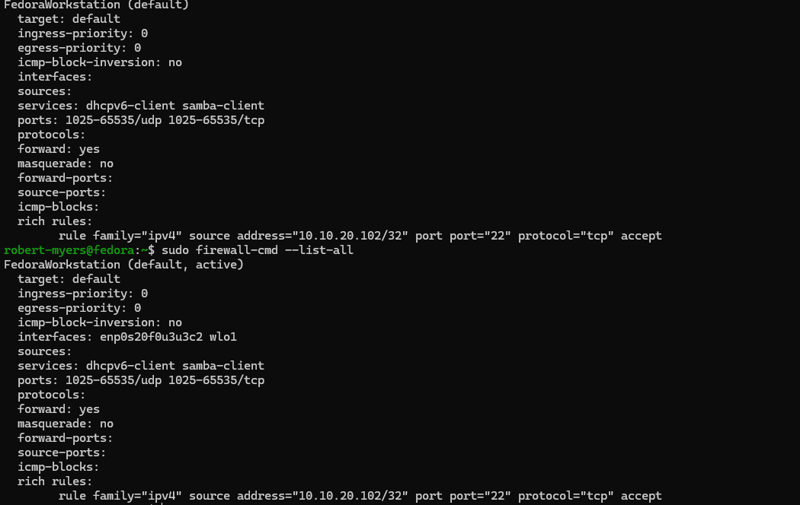
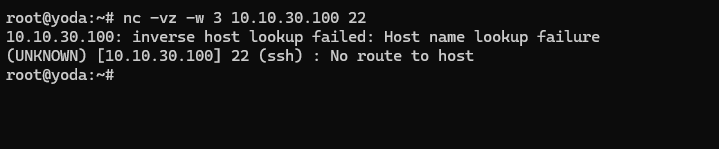
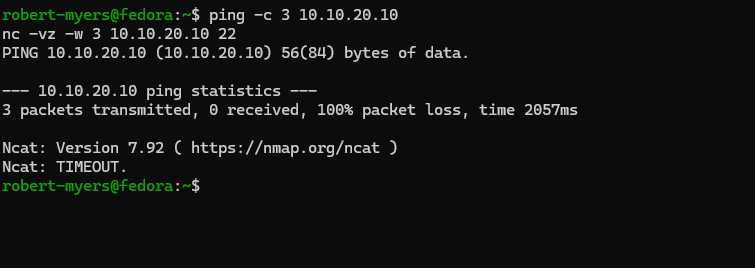

# NET-008 — Protected Systems Enclave

## Objective

Build and validate a protected systems enclave using VLAN segmentation, routed management access, and host-level firewall controls.

The goal was to move beyond basic VLAN separation and prove that a protected host could be managed from an authorized system while remaining isolated from unauthorized management systems and unable to initiate connections back into the management network.

## Environment

| System | Role | Address |
|---|---|---|
| Windows workstation | Authorized management host | 10.10.20.102 |
| Yoda / Proxmox | Management-side infrastructure host | 10.10.20.10 |
| Fedora | Protected enclave host | 10.10.30.100 |
| ER605 | Inter-VLAN gateway / policy enforcement | 10.10.20.1 / 10.10.30.1 |
| VLAN30 | Protected systems enclave | 10.10.30.0/24 |
| Lab LAN | Management network | 10.10.20.0/24 |

## Design

The protected enclave uses two layers of control:

1. The ER605 blocks VLAN30 from initiating connections into the management LAN.
2. Fedora firewalld restricts SSH management access to the designated Windows management workstation at 10.10.20.102.

This creates an asymmetric trust model:

```text
Authorized Management Host
10.10.20.102
        |
        | TCP/22 allowed
        v
Protected Fedora Host
10.10.30.100

Yoda
10.10.20.10
        |
        X TCP/22 denied

Protected Enclave
10.10.30.0/24
        |
        X
Management LAN
10.10.20.0/24
```

## Initial Validation

Fedora was connected to the protected VLAN with:

```text
Address: 10.10.30.100/24
Gateway: 10.10.30.1
```

Initial testing confirmed that Fedora could reach its VLAN gateway but could not reach Yoda at 10.10.20.10.

```bash
ping -c 3 10.10.20.10
nc -vz -w 3 10.10.20.10 22
```

Both tests failed.

The ER605 ACL confirmed that VLAN30 was blocked from initiating traffic into the management LAN.



## Reverse-Path Validation

Traffic from the management network into VLAN30 was tested from Yoda.

```bash
ping -c 4 10.10.30.100
nc -vz -w 3 10.10.30.100 22
```

ICMP succeeded.

The first TCP/22 test returned `Connection refused`, which showed that the network path was working but SSH was not yet listening on Fedora.

After enabling `sshd`, TCP/22 became reachable from Yoda.

This separated a service-state issue from a routing or firewall issue.

## Windows Routing Issue

The Windows management workstation was dual-homed:

- 10.10.20.102 on the lab network
- 192.168.1.18 on the household network

An initial connection attempt to 10.10.30.100 used the Wi-Fi interface and household gateway instead of the lab path.

Route inspection confirmed that Windows was selecting the wrong interface.

A specific route was added for the enclave network:

```powershell
route -p add 10.10.30.0 mask 255.255.255.0 10.10.20.1 metric 5 if 23
```

The corrected route uses Ethernet 2, source address 10.10.20.102, and next hop 10.10.20.1.





This demonstrated longest-prefix-match behavior in practice. The specific 10.10.30.0/24 route overrides the competing default routes for traffic destined for the protected enclave.

## Authorized Management Access

After correcting the route, the Windows management workstation successfully reached Fedora over SSH.

```powershell
Test-NetConnection 10.10.30.100 -Port 22
```

Validated path:

```text
Source:      10.10.20.102
Interface:   Ethernet 2
Destination: 10.10.30.100
Port:        TCP/22
Result:      Success
```



A full SSH login was then completed from the authorized management workstation.



## Host-Level Management Restriction

The ER605 provides network-level VLAN separation, but the LAN-to-LAN ACL interface in this environment only exposed network-level selectors for this use case.

Host-specific SSH restriction was therefore enforced on Fedora with firewalld.

A rich rule was created to permit SSH only from the authorized Windows management host:

```bash
sudo firewall-cmd --permanent \
  --add-rich-rule='rule family="ipv4" source address="10.10.20.102/32" port port="22" protocol="tcp" accept'
```

The broad SSH service permission was removed:

```bash
sudo firewall-cmd --permanent --remove-service=ssh
sudo firewall-cmd --reload
```

The final active and permanent configuration retained the specific /32 SSH allow rule without the general SSH service permission.





## Unauthorized Management Test

Yoda remained on the same 10.10.20.0/24 management network but was not included in the Fedora SSH allow rule.

Testing TCP/22 from Yoda:

```bash
nc -vz -w 3 10.10.30.100 22
```

returned a blocked result:

```text
No route to host
```

while the authorized Windows management workstation continued to connect successfully.



## Enclave Isolation Test

The protected Fedora host was tested against Yoda in the management network:

```bash
ping -c 3 10.10.20.10
nc -vz -w 3 10.10.20.10 22
```

Results:

- ICMP: 100% packet loss
- TCP/22: timeout

This validated that VLAN30 could not initiate traffic into the management LAN.



## Final Validation Matrix

| Source | Destination | Test | Result |
|---|---|---|---|
| Windows 10.10.20.102 | Fedora 10.10.30.100 | TCP/22 | Allowed |
| Windows 10.10.20.102 | Fedora 10.10.30.100 | SSH login | Allowed |
| Yoda 10.10.20.10 | Fedora 10.10.30.100 | TCP/22 | Blocked |
| Fedora 10.10.30.100 | Yoda 10.10.20.10 | ICMP | Blocked |
| Fedora 10.10.30.100 | Yoda 10.10.20.10 | TCP/22 | Blocked |
| Fedora 10.10.30.100 | ER605 10.10.30.1 | ICMP | Allowed |

## Troubleshooting Performed

This lab included several distinct troubleshooting points:

- Verified host addressing and gateway reachability.
- Confirmed inter-VLAN path behavior with ping, traceroute, route inspection, and TCP testing.
- Distinguished `Connection refused` from a timeout.
- Identified incorrect Windows route selection on a dual-homed system.
- Corrected the path with a specific route to 10.10.30.0/24.
- Verified source address and interface selection after the route change.
- Restricted SSH access with a host-specific firewalld rich rule.
- Re-tested both authorized and unauthorized management sources.
- Reloaded firewalld and validated that the permanent configuration matched the intended active state.

## Key Concepts Demonstrated

- VLAN segmentation
- Inter-VLAN routing
- Asymmetric trust boundaries
- Least-privilege management access
- Host firewall policy
- Defense in depth
- Longest-prefix-match route selection
- Dual-homed host troubleshooting
- Service-state versus network-path troubleshooting
- Positive and negative control testing
- Persistent route configuration
- Persistent firewall configuration

## Evidence

1. [Windows route to enclave](evidence/01-windows-route-to-enclave.png)
2. [Windows authorized SSH test](evidence/02-windows-authorized-ssh-test.png)
3. [Windows successful SSH login](evidence/03-windows-successful-ssh-login.png)
4. [Fedora firewall management rule](evidence/04-fedora-firewall-management-rule.png)
5. [Yoda unauthorized SSH blocked](evidence/05-yoda-unauthorized-ssh-blocked.png)
6. [Enclave to management blocked](evidence/06-enclave-to-management-blocked.png)
7. [ER605 VLAN30 to Lab deny rule](evidence/07-er605-vlan30-to-lab-deny-rule.png)
8. [Fedora persistent firewall policy](evidence/08-fedora-persistent-firewall-policy.png)
9. [Windows persistent enclave route](evidence/09-windows-persistent-enclave-route.png)

## Result

NET-008 established a protected systems enclave on VLAN30 with a controlled management path from the lab network.

The final design allows the designated Windows management workstation to administer the Fedora enclave host over SSH, blocks another management-side host from the same service, and prevents the enclave from initiating connections back into the management LAN.

The result is a small but functional example of segmented infrastructure with layered enforcement at both the network and host level.

## Public Evidence Notes

The screenshots used in this project were reviewed before publication. Public evidence excludes passwords, tokens, public IP addresses, MAC addresses, private keys, and other unnecessary identifiers. RFC1918 lab addresses are retained because they are part of the documented network design.
