# NET-008 — Protected Systems Enclave

## Hiring Claim
After reviewing this artifact, a hiring manager has evidence that I can place a host behind an explicit trust boundary, restrict management access to a single authorized source with layered network and host controls, and prove both the allowed and the denied paths with positive and negative tests.

## Employer Skills Demonstrated
- VLAN segmentation and inter-VLAN routing
- Router ACL policy (ER605)
- Host firewall policy (firewalld rich rules)
- Least-privilege management access
- Windows route-table troubleshooting on a dual-homed host
- Persistent route and firewall configuration
- Service-state versus network-path troubleshooting
- Positive and negative control testing

## Summary — Current State

ENVY (Fedora, `10.10.30.100`) is the enclave host on VLAN30. Victus (Windows 11, `10.10.20.102`) is the only host allowed to manage it. This is the state after the October 5, 2026 re-test and patch window:

- **ER605:** `DENY_VLAN30_TO_LAB` blocks VLAN30 → lab LAN. VLAN30 is in `GRP_LabNet`, so the existing `DENY_Lab_to_Household` and `DENY_Lab_to_Any` rules also block household and internet egress.
- **DNS:** VLAN30 DHCP hands out the ER605 (`10.10.30.1`) as the resolver.
- **ENVY interfaces:** single-homed on VLAN30; Wi-Fi radio off.
- **ENVY firewalld:** the zone allows only `dhcpv6-client` plus an SSH rich rule for `10.10.20.102/32`. No open ports.
- **ENVY services:** `passim` masked. Since October 7, `gnome-software` is masked and NetworkManager's connectivity check is disabled, so ENVY no longer retries HTTPS and HTTP egress in the background ([Background Egress Attempts](#background-egress-attempts--october-7-2026)).

The October 5 re-test found five problems in the October 2 build:

1. [Finding 1](#finding-1--vlan30-dhcp-handed-out-a-nonexistent-dns-server): VLAN30 DHCP handed out `10.10.31.1` (a typo) as DNS.
2. [Finding 2](#finding-2--the-enclave-host-was-dual-homed-on-the-household-network): ENVY was also on the household network over Wi-Fi.
3. [Finding 3](#finding-3--vlan30-had-household-and-internet-egress-through-the-er605): VLAN30 had household and internet egress through the ER605.
4. [Finding 4](#finding-4--the-ssh-lockdown-was-the-only-inbound-restriction): ports `1025-65535` were open, and Yoda reached `passimd` on 27500.
5. [Finding 5](#finding-5--a-pre-rule-ssh-session-from-yoda-survived-about-two-and-a-half-days): an SSH session from Yoda, opened before the `/32` rule, was still active.

[Patch Window](#patch-window--october-5-2026): I patched ENVY through a temporary ER605 allow rule, deleted the rule, rebooted, and re-checked the controls.

### Validation Matrix

| Source | Destination | Test | Before Oct 5 fixes | After Oct 5 fixes | Evidence (before / after) |
|---|---|---|---|---|---|
| Victus 10.10.20.102 | ENVY 10.10.30.100 | TCP/22, SSH login | Allowed | Allowed | 02, 03, 09 / 14 |
| Yoda 10.10.20.10 | ENVY | New TCP/22 | Rejected | Rejected | 05 / 13 |
| Yoda | ENVY | High port (27500 before, 5355 after) | **Open** | Rejected | 37 / 41 |
| ENVY | Yoda | ICMP | Blocked | Blocked | 06 / 33 |
| ENVY | Yoda | TCP/22 | Blocked (timeout) | Not re-tested | 06 |
| ENVY | Household 192.168.1.1 | ICMP | **Allowed** | Blocked | 22 / 30, 47 |
| ENVY | Internet 1.1.1.1 | ICMP | **Allowed** | Blocked | output §5 / 31 |
| ENVY | mirrors.fedoraproject.org | HTTPS | Not tested | Timed out | 43, 53 |
| ENVY | ER605 10.10.30.1 | DNS from DHCP | **10.10.31.1** | Resolves | 18, output §1 / 17, 20, 32, 57 |
| ENVY | — | Default routes | **VLAN30 and Wi-Fi** | VLAN30 only | output §2 / output §3, 55 |
| ENVY | Internet, ports 443 and 80 | Background SYN retries (found Oct 7) | Retrying constantly; dropped at the ER605 | None in 6 minutes after the Oct 7 fixes | 58, 59 / 64 |
| ENVY | — | firewalld zone | **`samba-client`, `1025-65535`** | `dhcpv6-client`, `/32` SSH rule | 04, 34 / 39, 40, 56 |

"Output §n" is a section of [`remediation-terminal-output.txt`](evidence/remediation-terminal-output.txt).

## Original Build — October 2, 2026

This section is the build as I documented it on October 2. Where the October 5 re-test proved something here wrong or incomplete, it's marked.

### Objective

Build and validate a protected systems enclave using VLAN segmentation, routed management access, and host-level firewall controls.

The goal was to move beyond basic VLAN separation and prove that a protected host could be managed from an authorized system while remaining isolated from unauthorized management systems and unable to initiate connections back into the management network.

*(Not met as of October 2: ENVY could still reach the household network and the internet, and its firewall zone left ports `1025-65535` open. See Findings 2–4.)*

### Environment

| System | Role | Address |
|---|---|---|
| Victus (Windows 11) | Authorized management host | 10.10.20.102 |
| Yoda (Proxmox) | Management-side infrastructure host | 10.10.20.10 |
| ENVY (Fedora, hostname `fedora`) | Protected enclave host | 10.10.30.100 |
| ER605 | Inter-VLAN gateway / policy enforcement | 10.10.20.1 / 10.10.30.1 |
| VLAN30 | Protected systems enclave | 10.10.30.0/24 |
| Lab LAN | Management network | 10.10.20.0/24 |

### Design

The protected enclave uses two layers of control:

1. The ER605 blocks VLAN30 from initiating connections into the management LAN.
2. firewalld on ENVY restricts SSH management access to Victus at 10.10.20.102.

This creates an asymmetric trust model:

```text
Victus (authorized)
10.10.20.102
        |
        | TCP/22 allowed
        v
ENVY (protected host)
10.10.30.100

Yoda
10.10.20.10
        |
        X TCP/22 denied

Protected Enclave
10.10.30.0/24
        |
        X
Management LAN
10.10.20.0/24
```

*(Superseded: two layers were not enough. The final design also relies on VLAN30 being in `GRP_LabNet`, DNS through the ER605, a single-homed host, a tightened firewalld zone, and `passim` masked. See the [Summary](#summary--current-state).)*

### Initial Validation

ENVY was connected to the protected VLAN with:

```text
Address: 10.10.30.100/24
Gateway: 10.10.30.1
```

Initial testing confirmed that ENVY could not reach Yoda at 10.10.20.10 (screenshot 06, under Enclave Isolation Test):

```bash
ping -c 3 10.10.20.10
nc -vz -w 3 10.10.20.10 22
```

Both tests failed.

Not captured: ENVY reaching its gateway `10.10.30.1` in this project. NET-007 screenshot 02 shows that test from NET-007.

The ER605 ACL confirmed that VLAN30 was blocked from initiating traffic into the management LAN.


### Reverse-Path Validation

Traffic from the management network into VLAN30 was tested from Yoda.

```bash
ping -c 4 10.10.30.100
nc -vz -w 3 10.10.30.100 22
```

ICMP succeeded.

The first TCP/22 test returned `Connection refused`, which showed that the network path was working but SSH was not yet listening on ENVY.

After enabling `sshd`, TCP/22 became reachable from Yoda.

This separated a service-state issue from a routing or firewall issue.

Not captured: the Yoda ping, the `Connection refused` result, and enabling `sshd`. The lab LAN → VLAN30 path is shown later: on October 5 Yoda connected to ENVY on port 27500 (screenshot 37).

### Windows Routing Issue

Victus was dual-homed:

- 10.10.20.102 on the lab network (Ethernet 2)
- 192.168.1.18 on the household network (Wi-Fi)

Screenshot 10, captured October 5, shows both addresses.

An initial connection attempt to 10.10.30.100 used the Wi-Fi interface and household gateway instead of the lab path. Route inspection confirmed that Windows was selecting the wrong interface.

Not captured: the failed attempt and the route inspection before the fix. The screenshots below show the route after it.

A specific route was added for the enclave network:

```powershell
route -p add 10.10.30.0 mask 255.255.255.0 10.10.20.1 metric 5 if 23
```

The corrected route uses Ethernet 2, source address 10.10.20.102, and next hop 10.10.20.1.


Screenshot 01 (`Find-NetRoute`) shows a `10.10.30.0/24` route on Ethernet 2 (ifIndex 23) with next hop `10.10.20.1` and source `10.10.20.102`, but with RouteMetric 256 and InterfaceMetric 25, not the `metric 5` in the command. Screenshot 09 (`Get-NetRoute`) shows RouteMetric 5, which matches the command. Neither screenshot is timestamped, so they don't show which came first.

This demonstrated longest-prefix-match behavior in practice. The specific 10.10.30.0/24 route overrides the competing default routes for traffic destined for the protected enclave.

### Authorized Management Access

After correcting the route, Victus successfully reached ENVY over SSH.

```powershell
Test-NetConnection 10.10.30.100 -Port 22
```

Validated path:

```text
Source:      10.10.20.102
Interface:   Ethernet 2
Destination: 10.10.30.100
Port:        TCP/22
Result:      Success
```


A full SSH login was then completed from Victus.


*(The `who` output in screenshot 03 also lists `pts/2` from `10.10.20.10` at 19:57. That is the Yoda session in [Finding 5](#finding-5--a-pre-rule-ssh-session-from-yoda-survived-about-two-and-a-half-days).)*

### Host-Level Management Restriction

The ER605 separates the VLANs, but on this firmware the LAN-to-LAN rule form selects whole networks (Source Network / Destination Network), not individual hosts. The ACL table shows the difference: rule 3 (LAN->LAN) uses network selectors, while rules 1 and 2 (LAN->WAN) use IP groups (screenshot 24). So the per-host SSH restriction between the two internal networks went on ENVY, in firewalld.

A rich rule was created to permit SSH only from Victus:

```bash
sudo firewall-cmd --permanent \
  --add-rich-rule='rule family="ipv4" source address="10.10.20.102/32" port port="22" protocol="tcp" accept'
```

The broad SSH service permission was removed:

```bash
sudo firewall-cmd --permanent --remove-service=ssh
sudo firewall-cmd --reload
```

The final active and permanent configuration retained the specific /32 SSH allow rule without the general SSH service permission.


*(Incomplete: the same output lists `wlo1` as a zone interface ([Finding 2](#finding-2--the-enclave-host-was-dual-homed-on-the-household-network)) and shows `samba-client` and TCP/UDP `1025-65535` open ([Finding 4](#finding-4--the-ssh-lockdown-was-the-only-inbound-restriction)).)*

I captured the saved (`--permanent`) configuration on October 5, before changing it. It confirms the SSH rule persisted, and it also shows the Fedora Workstation default `1025-65535` TCP/UDP port range, which I removed in Finding 4.

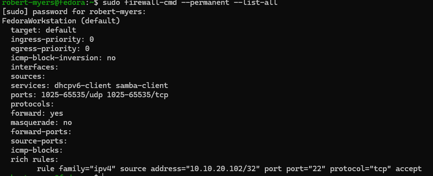

### Unauthorized Management Test

Yoda remained on the same 10.10.20.0/24 management network but was not included in ENVY's SSH allow rule.

Testing TCP/22 from Yoda:

```bash
nc -vz -w 3 10.10.30.100 22
```

returned a blocked result:

```text
No route to host
```

while Victus continued to connect successfully.

Despite the wording, this is not a routing failure. The route exists: Yoda connected to ENVY on port 27500 during the October 5 re-test (screenshot 37). Traffic that matches no allow rule in the firewalld zone is rejected with an ICMP "prohibited" message, and Linux reports that ICMP error to `nc` as "No route to host". A silent drop would have produced a timeout instead, as in the enclave-isolation test below.


### Enclave Isolation Test

ENVY was tested against Yoda in the management network:

```bash
ping -c 3 10.10.20.10
nc -vz -w 3 10.10.20.10 22
```

Results:

- ICMP: 100% packet loss
- TCP/22: timeout

This validated that VLAN30 could not initiate traffic into the management LAN.


### Final Validation Matrix

| Source | Destination | Test | Result |
|---|---|---|---|
| Victus 10.10.20.102 | ENVY 10.10.30.100 | TCP/22 | Allowed |
| Victus 10.10.20.102 | ENVY 10.10.30.100 | SSH login | Allowed |
| Yoda 10.10.20.10 | ENVY 10.10.30.100 | TCP/22 | Blocked |
| ENVY 10.10.30.100 | Yoda 10.10.20.10 | ICMP | Blocked |
| ENVY 10.10.30.100 | Yoda 10.10.20.10 | TCP/22 | Blocked |
| ENVY 10.10.30.100 | ER605 10.10.30.1 | ICMP | Allowed (not captured in NET-008) |

*(Superseded by the [Validation Matrix](#validation-matrix) in the Summary. This matrix had no rows for household or internet egress, ENVY's Wi-Fi interface, or ports other than 22; see Findings 2–4.)*

### Troubleshooting Performed

This lab included several distinct troubleshooting points:

- Verified host addressing and gateway reachability.
- Confirmed inter-VLAN path behavior with ping, route inspection, and TCP testing.
- Distinguished `Connection refused` from a timeout. (Not captured; see Reverse-Path Validation.)
- Identified incorrect Windows route selection on a dual-homed system. (Not captured; see Windows Routing Issue.)
- Corrected the path with a specific route to 10.10.30.0/24.
- Verified source address and interface selection after the route change.
- Restricted SSH access with a host-specific firewalld rich rule.
- Re-tested both authorized and unauthorized management sources.
- Reloaded firewalld and validated that the permanent configuration matched the intended active state. *(Superseded: on October 5 the saved configuration still had `1025-65535` and `samba-client`; see Finding 4.)*

### Key Concepts Demonstrated

- VLAN segmentation
- Inter-VLAN routing
- Asymmetric trust boundaries
- Least-privilege management access
- Host firewall policy
- Defense in depth
- Longest-prefix-match route selection
- Dual-homed host troubleshooting
- Service-state versus network-path troubleshooting
- Positive and negative control testing
- Persistent route configuration
- Persistent firewall configuration

*(Least privilege, defense in depth, and the persistent firewall configuration were incomplete as of October 2; see Findings 2–4.)*

### Result

NET-008 established a protected systems enclave on VLAN30 with a controlled management path from the lab network.

The final design allows Victus to administer ENVY over SSH, blocks another management-side host from the same service, and prevents the enclave from initiating connections back into the management LAN.

The ER605 keeps the enclave off the management LAN, and firewalld on the host limits who can manage it.

*(Superseded: this is the October 2 result. The current state is in the [Summary](#summary--current-state).)*

## Re-Test and Fixes — October 5, 2026

On October 5 I re-tested the enclave. My original tests only checked the paths the design was meant to control. This time I also tested the paths around it, and found five problems. I confirmed each one, traced it to a root cause, fixed it, and re-tested.

Terminal output I didn't capture as screenshots is in [`remediation-terminal-output.txt`](evidence/remediation-terminal-output.txt).

### Finding 1 — VLAN30 DHCP handed out a nonexistent DNS server

**Expected:** VLAN30 clients resolve names through the ER605.
**Observed:** ENVY's only lab resolver was `10.10.31.1`, an address on no configured subnet.
**Investigated:** `resolvectl status` showed the resolver; `nmcli -f DHCP4 device show` showed it arrived from the ER605 (`dhcp_server_identifier = 10.10.30.1`, `domain_name_servers = 10.10.31.1`; output §1). Before changing anything, `dig @10.10.30.1` confirmed the ER605 answers DNS on VLAN30.
**Root cause:** a one-digit typo I made in the VLAN30 DHCP pool's Primary DNS field when I created VLAN30 in NET-007.
**Change:** I changed Primary DNS to `10.10.30.1` and renewed ENVY's lease with `nmcli connection up`.
**Validation:** `resolvectl` reports `10.10.30.1`, and `resolvectl query` resolves through the lab interface (output §4).

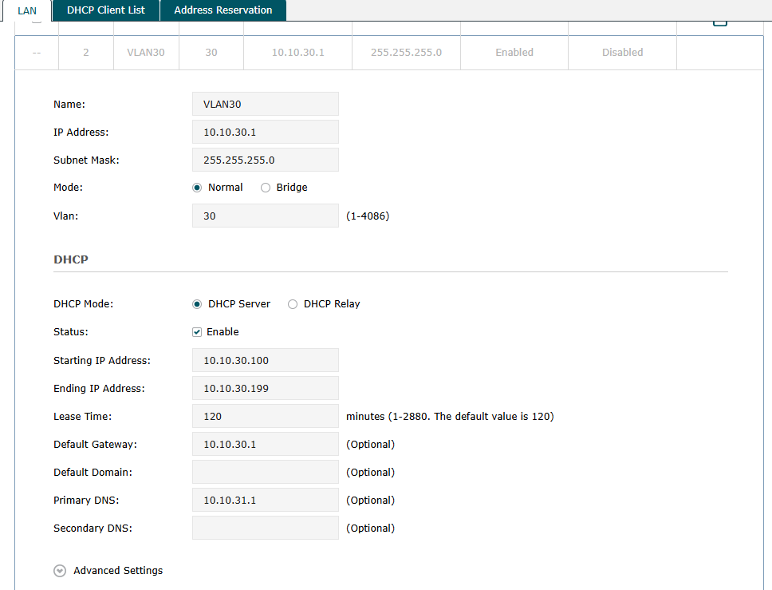

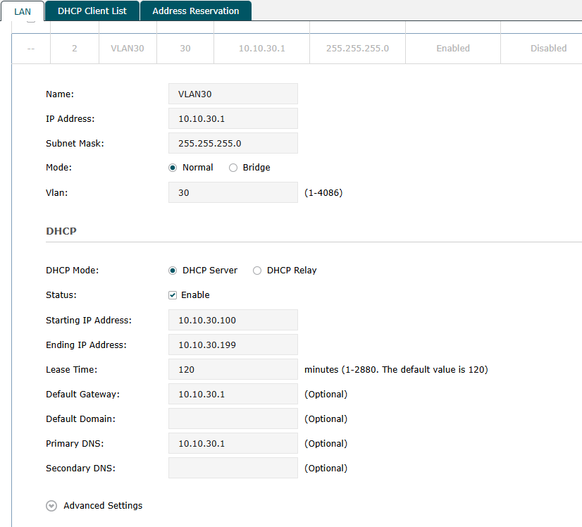

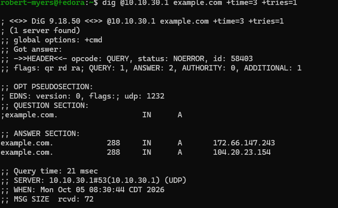

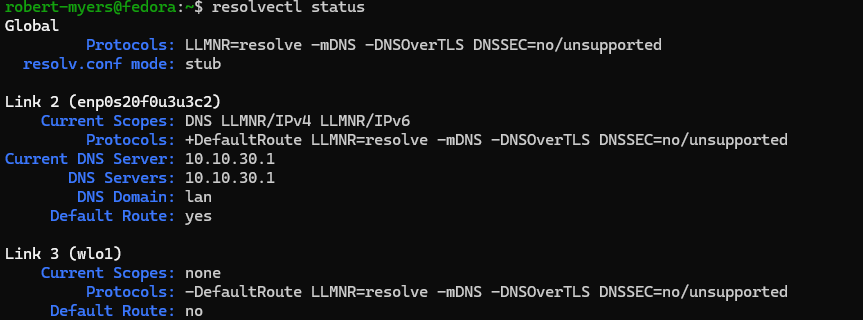

DNS seemed fine during the original build because ENVY was also resolving over its Wi-Fi interface. That's Finding 2.

### Finding 2 — The enclave host was dual-homed on the household network

**Expected:** the enclave host's only network path is VLAN30 through the ER605.
**Observed:** `ip route` showed ENVY's Wi-Fi interface on `192.168.1.0/24` with its own default route (output §2). The household network was directly attached, bypassing every ER605 control in both directions.
**Root cause:** I left the host's Wi-Fi connected when I moved it into the enclave. I didn't include host interfaces in the original test plan.
**Change:** `sudo nmcli radio wifi off`. NetworkManager persists the radio state across reboots.
**Validation:** `ip route` shows only the VLAN30 interface (output §3), and `resolvectl` shows `wlo1` with no scopes and no default route (screenshot 20).

The SSH restriction was not exposed through this path: both interfaces were in the same firewalld zone, so the `/32` rule applied to Wi-Fi too.

### Finding 3 — VLAN30 had household and internet egress through the ER605

**Expected:** like the rest of the lab, the enclave cannot reach the household network or the internet.
**Observed:** with Wi-Fi off, `ping 192.168.1.1` and `ping 1.1.1.1` from ENVY both succeeded (screenshot 22, output §5). A TTL of 63 from the household router confirmed the traffic was routed by the ER605.
**Investigated:** the ER605 egress rules (`DENY_Lab_to_Household`, `DENY_Lab_to_Any`) match the source group `GRP_LabNet`, which contained only `LabNet` (`10.10.20.0/24`).
**Root cause:** when I added VLAN30 in NET-007, I gave it a rule blocking the management LAN but never added it to the lab group the existing egress rules use.
**Change:** I added an address object `Enclave` (`10.10.30.0/24`) to `GRP_LabNet`. I didn't add or edit any ACL rules. Any rule keyed on the group now covers both subnets.
**Validation:** both pings now fail with 100% loss. A non-cached lookup (`resolvectl query --cache=no example.org`) still succeeds, because the ER605 performs the upstream query itself.

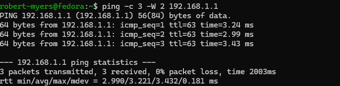

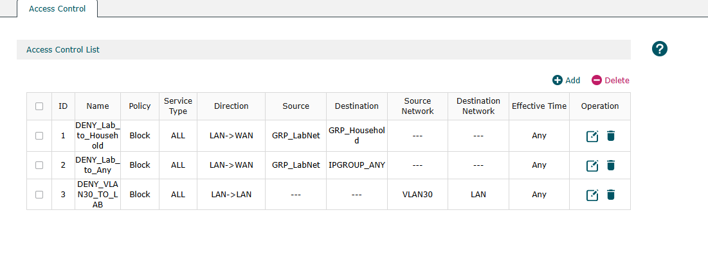

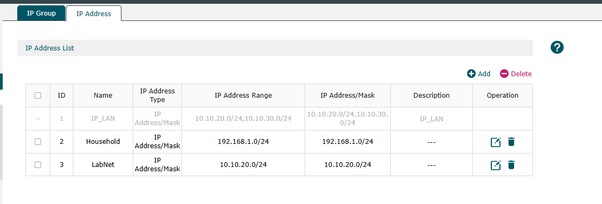

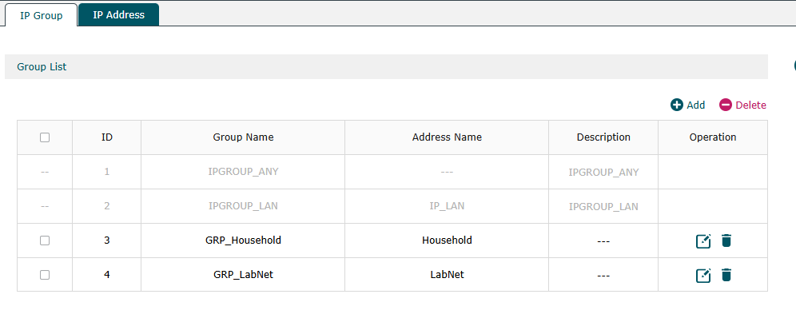

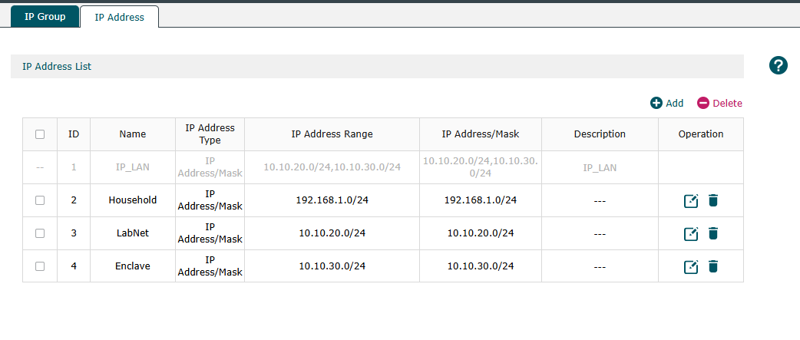

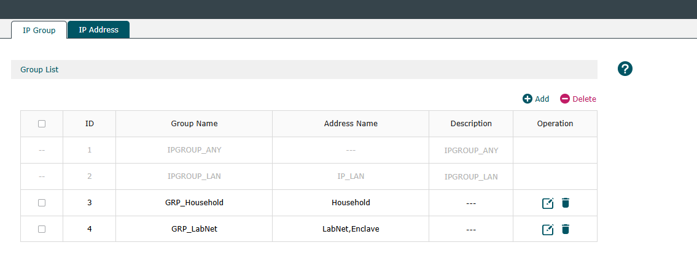

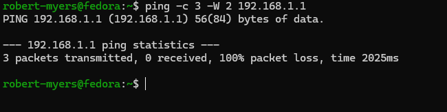

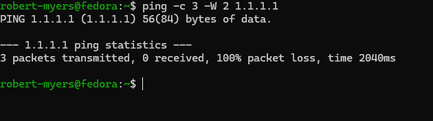

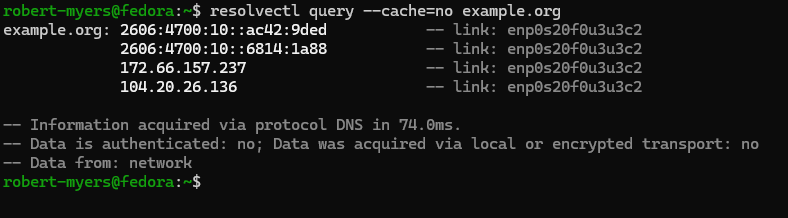

### Finding 4 — The SSH lockdown was the only inbound restriction

**Expected:** the enclave accepts only management SSH from the authorized workstation.
**Observed:** the saved firewall zone still carried the Fedora Workstation default of TCP and UDP `1025-65535` open. `ss -tuln` showed a listener on `0.0.0.0:27500`, and Yoda, which is refused on port 22, connected to port 27500.
**Investigated:** `ss -tlnp` identified the owner as `passimd`, the fwupd firmware-metadata sharing service. It's legitimate, but its job is sharing files with neighboring hosts, and an enclave host shouldn't do that.
**Change:** I masked the service with `systemctl mask --now passim.service`. Then I removed the high-port ranges and `samba-client` from the saved zone, checked the saved config, and applied it with `firewall-cmd --reload`. `samba-client` allows inbound NetBIOS traffic used for browsing Windows file shares, which the enclave host doesn't need.
**Validation:** port 27500 has no listener. Yoda is rejected on TCP 5355 (LLMNR), a service that is still listening, which proves the firewall alone now blocks it.

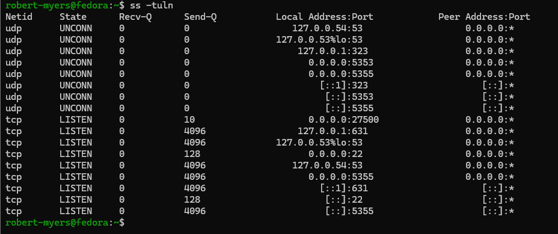

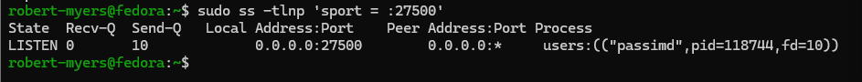

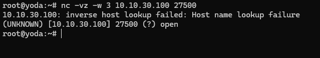

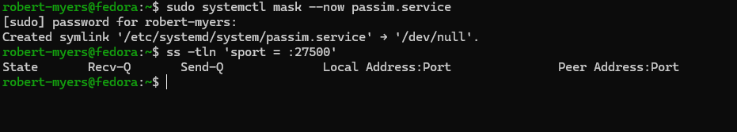

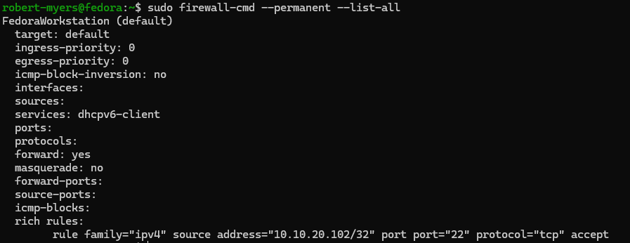

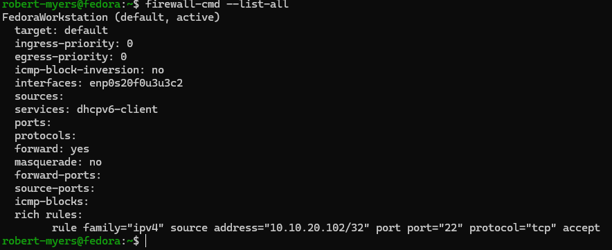

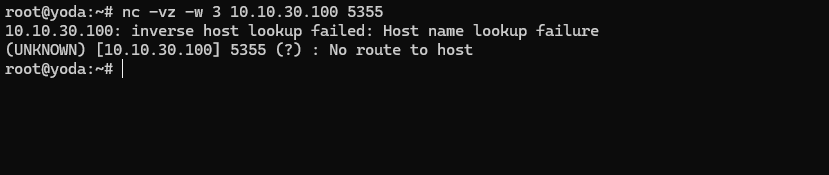

### Finding 5 — A pre-rule SSH session from Yoda survived about two and a half days

**Expected:** after the `/32` rule, the only SSH session on ENVY comes from Victus (`10.10.20.102`).
**Observed:** one SSH session on ENVY reported its source as `10.10.20.10`, which is Yoda. I didn't keep that first `$SSH_CONNECTION` output as a screenshot. Screenshot 12 shows the session: `who` lists `pts/2` from `10.10.20.10`, opened 2026-10-02 19:57.
**Investigated:** I checked Victus's addresses to rule out a duplicate IP (Victus was `10.10.20.102`, screenshot 10). I ran `$SSH_CONNECTION` again in my Victus session, which showed `10.10.20.102 51412 10.10.30.100 22` (screenshot 11). Then `who` showed two remote sessions: `pts/3` from Victus and `pts/2` from Yoda (screenshot 12). The Yoda session also appears in the October 2 `who` output in screenshot 03. New connections from Yoda are rejected (screenshot 13), so this session was opened before the rule took effect; I didn't record the time I applied the rule.
**Root cause:** firewalld tracks established connections, so tightening the rules does not terminate sessions that are already open. A plain `firewall-cmd --reload` preserves them.
**Change:** the stale session was closed. No firewall change was needed. Not captured: how I closed it.
**Validation:** `who` at 08:27 on October 5 shows only the Victus session (screenshot 14), and a new connection from Yoda is rejected (screenshot 13). Screenshot 13 has the same output as screenshot 05 and isn't timestamped.

The session was open from 19:57 on October 2 until the morning of October 5, about two and a half days.

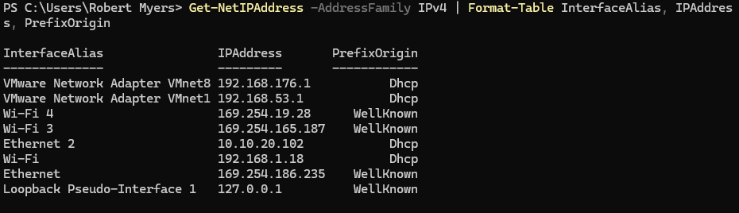


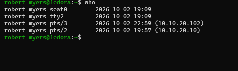

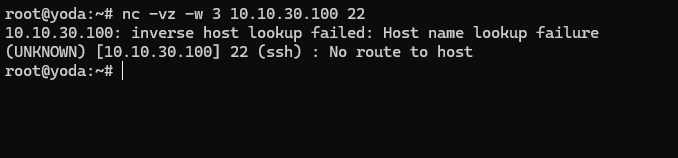

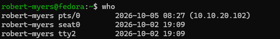

### Re-Test Results

The before/after results are in the [Validation Matrix](#validation-matrix) in the Summary. After the fixes, ENVY still can't reach Yoda:

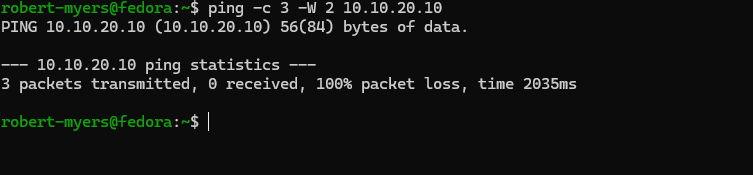

### Lessons

- **Test around the design, not just the design.** My original matrix only covered the paths the policy was built for. Every finding was on a path I hadn't written a test for: a second interface, an egress direction, a high port.
- **Read the evidence I already have.** The original build screenshots already showed three of the five problems: screenshot 04 lists `wlo1` in the firewall zone (Finding 2) and `1025-65535` open (Finding 4), and the `who` output in screenshot 03 lists `pts/2` from `10.10.20.10` (Finding 5). I captured them without catching them.
- **Group-based policy needs group maintenance.** Adding a subnet is incomplete until it is in every group the existing rules depend on.
- **A working symptom can hide a broken dependency.** DNS worked over Wi-Fi, so the broken lab resolver went unnoticed for a week.
- **Firewall changes don't revoke existing sessions.** After tightening access, check for and close sessions that predate the change.

### Production Considerations

- The enclave now has no standing internet egress. OS updates need a change window. I ran the first one the same day; see Patch Window below.
- In production, the ER605 and firewalld changes would go through change control with a rollback plan. The two-stage `--permanent` then `--reload` sequence used here is the host-level version of that discipline.
- Host interface inventory (`ip -br link`, `ip route`) belongs in any segmentation acceptance test.

## Patch Window — October 5, 2026

With egress blocked, ENVY can't reach the Fedora update mirrors. I opened a temporary, narrow path, patched, closed it, and re-tested.

**Plan and rollback before starting**

- The temporary rule must let VLAN30 reach the internet without reopening the household network.
- If the update broke something: `sudo dnf history undo last`.
- If the ER605 change misbehaved: delete the one rule I added.
- Before the reboot: confirm console access to ENVY in case SSH didn't come back. Not captured: the console-access check itself.

**Pre-change checks**

- Disk: 222 GB free on `/` (6% used); output §6.
- HTTPS to `mirrors.fedoraproject.org` timed out: `curl: (28) Connection timed out`, status `000`. That's the protocol dnf uses, so it's a better test than ping.

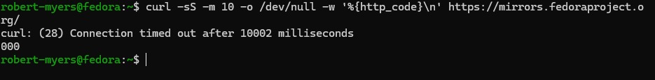

**Opening the window**

Pulling VLAN30 out of `GRP_LabNet` would also reopen the household network, so I didn't do that. Instead I created `GRP_Enclave` (VLAN30 only) and added an allow rule for it. The ER605 ACL form has an optional ID field that sets the rule's position, so I placed the rule at ID 2:

| ID | Rule | Effect for VLAN30 |
|---|---|---|
| 1 | `DENY_Lab_to_Household` | household still denied, matched first |
| 2 | `TEMP_ALLOW_Enclave_Updates` | internet allowed |
| 3 | `DENY_Lab_to_Any` | everything else denied |
| 4 | `DENY_VLAN30_TO_LAB` | lab LAN still denied |

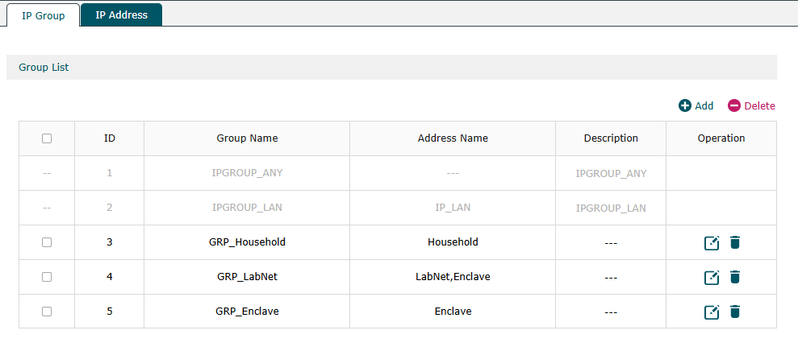

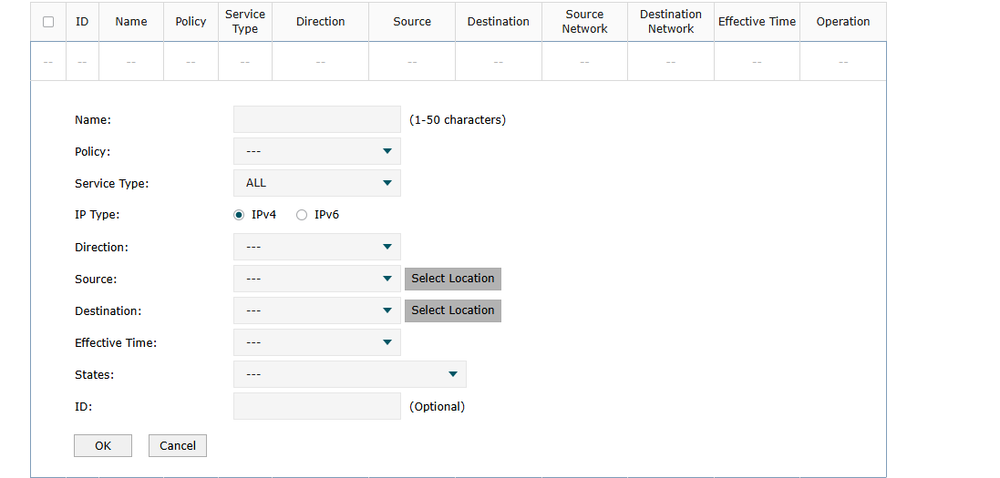

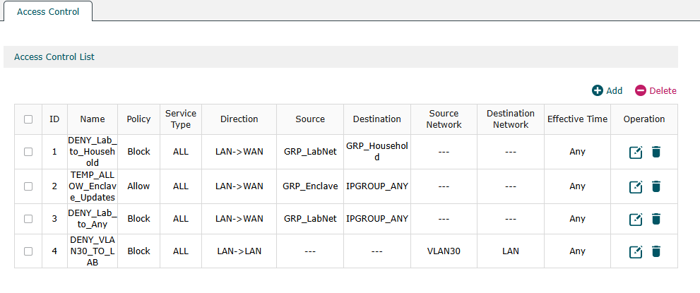

Before using the window I tested that it only opened what I intended. The household router was still unreachable, and the mirror site answered with `302`.

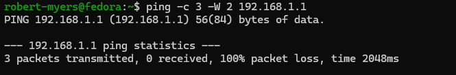

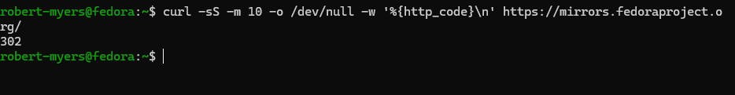

The service type was `ALL` because dnf may use HTTP or HTTPS mirrors. In production I'd narrow it to ports 80 and 443, and to the mirror destinations if the firewall supports it.

**Update**

A dry run (`sudo dnf upgrade --refresh --assumeno`) showed 150 packages and a 1 GiB download, so I knew the size before committing. The real run listed a new kernel, `7.2.8-200.fc44`, so a reboot was needed.

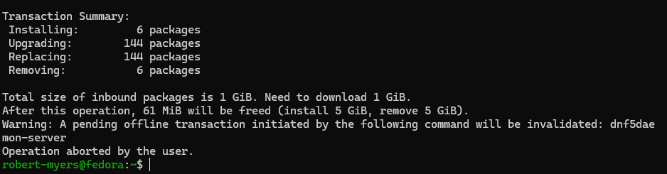

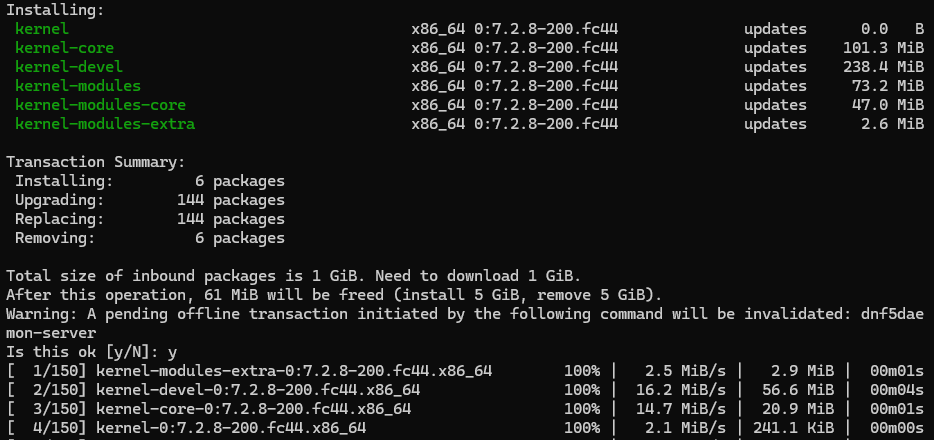


dnf invalidated a pending offline update that GNOME Software (`dnf5daemon-server`) had queued.

**Closing the window**

I deleted the temporary rule before rebooting, since nothing else needed internet access. Deleting instead of disabling means there's no allow rule left that could be switched back on by mistake. `GRP_Enclave` stays for the next window. HTTPS to the mirror site timed out again.

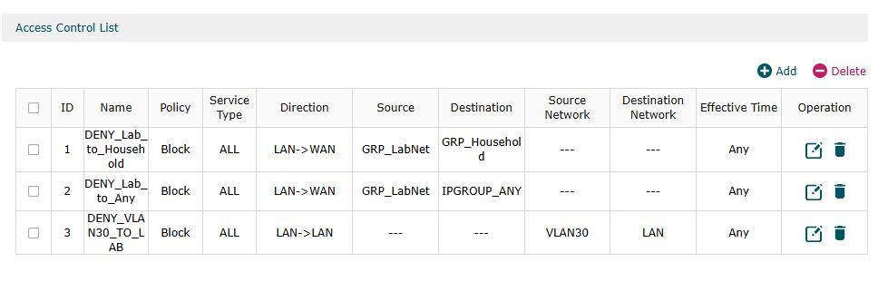

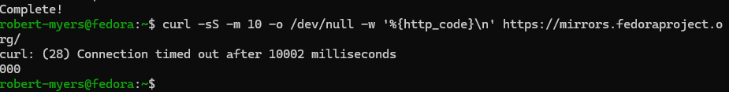

**After the reboot**

| Check | Result |
|---|---|
| Running kernel | `7.2.8-200.fc44.x86_64` |
| Wi-Fi radio | `disabled`; only VLAN30 routes |
| Firewall zone | `dhcpv6-client` only, no open ports, `/32` SSH rule present |
| Passim | `masked` |
| DNS | resolves through the ER605 |
| SSH from Victus | reconnected normally |

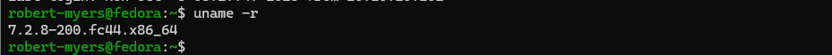

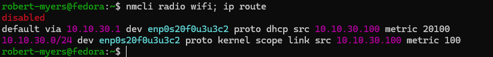

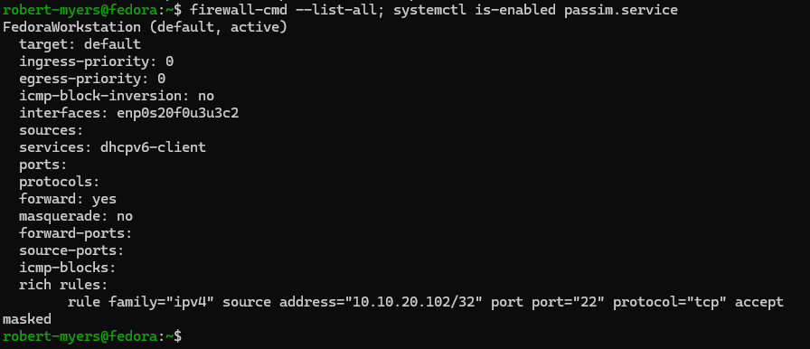

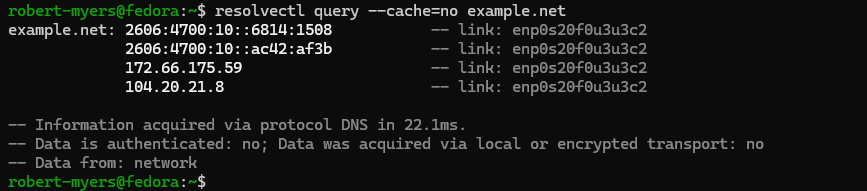

One change I didn't expect: the default route's metric went from 100 to 20100. After boot, NetworkManager's connectivity check couldn't reach the internet, so it marked the connection as limited and added a 20000 penalty to that route. With only one default route, traffic still goes to `10.10.30.1`. The host noticed for itself that it has no internet.

I didn't capture timestamps for opening and closing the window. The update was the only thing I used it for.

## Background Egress Attempts — October 7, 2026

During the NET-007 trunk capture, ENVY was sending traffic nobody had told it to send. The capture box was the XPS on a mirror of SG108E Port 1, set up so it sends nothing itself ([NET-007 re-test](../NET-007-vlan-segmentation/README.md#re-test-8021q-tag-captured-on-the-trunk-october-7-2026)).

### What was on the wire

ENVY was sending a steady stream of TCP SYNs to port 443 with no replies. The SYNs repeated with the same sequence numbers, which is TCP retransmitting the first packet of a connection that never got an answer. Four connections were cycling to `52.222.205.16`, `.45`, `.65` and `.74` (evidence 58). The boundary was dropping them, so ENVY kept retrying.

### Naming the processes

`ss` on ENVY shows which process owns a connection, but by the time I ran it, those four had timed out and been replaced, so I couldn't tie them to anything. To get a match, I ran the capture and `sudo ss -tnp state syn-sent` at the same time:

- Capture: `10.10.30.100.54728 > 151.101.65.91.443: Flags [S]` (evidence 59)
- `ss`: `10.10.30.100:54728  151.101.65.91:443  users:(("gnome-software",pid=3390,fd=43))` (evidence 60)

Same source port, same destination, at the same moment. Every connection in `SYN-SENT` belonged to `gnome-software`.

The same capture showed a second pattern: a DNS lookup for `fedoraproject.org` through the ER605, followed by SYNs to the answers on port 80. None of those appeared in the `ss` output under `gnome-software`. NetworkManager's connectivity check is configured as `uri=http://fedoraproject.org/static/hotspot.txt` (evidence 61), which matches the lookup and the port.

| Talker | What it does | Port | How it was identified |
|---|---|---|---|
| `gnome-software` | Refreshes the app catalog. Its log shows repeated `Treating remote fetch error as non-fatal` warnings for `runtime/…` and `app/…` refs | 443 | Source port 54728 matched between capture and `ss` |
| NetworkManager connectivity check | Fetches `hotspot.txt` to decide whether the host has internet | 80 | Configured URI matches the DNS lookup and port 80 SYNs |
| Not identified | SYNs to `52.222.205.x:443` | 443 | Timed out before I could check them |

Neither talker can succeed in the enclave. The cost is noise: a box that's supposed to be quiet was retrying constantly, which would hide traffic that shouldn't be there.

### Fixes

**NetworkManager connectivity check.** I left Fedora's file in `/usr/lib` alone, since a package update can overwrite it, and added an override in `/etc`:

```text
/etc/NetworkManager/conf.d/99-disable-connectivity-check.conf
[connectivity]
enabled=false
```

`sudo nmcli general reload conf` applied it without restarting NetworkManager, so my SSH session from Victus stayed up. `NetworkManager --print-config` shows the merged result as `[connectivity]` / `enabled=false` (evidence 61). Files load in order, so `99-` wins over Fedora's `20-connectivity-fedora.conf`.

**gnome-software.** `/etc/xdg/autostart` had no entry for it. `systemctl --user status 3390` showed why: it runs as the systemd user service `gnome-software.service` (`static`, started on demand), running `/usr/bin/gnome-software --gapplication-service` (evidence 62). A static unit can't be disabled, so I masked it first and then stopped it:

```text
systemctl --user mask gnome-software.service
systemctl --user stop gnome-software.service
```

Status afterward: `Loaded: masked`, `Active: inactive (dead) since 17:50:36`, `Main PID: 3390 (code=killed, signal=TERM)` (evidence 63). The Software app won't open while it's masked. ENVY's updates go through `dnf` in a temporary window, so it isn't needed here. `systemctl --user unmask gnome-software.service` reverses it.

### Validation

A 6-minute capture on the same mirror after both fixes, excluding my SSH session:

```text
sudo timeout 360 tcpdump -i eth0 -nn 'vlan 30 and host 10.10.30.100 and not port 22'
```

There were no SYNs to port 443 or 80 and no `fedoraproject.org` lookups (evidence 64). What was left:

| Traffic | What it is |
|---|---|
| ARP request and reply for `10.10.30.1` (twice) | ENVY keeping its gateway's MAC current |
| mDNS query to `224.0.0.251:5353` | Avahi asking the local network for file-sharing services. Link-local, so it doesn't leave VLAN 30 |
| NTPv4 client to `172.234.25.10:123` | chrony reaching for an internet time server. The ER605 drops it, so ENVY currently has no time source |

The NTP finding is not fixed here.

### Lessons

- **A passive capture shows what a host actually does, not what it was configured to do.** The firewall and ACL tests in the October 5 re-test proved what was blocked. They didn't show what ENVY kept trying to reach.
- **Tie the packet to the process before naming it.** The first `ss` check showed `gnome-software`, but on different connections than the ones I'd captured. Running both at the same moment and matching a source port is what made the claim.
- **Override vendor config in `/etc`, don't edit it in `/usr/lib`.**

### Evidence Limits

- Evidence 58, 59, 60 and 64 are phone photos of the screen. MAC addresses in 59 and 64 are masked.
- The four `52.222.205.x` connections in the first capture were never tied to a process.
- The 6-minute capture reported `10 packets received by filter` but printed 6. The other four matched the filter but weren't printed before `timeout` ended the capture.
- The default route metric of 20100 noted under Patch Window came from the connectivity check marking the connection as limited. With the check disabled, I haven't re-checked the metric.

## Evidence Index

"Output §n" is a section of [`remediation-terminal-output.txt`](evidence/remediation-terminal-output.txt). Numbers 15, 16, 21, 23, 29 and 42 were not kept as screenshots.

| # | File | What it shows |
|---|---|---|
| 01 | `01-windows-route-to-enclave.png` | Victus `Find-NetRoute`: `10.10.30.0/24` via `10.10.20.1` on Ethernet 2, source `10.10.20.102`, RouteMetric 256 |
| 02 | `02-windows-authorized-ssh-test.png` | Victus `Test-NetConnection` to ENVY TCP/22 succeeds from `10.10.20.102` over Ethernet 2 |
| 03 | `03-windows-successful-ssh-login.png` | SSH login from Victus; October 2 `who` also lists `pts/2` from `10.10.20.10` (Finding 5) |
| 04 | `04-fedora-firewall-management-rule.png` | ENVY runtime zone (original build): `/32` SSH rule, no `ssh` service; also `wlo1`, `samba-client`, `1025-65535` |
| 05 | `05-yoda-unauthorized-ssh-blocked.png` | Yoda to ENVY TCP/22: `No route to host` (firewalld reject) |
| 06 | `06-enclave-to-management-blocked.png` | ENVY to Yoda: ICMP 100% loss, TCP/22 timeout |
| 07 | `07-er605-vlan30-to-lab-deny-rule.png` | ER605 ACL table with `DENY_VLAN30_TO_LAB` |
| 08 | — | Not used; the permanent firewall view is 34 |
| 09 | `09-windows-persistent-enclave-route.png` | Victus route with RouteMetric 5, and TCP/22 to ENVY succeeding |
| 10 | `10-victus-ipv4-addresses.png` | Victus: Ethernet 2 `10.10.20.102`, Wi-Fi `192.168.1.18`; no duplicate of `10.10.20.10` |
| 11 | `11-fedora-sees-source-victus-10.10.20.102.png` | `$SSH_CONNECTION` in the Victus session: `10.10.20.102 51412 10.10.30.100 22` |
| 12 | `12-fedora-who-active-sessions.png` | `who`: `pts/3` from Victus (Oct 2 22:59), `pts/2` from Yoda (Oct 2 19:57) |
| 13 | `13-yoda-new-ssh-rejected.png` | Yoda new TCP/22 to ENVY: `No route to host` (not timestamped) |
| 14 | `14-fedora-who-after-reconnect.png` | `who` at Oct 5 08:27: only the Victus session remains |
| 15 | not kept | Output §2: `ip route` with VLAN30 and Wi-Fi default routes |
| 16 | not kept | Output §3: Wi-Fi off, VLAN30 routes only |
| 17 | `17-dig-er605-vlan30-resolver-test.png` | `dig @10.10.30.1` answers (Oct 5 08:30:44 CDT) |
| 18 | `18-er605-vlan30-dhcp-dns-before.png` | VLAN30 DHCP Primary DNS `10.10.31.1` |
| 19 | `19-er605-vlan30-dhcp-dns-after.png` | VLAN30 DHCP Primary DNS `10.10.30.1` |
| 20 | `20-resolvectl-after-dhcp-fix.png` | `resolvectl`: `10.10.30.1` on the VLAN30 link; `wlo1` no scopes, no default route |
| 21 | not kept | Output §4: lease renewed, `resolvectl query` through the lab link |
| 22 | `22-fedora-to-household-ALLOWED.png` | ENVY to `192.168.1.1`: 3/3 replies, TTL 63 |
| 23 | not kept | Output §5: ENVY to `1.1.1.1`: 3/3 replies |
| 24 | `24-er605-acl-rules-before.png` | ER605 egress rules keyed on `GRP_LabNet` |
| 25 | `25-er605-ip-addresses-before.png` | ER605 addresses: `LabNet` and `Household`, no VLAN30 object |
| 26 | `26-er605-ip-groups-before.png` | `GRP_LabNet` = `LabNet` only |
| 27 | `27-er605-ip-address-enclave-added.png` | `Enclave` (`10.10.30.0/24`) address added |
| 28 | `28-er605-grp-labnet-after.png` | `GRP_LabNet` = `LabNet,Enclave` |
| 29 | not kept | No copy of its output is in the repo |
| 30 | `30-fedora-to-household-blocked-after.png` | ENVY to `192.168.1.1`: 100% loss |
| 31 | `31-fedora-to-internet-blocked-after.png` | ENVY to `1.1.1.1`: 100% loss |
| 32 | `32-dns-still-works-egress-blocked.png` | Non-cached lookup still resolves with egress blocked |
| 33 | `33-enclave-to-management-blocked.png` | ENVY to Yoda: 100% loss after the fixes |
| 34 | `34-firewall-permanent-before-tightening.png` | Saved zone before Finding 4: `samba-client`, `1025-65535`, `/32` rule |
| 35 | `35-fedora-listening-sockets-before.png` | `ss -tuln`: listener on `0.0.0.0:27500` |
| 36 | `36-port-27500-owner.png` | Port 27500 owned by `passimd` |
| 37 | `37-yoda-reaches-27500-before.png` | Yoda to ENVY 27500: open |
| 38 | `38-passim-masked-27500-closed.png` | `passim` masked; no listener on 27500 |
| 39 | `39-firewall-permanent-tightened.png` | Saved zone after: `dhcpv6-client`, `/32` rule, no ports |
| 40 | `40-firewall-runtime-after-reload.png` | Runtime zone after reload matches; only the VLAN30 interface |
| 41 | `41-yoda-high-port-rejected-after.png` | Yoda to ENVY 5355: `No route to host` (rejected) |
| 42 | not kept | Output §6: `df -h /`, 222G available, 6% used |
| 43 | `43-pre-change-https-egress-blocked.png` | HTTPS to the mirror site times out before the window |
| 44 | `44-er605-grp-enclave-created.png` | `GRP_Enclave` created |
| 45 | `45-er605-acl-add-form.png` | ACL form with the optional ID field |
| 46 | `46-er605-temp-allow-rule-order.png` | `TEMP_ALLOW_Enclave_Updates` at ID 2 |
| 47 | `47-window-open-household-still-blocked.png` | Household still blocked with the window open |
| 48 | `48-window-open-https-egress-allowed.png` | Mirror site answers `302` with the window open |
| 49 | `49-dnf-upgrade-dry-run.png` | Dry run: 150 packages, 1 GiB |
| 50 | `50-dnf-upgrade-kernel-in-transaction.png` | Kernel `7.2.8-200.fc44` in the transaction |
| 51 | `51-dnf-upgrade-complete.png` | dnf complete; pending offline transaction invalidated |
| 52 | `52-er605-temp-rule-removed.png` | Temporary rule deleted; ACL back to three rules |
| 53 | `53-window-closed-https-egress-blocked.png` | HTTPS to the mirror site times out after the window |
| 54 | `54-post-reboot-new-kernel.png` | Running kernel `7.2.8-200.fc44.x86_64` |
| 55 | `55-post-reboot-wifi-off-single-homed.png` | Wi-Fi `disabled`; only VLAN30 routes; default metric 20100 |
| 56 | `56-post-reboot-firewall-and-passim.png` | Zone after reboot; `passim` masked |
| 57 | `57-post-reboot-dns-works.png` | Non-cached lookup resolves after reboot |
| 58 | `58-xps-tcpdump-envy-https-syns-photo.jpg` | October 7: ENVY SYNs to `52.222.205.x:443`, same sequence numbers repeating (photo) |
| 59 | `59-xps-tcpdump-envy-correlated-photo.jpg` | SYN from source port 54728 to `151.101.65.91:443`; `fedoraproject.org` lookup and port 80 SYNs; all tagged `vlan 30` (photo, MACs masked) |
| 60 | `60-envy-ss-syn-sent-gnome-software-photo.jpg` | `ss` on ENVY: port 54728 to `151.101.65.91:443` owned by `gnome-software`, pid 3390 (photo) |
| 61 | `61-envy-nm-connectivity-uri-and-disabled.png` | Fedora's connectivity URI, and the merged config showing `enabled=false` |
| 62 | `62-envy-gnome-software-service.png` | `gnome-software.service`, static, `--gapplication-service`; remote fetch warnings in the log |
| 63 | `63-envy-gnome-software-masked-stopped.png` | Masked, stopped, pid 3390 killed with TERM |
| 64 | `64-xps-tcpdump-envy-quiet-after-fix-photo.jpg` | 6-minute capture after the fixes: ARP, mDNS, NTP only (photo, MACs masked) |
| — | `remediation-terminal-output.txt` | Output for 15, 16, 21, 23 and 42, plus the DHCP options for Finding 1 |

## Public Evidence Notes

The screenshots used in this project were reviewed before publication. Public evidence excludes passwords, tokens, public IP addresses, MAC addresses, private keys, and other unnecessary identifiers. RFC1918 lab addresses are retained because they are part of the documented network design.

## Status
**PROVEN**

Allowed and denied management paths were tested from both sides of the boundary, and both the route and the firewall policy were made persistent. The October 5 re-test found and fixed five problems; see [GAPS.md](../../_control/GAPS.md). A few October 2 steps were not captured and are marked "Not captured" above. On October 7, a passive capture found ENVY retrying HTTPS and HTTP egress in the background; both sources were named, turned off, and confirmed quiet on the wire.
