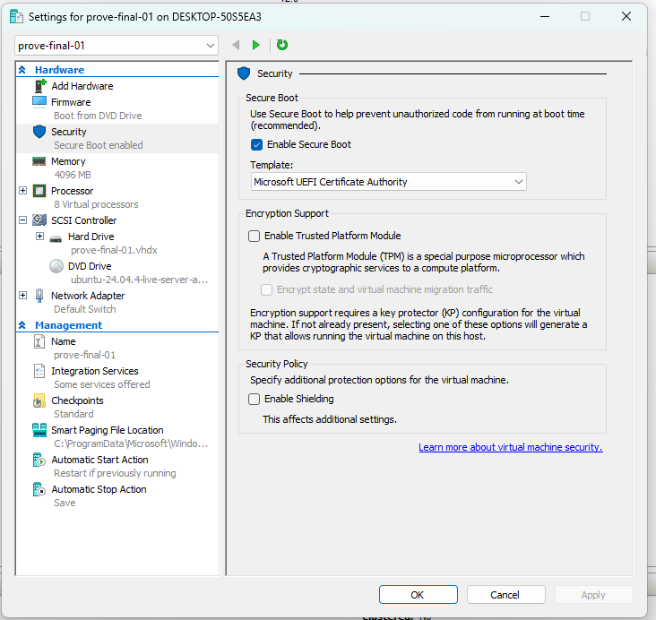
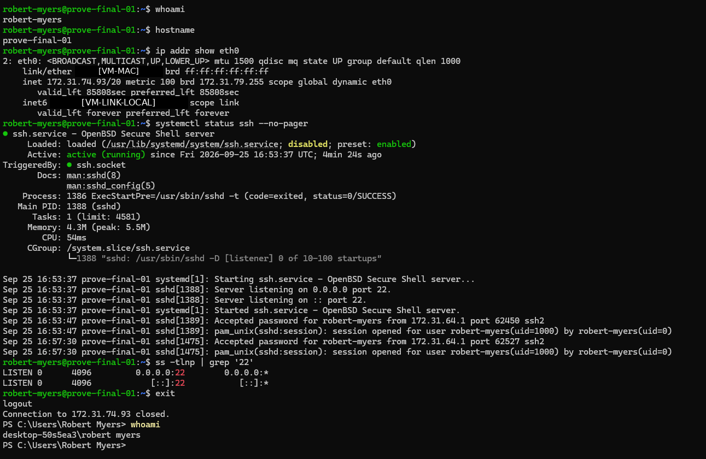
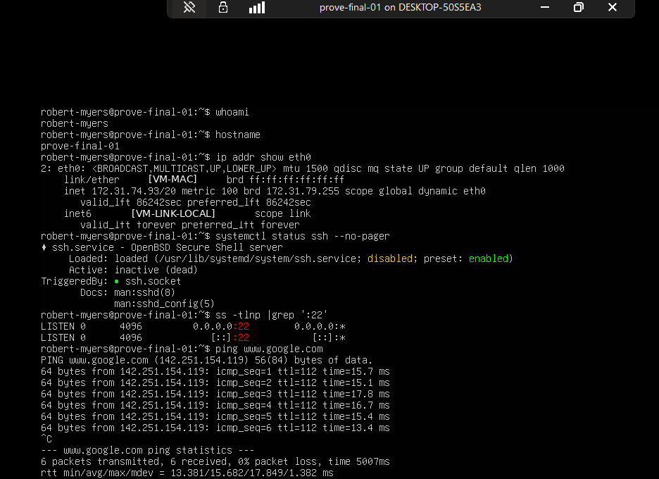

# LNX-001 — Linux VM Build and SSH Administration

## Hiring Claim
After reviewing this artifact, a hiring manager has evidence that I can build a Linux server VM in Hyper-V, put it on the network, and connect to and verify it over SSH, with proof from both the client and the server side.

## Employer Skills Demonstrated
- Hyper-V Generation 2 VM build
- Secure Boot template selection for Linux
- Ubuntu Server installation
- Linux network configuration checks
- DNS and external connectivity validation
- SSH remote access from Windows
- SSH listener and log verification

## Objective
Build a fresh Linux virtual machine, get it on the network, and remotely administer it over SSH without being walked through the process.

This was not my first time building a VM. The difference here was proving each part instead of treating a working VM as proof by itself.

## Environment

| Item | Value |
|---|---|
| Host | Victus (Windows, Hyper-V) |
| VM | `prove-final-01`, Generation 2 |
| OS | Ubuntu Server 24.04.4 LTS |
| Resources | 4 GB RAM, 8 vCPU, 30 GB disk |
| Network | Hyper-V Default Switch |

## Build

Because I was installing Linux on a Generation 2 Hyper-V VM, I changed the Secure Boot template from the Windows default to **Microsoft UEFI Certificate Authority** before installing Ubuntu. That lets the VM trust the Ubuntu boot loader.

I installed Ubuntu Server with a normal non-root account and included OpenSSH Server.

In the installer, `eth0` got `172.31.77.143/20` from DHCP on the Default Switch (screenshot 03). For storage I used the LVM layout: `/boot/efi` (1.049G fat32) and `/boot` (2.000G ext4) as partitions on the 30 GB disk, with `/` as a 13.472G ext4 logical volume in `ubuntu-vg` and 13.472G of the volume group left free (screenshot 04).

I did not patch the VM after installation. Patching was not the objective. The goal was to build the system, establish networking, reach the outside network, and administer it over SSH.

## Local Validation

After installation I verified the system locally:

- User: `robert-myers`
- Hostname: `prove-final-01`
- Interface: `eth0`
- IPv4 address: `172.31.74.93/20`

That is a different address from the one the installer showed (`172.31.77.143`). The Default Switch DHCP address changed after installation.

I also confirmed TCP port 22 was listening on IPv4 and IPv6.

One detail I want to understand better: before I connected remotely, `ssh.service` showed as inactive while `ssh.socket` was listening on port 22. After the SSH connection was made, the service became active and logged the authentication. I'm leaving the deeper explanation for the systemd and services work instead of hand-waving past it here.

## External Connectivity

I tested connectivity to `www.google.com`. The VM resolved the name to a public address and got 6 of 6 ICMP replies with 0% packet loss. That shows both DNS resolution and outbound connectivity.

## Remote SSH Validation

From Windows on Victus I connected to `prove-final-01` over SSH and verified the user, hostname, and interface again from inside the remote session.

The Linux SSH logs recorded two accepted password logins for `robert-myers` from the Hyper-V host-side address `172.31.64.1` (source ports `62450` at 16:53:47 and `62527` at 16:57:30).

That gives evidence from both sides: Windows established the session, and Linux recorded the authentication.

## Evidence Review

The external connectivity proof (screenshot 07) comes from the same local console session as screenshot 05. Both show the same `valid_lft 86242sec` and `ssh.service` as `inactive (dead)`, and 07 continues with the `ping www.google.com` after the `ss` check. So the ping ran before the SSH session, not afterward. During my final evidence review I noticed the package didn't include it, and I added it from that session's output.

Doing the work and proving the work are two different things.

## Findings

- The VM was built with the correct Secure Boot trust template for Linux.
- The VM received an address on the Hyper-V Default Switch network and reached the internet with working DNS.
- SSH was listening on TCP/22 and accepted a session from the Windows host.
- The Linux side logged that session from the expected host-side address.

## Evidence Index

| Evidence | What it shows |
|---|---|
| `01-hyperv-vm-build.png` | Generation 2 VM creation |
| `02-hyperv-secure-boot.png` | Microsoft UEFI Certificate Authority template |
| `03-installer-network-config.png` | Installer network configuration |
| `04-installer-lvm-layout.png` | LVM storage layout (disk ID redacted) |
| `05-local-linux-validation.png` | Local user, hostname, interface, SSH listener |
| `06-remote-ssh-validation.png` | SSH session from Windows and Linux log entry |
| `07-external-connectivity.png` | DNS resolution and 6/6 ICMP replies |

## Evidence Handling
VM MAC addresses and the MAC-derived IPv6 link-local addresses are replaced with `[VM-MAC]` and `[VM-LINK-LOCAL]`. The virtual disk identifier in the installer storage screen (screenshot 04) is covered with `[DISK-ID]`. My username and host names are left visible.

## Status
**PROVEN**

The build, addressing, DNS and outbound ping, and SSH login are each shown in screenshots, and the SSH login is confirmed from both sides. The remote session ran read-only checks; I didn't make configuration changes over SSH in this project.
