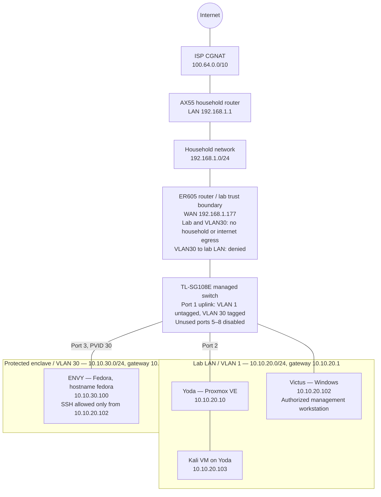

# Prove-It

This repository is my hands-on body of proof for **Network & Systems Infrastructure**.

The goal is simple: demonstrate that I can understand, build, troubleshoot, secure, validate, and recover networked systems through work I actually performed and evidence I can explain in an interview.

## Current Technical Spine

**Network & Systems Infrastructure**

Primary focus:

- Ethernet, ARP, TCP/IP, routing, and switching
- VLANs, 802.1Q, inter-VLAN routing, and segmentation
- DNS, DHCP, NAT, VPN, and other core network services
- Linux and Windows systems administration
- Proxmox and Hyper-V virtualization
- Packet capture and protocol analysis
- Firewall and access-control behavior
- Monitoring, logging, backup, and recovery
- Structured troubleshooting and root-cause analysis

Security is integrated into the infrastructure work through segmentation, least privilege, traffic analysis, logging, hardening, and recovery validation.

## Proof Method

Every substantial artifact follows the same standard:

**Learn -> Build -> Break when useful -> Diagnose -> Fix -> Prove -> Explain**

A screenshot, command, or successful ping is not enough by itself.

Strong proof connects:

**Objective -> Action -> Machine-generated evidence -> Analysis -> Validation -> Finding**

Failures are useful when they expose real troubleshooting work. Claims are limited to what the collected evidence actually supports.

Each project is one documented run. When I retest or fix something later, I record it in the same project instead of starting a new version.

## Lab Topology

Current state as of October 7, 2026, after the LAB-001, NET-007 and NET-008 re-tests. Each artifact documents the state at the time it was built.

### Host Roster

| Host | OS / Platform | Address | Network | Role | First documented |
|---|---|---|---|---|---|
| ER605 | TP-Link ER605 v2 | `10.10.20.1`, `10.10.30.1`, WAN `192.168.1.177` | Lab / VLAN 30 / household | Router, DHCP, DNS relay, ACL trust boundary | LAB-001 |
| TL-SG108E | TP-Link managed switch | `10.10.20.100` | Lab | 802.1Q switching, port mirroring; unused ports 5–8 disabled since NET-007; doesn't answer ping | LAB-001 |
| Yoda | Proxmox VE | `10.10.20.10` | Lab | Virtualization host; IP forwarding off on `vmbr0` since NET-005 | LAB-001 |
| Kali | Kali Linux VM on Yoda | `10.10.20.103` | Lab | Security testing, no egress | LAB-001 |
| Victus | Windows 11 | `10.10.20.102` | Lab (also household Wi-Fi) | Management workstation, Wireshark | LAB-001 |
| ENVY | Fedora Workstation, hostname `fedora` | `10.10.30.100` | VLAN 30 | Protected enclave host, tcpdump capture; background update checks off since NET-008 | LAB-001 |
| AX55 | Household router | `192.168.1.1` | Household | Household router, CGNAT upstream | NET-006 |

ENVY was on the lab LAN at `10.10.20.101` until NET-007 moved it to VLAN 30. Its Wi-Fi was turned off in NET-008, so it is single-homed. Victus is still dual-homed; a specific route sends enclave traffic over its lab interface (NET-008).

A separate Kali laptop (the XPS) is used as a passive capture box on a switch mirror port. It isn't a range member: it runs with no address and NetworkManager off on its wired interface (NET-007).

## Repository Structure

Every artifact lives at `NN-area/ID-short-slug/`, numbered in catalog order:

- `00-lab-infrastructure/` - lab architecture, boundaries, and baseline state
- `01-networking/` - networking proof from Ethernet through segmentation and troubleshooting
- `02-linux/` - Linux administration

New areas appear as their first artifact is published.

The [Evidence Index](EVIDENCE-INDEX.md) links every published artifact and maps each skill to the work that proves it.

## Current Networking Proof

Published networking artifacts include:

- **NET-001** - Ethernet, ARP & MAC Learning with Port Mirroring
- **NET-002** - TCP vs UDP Traffic Analysis
- **NET-003** - DNS Resolution and Troubleshooting
- **NET-004** - HTTP/TLS Traffic Analysis
- **NET-005** - Routing and Path Selection
- **NET-006** - NAT and CGNAT Path Analysis
- **NET-007** - VLAN Segmentation and Policy Enforcement
- **NET-008** - Protected Systems Enclave

These artifacts use physical and virtual lab systems, packet captures, routing evidence, switch/router configuration, controlled failure, and before/after validation.

## Evidence and Privacy

Raw working evidence stays local under ignored `evidence/raw/` directories.

Before publication, evidence is reviewed and unnecessary identifiers, credentials, secrets, MAC addresses, SSIDs, public IPs, account identifiers, and unrelated packet data are removed or replaced with stable role labels when needed.

Private RFC1918 addressing is retained when it materially explains the architecture.

My name, usernames, and workstation hostnames show up in terminal prompts and window titles. I leave those visible on purpose because this is a named portfolio.

A companion investigation, [packet-analysis-lab](https://github.com/RobertMyersCloud/packet-analysis-lab), applies the protocol work from NET-001 through NET-003 to troubleshooting and security analysis.

## Training Boundary

Training is an input, not a public artifact.

I do not publish proprietary course material, answer keys, exam questions, copyrighted lab instructions, proprietary VM images, or restricted datasets.

Useful concepts are learned, reproduced independently in my own environment, validated with original evidence, and documented in my own words.

## End State

I'm not trying to collect a pile of disconnected labs. Each project builds on the one before it, from fundamentals toward the kind of troubleshooting, monitoring, and recovery work an infrastructure job actually involves.

**Prove it.**
