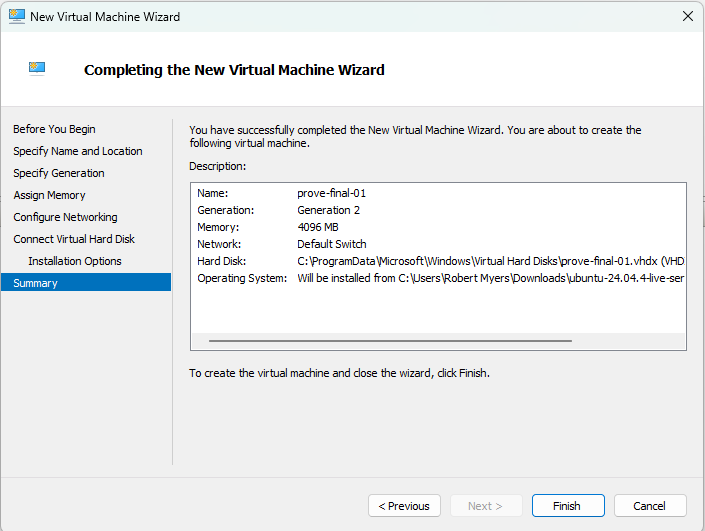
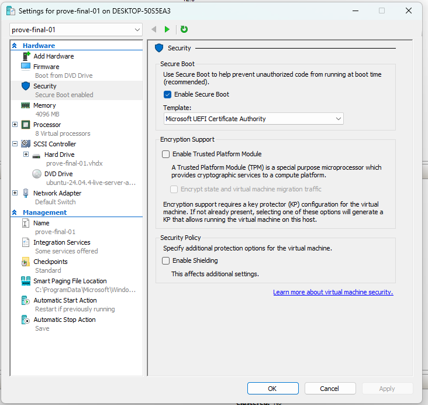
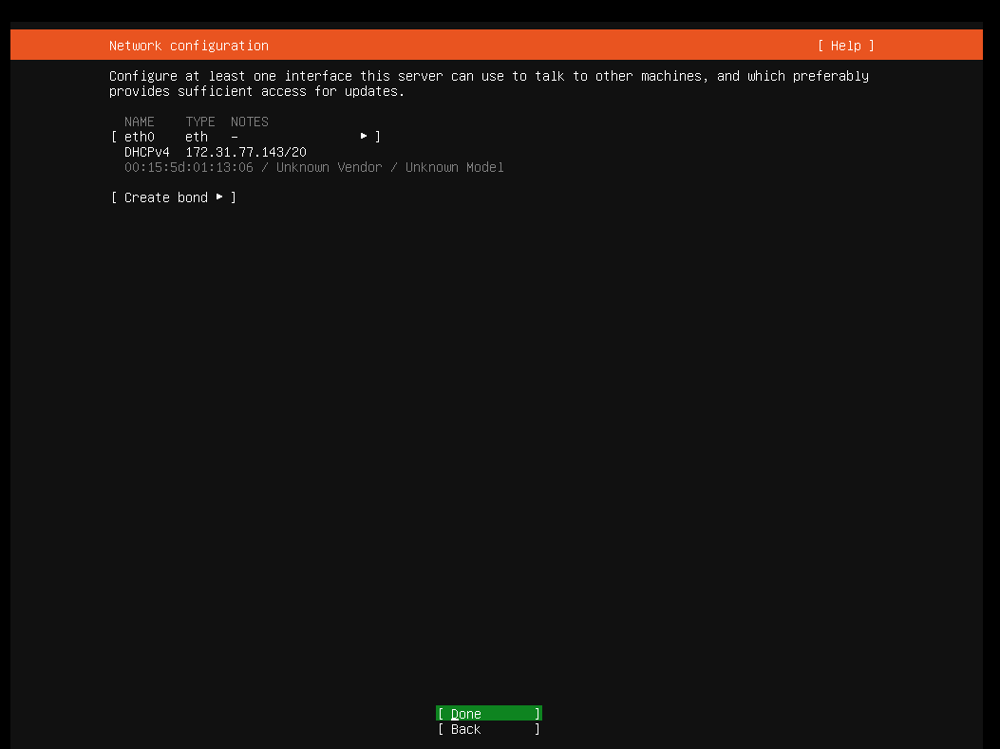
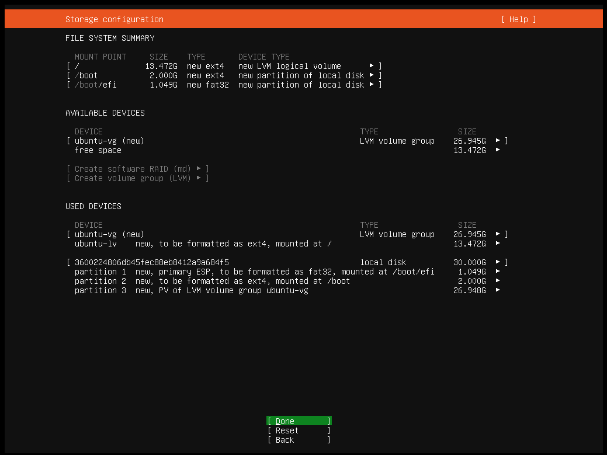
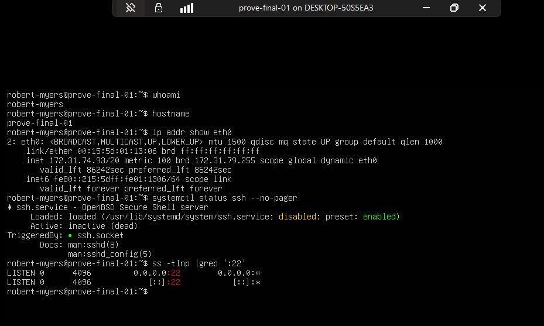
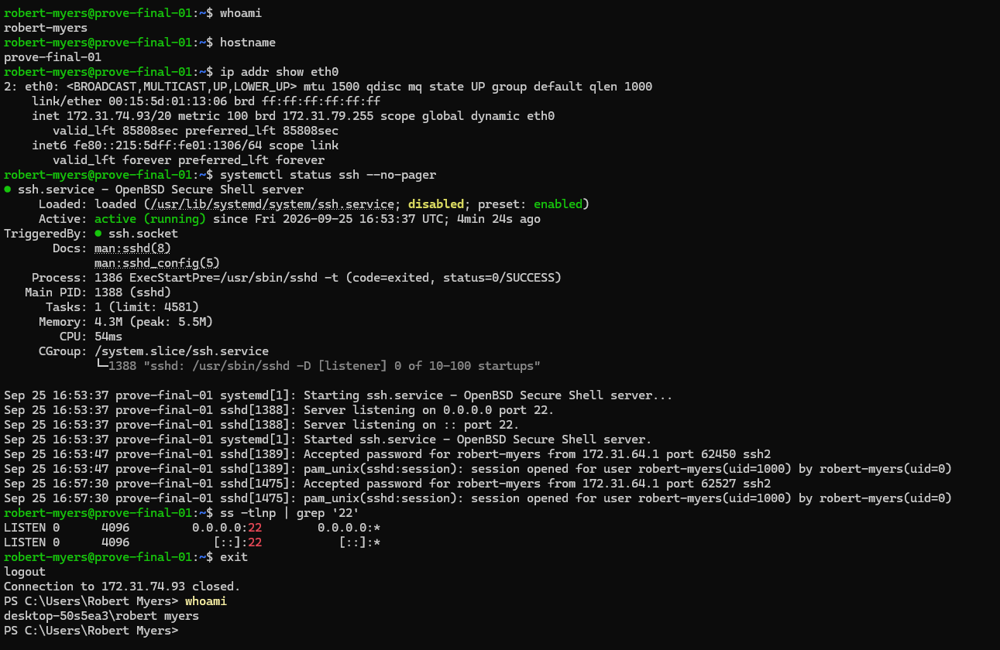
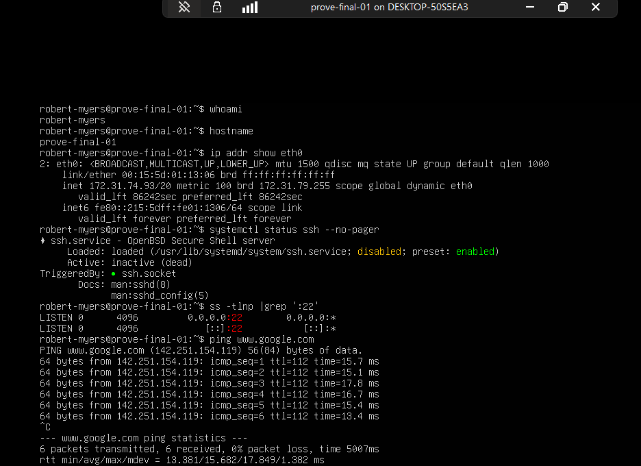

# Cluster 01 — Run 3: Closed-Book Linux VM and SSH

**Run:** 3 — Solo  
**Status:** PASS  
**Platform:** Hyper-V / Ubuntu Server 24.04.4 LTS  
**Host:** Victus (Windows)  
**VM:** prove-final-01

## Objective

The goal of this run was to prove that I could build a fresh Linux virtual machine, get it on the network, and remotely administer it over SSH without being walked through the process.

This was the final run for Cluster 01. I had the objective and acceptance criteria, but I had to determine how to build the machine, what commands to use, and what evidence was needed.

## Build

I created a fresh Generation 2 Hyper-V VM named `prove-final-01`.

The VM was configured with:

- 4 GB RAM
- 8 virtual processors
- Hyper-V Default Switch
- 30 GB virtual disk
- Ubuntu Server 24.04.4 LTS

Because I was installing Linux on a Generation 2 Hyper-V VM, I changed the Secure Boot template from the Windows default to **Microsoft UEFI Certificate Authority** before installing Ubuntu.

I then completed the Ubuntu Server installation using a normal non-root account.

I did not update the VM after installation because patching was not the objective of this run. The goal was to prove that I could independently build the system, establish networking, reach the outside network, and remotely administer it over SSH.

## Local Validation

After installation, I verified the system locally.

The machine identified itself as:

- User: `robert-myers`
- Hostname: `prove-final-01`
- Interface: `eth0`
- IPv4 address: `172.31.74.93/20`

I also verified that TCP port 22 was listening.

One detail showed up that I want to understand better later. Before I connected remotely, `ssh.service` showed as inactive while `ssh.socket` was listening on port 22. After the SSH connection was made, the service became active and recorded the successful authentication.

I am leaving the deeper explanation of that behavior for the systemd and services work in Cluster 03 instead of hand-waving past it here.

## External Connectivity

I tested connectivity to `www.google.com`.

The VM successfully resolved the hostname to a public IP address and received six out of six ICMP replies with zero packet loss.

That proved both DNS resolution and external network connectivity from the VM.

## Remote SSH Validation

From Windows on Victus, I connected remotely to `prove-final-01` over SSH.

Once connected, I verified the user, hostname, and network interface again from inside the remote session.

The Linux SSH logs also recorded the successful connection from the Hyper-V host-side address `172.31.64.1`.

This gave me evidence from both sides: Windows established the remote session, and Linux recorded the successful authentication.

## What This Proves

I completed this run without procedural help.

I independently demonstrated that I can:

- create and configure a Linux VM in Hyper-V
- configure the appropriate Secure Boot trust template for Linux
- install Ubuntu Server
- work with a normal Linux user account
- identify and verify Linux network configuration
- validate DNS and external network connectivity
- identify an SSH listener on TCP port 22
- establish an SSH session from Windows to Linux
- verify that I reached the intended remote system
- collect evidence that supports the result

## Reflection

Nothing really gave me trouble during this run. The build and validation flowed smoothly, and I did not need help figuring out the process or commands.

What made the difference was the earlier work. I completed the first guided run about two weeks ago, and the following run made me slow down and prove each part instead of just getting a VM working.

By this run, the process was familiar enough that I could concentrate on proving the result instead of figuring out what to do next.

During my final evidence review, I noticed that my original package did not include proof of external connectivity. I went back to the VM and captured the missing validation.

That reinforced one of the main lessons behind this project: doing the work and proving the work are two different things.

## Evidence

### Hyper-V Build

### Secure Boot Configuration

### Installation Network Configuration

### Storage Layout

### Local Linux Validation

### Remote SSH Validation

### External Connectivity

## Run Result

**Run 3 — PASS**

**Cluster 01 — PROVEN**
